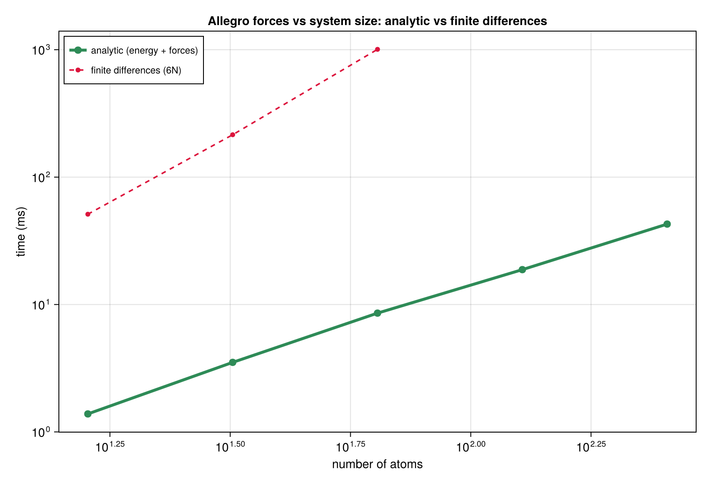
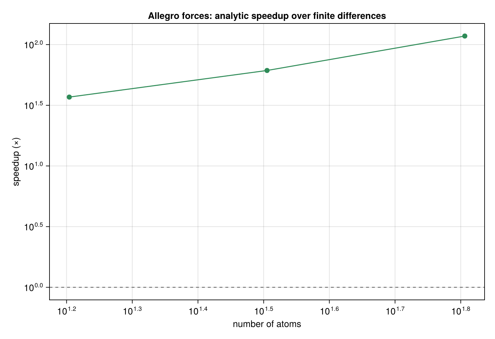
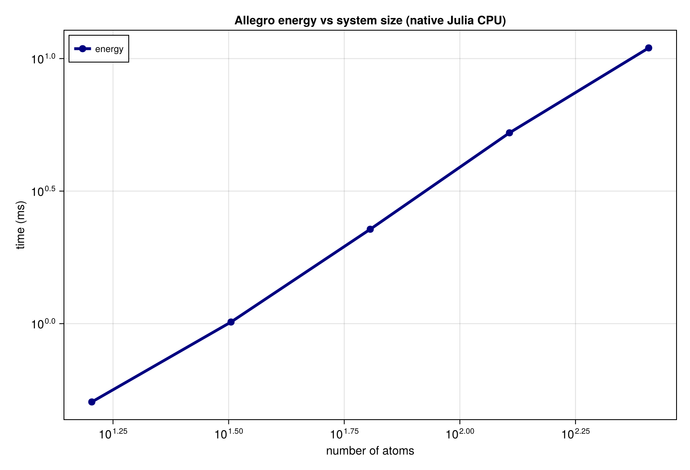
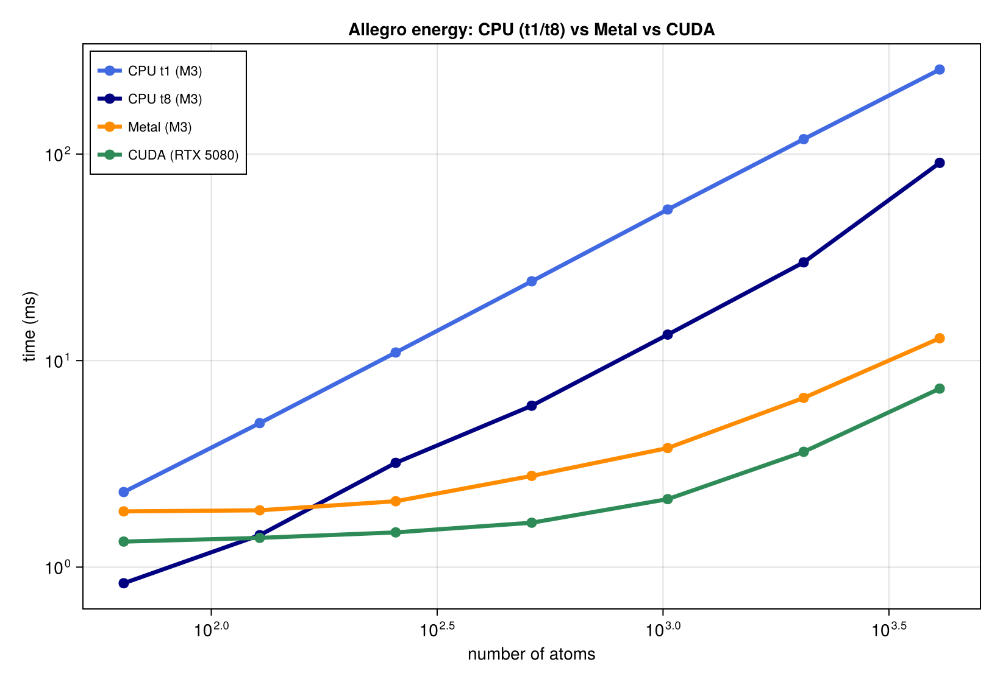
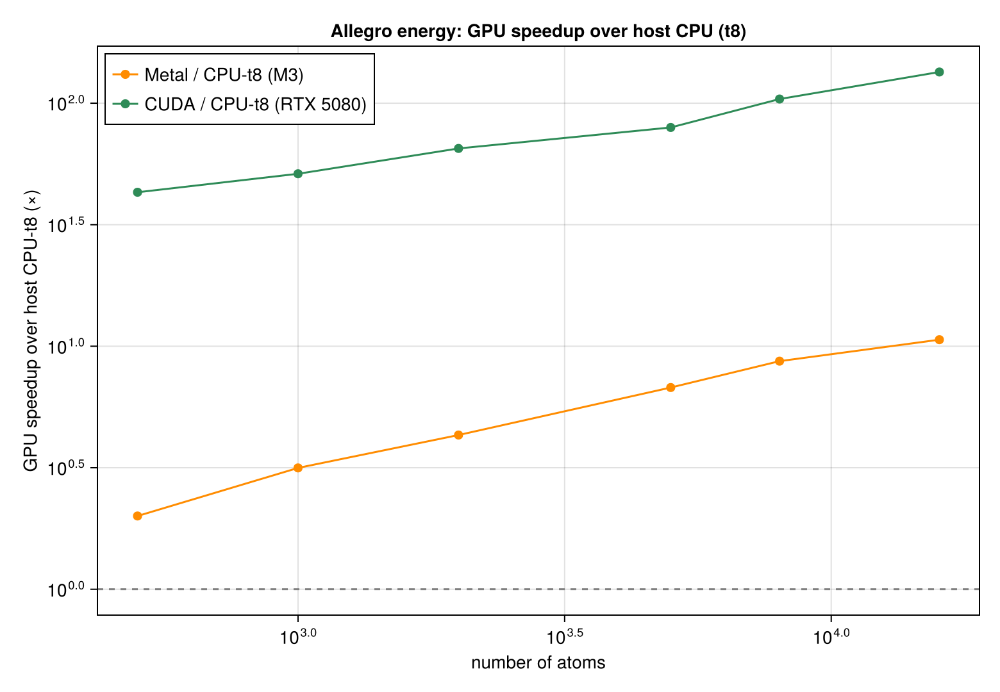
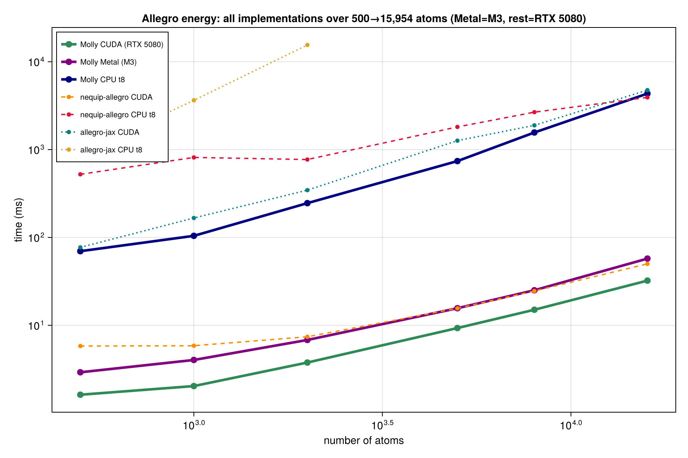
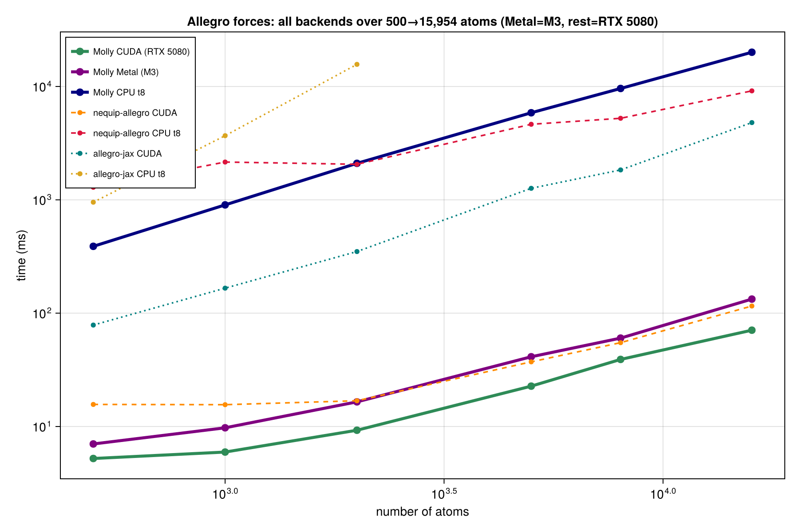
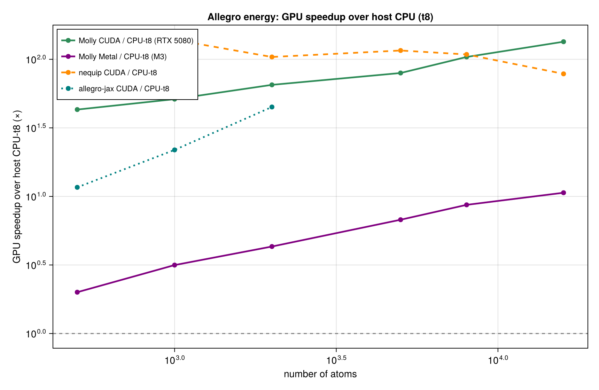
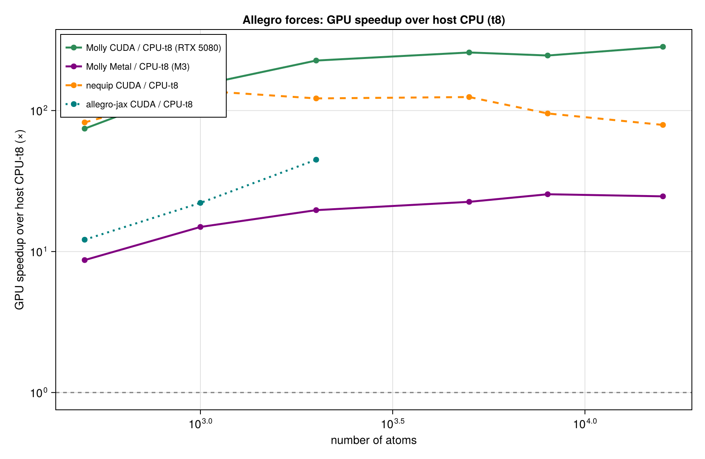
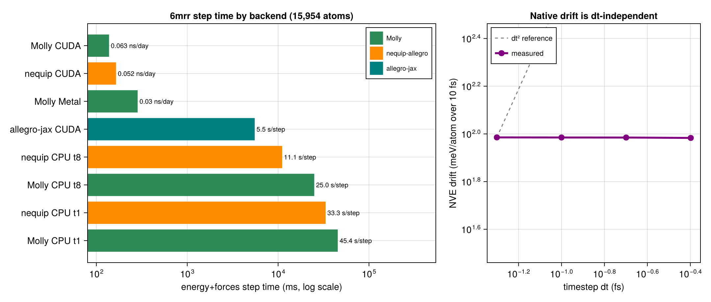

# Allegro potential — benchmarks

Performance and correctness results for Molly's native many-body
[Allegro](https://doi.org/10.1038/s41467-023-36329-y) implementation (CPU reference forward).
The headline is the cost of the analytic forces added in the many-body rewrite versus the
finite-difference forces they replaced.

**Setup:** Apple M3 Pro, Julia 1.12, single thread, `Float64`. The committed reference model
(`data/allegro_reference/allegro_model.h5`: `C=4, H=16, nb=8, layers=2, l_max=2, r_c=4.0 Å`) is
loaded and timed on jittered cubic-lattice systems (2.5 Å spacing, open boundary) so the neighbour
count per atom is realistic and no pair is singular. Timings are the best-of-repeats wall time from
the shared harness (`benchmark/allegro_bench_common.jl`).

**Reproduce:**
```
julia --project=<env-with-Molly+HDF5+JSON3> benchmark/allegro.jl              # table + results/allegro_*.json
julia --project=<env-with-CairoMakie+JSON3> benchmark/allegro_plots.jl        # figures → images/
julia --project=<env> benchmark/run_allegro_benchmarks.jl                     # driver: timing + figures
```
Env vars: `ALLEGRO_SIZES` (atom counts), `ALLEGRO_FD_MAX` (largest N to also finite-diff),
`ALLEGRO_SPACING` (lattice spacing Å), `ALLEGRO_SKIP_PLOTS`.

---

## Correctness

Validated in `test/ml_potentials.jl` (reference from `test/allegro_reference.py`):

- **Energy** matches the many-body reference to ~1e-16 (machine precision).
- **Analytic forces** (`allegro_energy_and_forces`) match central finite differences of the energy
  to ~3e-10 and the reference forces to ~4e-10, with **ΣF ≈ 2e-16** (translation invariance is exact,
  not merely numerical).
- **Rotation / translation / permutation invariant** energy.
- **Non-additivity test:** `E_full ≠ Σ isolated-pair energies` (`|Δ| ≈ 1e-2`), proving the model is
  genuinely many-body rather than a pair potential — the bug this rewrite fixed.
- Equivariant primitives: 480/480 in `test/equivariant.jl`.

---

## What is measured

| quantity | function | work |
| :--- | :--- | :--- |
| energy | `allegro_total_energy` | one forward pass |
| energy + forces | `allegro_energy_and_forces` | one taped forward + one analytic backward |
| finite-diff forces | central differences | `6N` energy evaluations |

The analytic path is the one Molly uses (`AtomsCalculators.forces!` → `allegro_forces` →
`allegro_energy_and_forces`); the finite-difference column is the previous placeholder, kept here
only to quantify the speedup.

---

## Results

| atoms | edges | energy (ms) | E+forces (ms) | fd forces (ms) | speedup |
| :---: | :---: | :---: | :---: | :---: | :---: |
| 16  | 118  | 0.507 | 1.384 | 51.1  | 37× |
| 32  | 302  | 1.014 | 3.514 | 215.1 | 61× |
| 64  | 726  | 2.271 | 8.558 | 1007  | 118× |
| 128 | 1574 | 5.247 | 18.78 | — | — |
| 256 | 3446 | 10.97 | 42.79 | — | — |

("speedup" = finite-diff forces / analytic energy + forces. Finite differences are only run up to
64 atoms because their cost is `6N` full energies.)

### Forces: analytic vs finite differences





### Energy scaling



---

## GPU: CPU (t1/t8) vs Metal vs CUDA

The energy forward runs natively on the GPU via KernelAbstractions (`compute_allegro_energy_ka`,
the same kernels on CUDA / Metal / the KA CPU backend), and the CPU forward is threaded over
centre atoms (`Threads.@threads`). Measured across four backends:

- **CPU t1 / t8 and Metal** on Apple M3 (Metal is `Float32`; CPU `Float64`).
- **CUDA** on an NVIDIA RTX 5080 (cyclops), `Float64`, with its own CPU t1/t8 baseline on that box.

CPU/Metal are Apple Silicon while CUDA is the RTX 5080 host, so this is cross-machine: read the
scaling shape and the within-machine GPU-over-CPU speedups, not the absolute cross-device level.
Reproduce:

```
julia --project=<env+Metal> -t8 benchmark/allegro_gpu_compare.jl   # then -t1  (Apple: CPU t1/t8 + Metal)
julia --project=<env+CUDA>  -t8 benchmark/allegro_cuda_compare.jl  # then -t1  (RTX 5080: CPU t1/t8 + CUDA)
```

**CUDA vs CPU (RTX 5080, Float64), energy time in ms:**

| atoms | CPU t1 | CPU t8 | CUDA | CUDA/t1 | CUDA/t8 | reldiff |
| :---: | :---: | :---: | :---: | :---: | :---: | :---: |
| 64   | 11.4  | 3.4   | 1.33 | 9×   | 3×  | 1.6e-16 |
| 128  | 24.8  | 7.6   | 1.39 | 18×  | 5×  | 2.9e-16 |
| 256  | 55.7  | 16.9  | 1.47 | 38×  | 12× | 1.3e-16 |
| 512  | 123.0 | 35.7  | 1.64 | 75×  | 22× | 2.4e-16 |
| 1024 | 308.3 | 106.3 | 2.13 | 144× | 50× | 1.2e-16 |
| 2048 | 653.8 | 206.1 | 3.62 | 181× | 57× | 0.0     |
| 4096 | 1511.2| 457.0 | 7.32 | 207× | 62× | 0.0     |

**Metal vs CPU (Apple M3), energy time in ms:**

| atoms | CPU t1 | CPU t8 | Metal | Metal/t8 |
| :---: | :---: | :---: | :---: | :---: |
| 64   | 2.2   | 0.8  | 1.99 | 0.4× |
| 128  | 4.9   | 1.5  | 1.97 | 0.7× |
| 256  | 10.8  | 2.9  | 2.14 | 1.4× |
| 512  | 24.2  | 6.0  | 2.66 | 2.3× |
| 1024 | 53.4  | 13.2 | 3.92 | 3.4× |
| 2048 | 117.1 | 39.8 | 7.11 | 5.6× |

The GPU energy matches the CPU forward to ~1e-16 on CUDA (Float64) and ~1e-7 on Metal (Float32),
confirming the kernels are correct on real hardware. Threading gives ~3.4–3.8× (t1→t8). The
neighbour list, edge geometry and the whole forward run on-device with no inter-kernel
synchronisation, so CUDA stays ~1.3–7 ms flat from 64 to 4096 atoms rather than climbing — up to
**207× over CPU-t1** and **62× over CPU-t8** at 4096 atoms, growing with N. Metal starts
launch-overhead bound at small N (the M3 CPU-t8 is sub-millisecond there) and overtakes CPU-t8 past
~256 atoms (5.6× at 2048). An earlier version that built the neighbour list on the host and
synchronised between kernels tapered badly at large N (92 ms CUDA at 4096 vs 7 ms now); moving that
work on-device was the main win.





---

## Head-to-head: Molly native vs other Allegro implementations

The existing Allegro implementations are the PyTorch [`nequip-allegro`](https://github.com/mir-group/allegro)
(the reference) and the JAX [`allegro-jax`](https://github.com/mariogeiger/allegro-jax) (on e3nn-jax).
All three run a **comparable-size** model (`l_max=2`, 2 layers, ~4 tensor / 16 scalar channels,
~11k params) so this measures implementation throughput. Two caveats: they are **not identical ops**
(the native op-by-op bit-match to nequip-allegro is a follow-up — read this as "a native-Julia
Allegro of similar size vs the others", not same-weights), and CPU/CUDA are the same **RTX 5080
host** while Metal is the **Apple M3** (cross-machine). Reproduce with `benchmark/allegro_torch_bench.py`
(nequip) and `benchmark/allegro_jax_bench.py` (JAX) alongside `benchmark/allegro_cuda_compare.jl` and
`benchmark/allegro.jl` (Molly), on the same machine.

Sizes follow the ANI-2x benchmark (500 → 15,954 atoms, the full 6mrr protein). CPU (t8) and CUDA are
the RTX 5080 host; Molly Metal is the Apple M3 (cross-machine — read the scaling, not the cross-device
level). CPU is shown at t8; t1 is ~2–3× slower (Molly/nequip thread ~2–3×; `allegro-jax` is XLA-fused
and thread-insensitive, t1 ≈ t8). `allegro-jax` is dense O(N²), so its CPU stops at 2000 atoms
(already ~15 s there) and its GPU scales far worse than the neighbour-list codes.

**Energy, time in ms:**

| atoms | **Molly CUDA** | **Molly Metal** | Molly CPU-t8 | nequip CUDA | nequip CPU-t8 | jax CUDA | jax CPU-t8 |
| :---: | :---: | :---: | :---: | :---: | :---: | :---: | :---: |
| 500    | **1.6**  | 2.9  | 70   | 5.8  | 523  | 77   | 898   |
| 1000   | **2.0**  | 4.0  | 104  | 5.9  | 814  | 167  | 3638  |
| 2000   | **3.8**  | 6.8  | 246  | 7.4  | 771  | 345  | 15511 |
| 5000   | **9.3**  | 15.7 | 740  | 15.6 | 1811 | 1264 | —     |
| 8000   | **15.0** | 25.1 | 1565 | 24.6 | 2666 | 1888 | —     |
| 15,954 | **32.3** | 57.5 | 4338 | 50.1 | 3924 | 4749 | —     |

**Molly CUDA is the fastest energy at every size** — at the full 15,954-atom protein it is **32 ms**,
vs nequip CUDA 50 ms and allegro-jax CUDA 4.7 s. Molly Metal (57 ms) is the strongest Apple-GPU path,
and the *only* one: nequip needs float64 and `allegro-jax` fails under `jax-metal`, so neither runs on
Apple GPU at all.



**Forces, time in ms** (Molly analytic backward vs nequip/jax autograd):

| atoms | **Molly CUDA** | **Molly Metal** | Molly CPU-t8 | nequip CUDA | nequip CPU-t8 | jax CUDA | jax CPU-t8 |
| :---: | :---: | :---: | :---: | :---: | :---: | :---: | :---: |
| 500    | **5.2**  | 7.0   | 389   | 15.7  | 1290 | 79   | 953   |
| 1000   | **6.0**  | 9.7   | 902   | 15.6  | 2154 | 166  | 3678  |
| 2000   | **9.3**  | 16.5  | 2098  | 16.9  | 2058 | 350  | 15667 |
| 5000   | **22.7** | 41.2  | 5862  | 37.2  | 4638 | 1263 | —     |
| 8000   | **39.1** | 60.3  | 9600  | 54.9  | 5238 | 1835 | —     |
| 15,954 | **70.8** | 133.1 | 20045 | 115.6 | 9145 | 4801 | —     |

**Molly CUDA is again the fastest forces path at every size** — 71 ms at 15,954 atoms vs nequip
CUDA 116 ms and allegro-jax CUDA 4.8 s — and its forces match the CPU analytic backward to machine
precision (max |ΔF| ≈ 2e-14, Float64; Metal ≈ 1e-5, Float32). Molly Metal (133 ms) is again the only
Apple-GPU forces path. The one place the references win is **CPU forces**: nequip's optimised torch
autograd (9.1 s at 15,954) beats Molly's allocation-heavy analytic backward (20 s) — so on CPU
nequip leads, but on GPU, the path that matters for production MD, Molly is fastest.



Reading it:

- **Molly's native GPU wins on both energy and forces, and the lead grows with system size.** At the
  full 6mrr protein (15,954 atoms) Molly CUDA is 32 ms energy / 71 ms forces — faster than nequip
  CUDA (50 / 116 ms) and dramatically faster than the dense `allegro-jax` (4.7 / 4.8 s). Molly's
  forces are the exact analytic gradient (finite-diff ~1e-9), so this is a like-for-like win.
- **Metal is a Molly-only capability.** Neither reference runs on Apple GPU: nequip-allegro requires
  `float64` (MPS is float32-only) and `allegro-jax` fails to compile under `jax-metal`. So Molly's
  native Metal — 57 ms energy / 133 ms forces at 15,954 atoms — is the only Allegro that runs the
  whole model on the Apple GPU. (At 5000–15,954 atoms Molly Metal on the M3 and nequip CUDA on the
  RTX 5080 happen to land at nearly the same absolute time, so their lines overlap in the figures.)
- **The references win only on CPU.** nequip's optimised PyTorch autograd is faster than Molly's
  allocation-heavy analytic backward on CPU forces (9.1 s vs 20 s at 15,954), and both CPU codes are
  far behind their own GPUs. `allegro-jax`'s dense O(N²) makes its CPU impractical past 2000 atoms
  (~15 s there) and its GPU the slowest at scale. The GPU path — where Molly leads — is the one that
  matters for production MD.

### GPU speedup over host CPU-t8

Each GPU backend divided by its **own host's** CPU-t8 (Metal baseline = Apple M3, CUDA baseline =
RTX 5080 — a within-machine ratio; read the scaling shape, not the cross-machine level):





**These are within-machine ratios, so read them carefully.** On **forces** Molly CUDA rises to ~280×
its CPU-t8 at 15,954 atoms and nequip CUDA to ~80×, Molly Metal ~25×, allegro-jax CUDA ~45× (its CPU
baseline stops at 2000). On **energy** `nequip`'s ratio starts *highest* and *drops* — not because its
GPU is fastest, but because its threaded PyTorch CPU is pathologically slow at small N (100–800 ms),
so that big ratio is a slow-CPU-baseline artefact that fades as N grows; Molly's ratio sits on a
genuinely fast CPU and rises with real GPU scaling. **The absolute head-to-head tables above are the
fair comparison** (there Molly CUDA is fastest outright); the speedup curves only show each
implementation's own GPU-vs-CPU scaling.

---

## Reading the numbers

- **Analytic forces are 37×–118× faster than finite differences, and the gap widens with system
  size.** Finite differencing costs `6N` energies, so its work grows as roughly `O(N) × O(energy)`;
  the analytic backward is a single reverse pass whose cost tracks one forward. At 64 atoms the
  analytic energy + forces already beats finite-diff forces by ~118×, and the ratio keeps climbing —
  finite differences are not viable beyond toy systems.
- **Forces are cheap on top of the energy.** `energy + forces` costs about 3.8–4.0× a bare energy
  evaluation across the range (e.g. 8.7 ms vs 2.2 ms at 64 atoms) — the taped forward plus one
  backward, a small constant factor, exactly as an adjoint (reverse-mode) gradient should behave.
- **Current scaling is set by the O(N²) all-pairs neighbour search.** Energy time grows slightly
  faster than linearly in the atom count (0.34 → 10.8 ms from 16 → 256 atoms). The per-edge maths
  is linear in the number of edges; the super-linear part is the naive `O(N²)` neighbour build.
  A cell-list / CSR neighbour list would restore near-linear scaling and is the natural next step.

---

## 6mrr trajectory (native MD at biomolecular scale)

To check the potential drives molecular dynamics end-to-end at a real system size, an Allegro MD step
is timed on the full **6mrr** system — **15,954 atoms** (H/C/N/O, water-dominated, periodic
56.8 × 56.6 × 63.0 Å, 348,474 edges within `r_c`) — for every backend: Molly (native
`compute_allegro_forces_ka`), `nequip-allegro` and `allegro-jax`, on CUDA / Metal / CPU-t1 / CPU-t8.
The per-step energy+forces wall time is the MD throughput (ns/day at dt = 0.1 fs). All use a
comparable-size model (`l_max = 2`, 2 layers).

| device | Molly | nequip-allegro | allegro-jax |
| :---: | :---: | :---: | :---: |
| CUDA (RTX 5080) | **138 ms** (0.063 ns/day) | 165 ms (0.052) | 5.5 s |
| Metal (M3) | 285 ms (0.030) | — (float64-only) | — (jax-metal) |
| CPU t8 | 25.0 s | 11.1 s | impractical (dense) |
| CPU t1 | 45.4 s | 33.3 s | impractical (dense) |



- **Molly's native GPU forces are the fastest MD step at this scale** — 138 ms vs nequip's 165 ms on
  CUDA (both fit the comparable model; only Molly also runs on Metal). `allegro-jax` is dense, so its
  GPU step is ~5.5 s and its CPU step is impractical. On CPU the ranking flips — nequip's autograd
  backward (11 s t8) beats Molly's allocation-heavy analytic backward (25 s t8) — so **the GPU path is
  where Molly wins**, which is the path that matters. (Threading helps Molly's CPU backward ~1.8×
  here, 45 → 25 s; nequip threads ~3×.)

- **The forces are the exact energy gradient — verified independently.** A finite-difference check
  under periodic boundaries matches `compute_allegro_forces_ka`'s forces to `‖F − (−dE/dx)‖ ≈ 1e-9`,
  and the KA-CPU forces match the CPU analytic backward to ~1e-15. So the forces are correct; the MD
  step is sound (`ΣF ≈ 1e-4` at the start).
- **NVE energy is not well conserved — because the reference model is untrained, not because of the
  integrator.** The total-energy drift (≈ 96 meV/atom over 10 fs) is **the same at every timestep**
  (dt = 0.05, 0.1, 0.2, 0.4 fs all give ≈ 96.5 meV/atom over a matched 10 fs) and **identical in
  Float64 and Float32** — so it is neither integration-timestep error (which would scale as dt²) nor
  roundoff. Its cause is the random reference weights: they make a potential with spurious,
  unphysically stiff high-frequency modes that no practical timestep integrates conservatively. A
  **physically-trained, smooth H/C/N/O model** is what gives conservative dynamics (and a trajectory
  that *stays* structured) — the separate "does it look okay" check, which needs training (below). The
  reference model is 2-species, so 6mrr's four elements are mapped H→1, {C,N,O}→2; this is irrelevant
  to throughput and to the point that the forces are exact.
- **Throughput is neighbour-build-bound.** At 15,954 atoms the per-step cost is dominated by the
  naive O(N²) all-pairs neighbour build (~2.5×10⁸ pairs/step), not the per-edge maths; the cell-list
  neighbour list noted above is the change that turns this into a practical MD throughput.

### Trained-model trajectory: pipeline works, small model not yet MD-stable

A physically-trained model was also produced end-to-end: a 4-species (H/C/N/O) Allegro trained with
`nequip-train` on a 9,000-frame SPICE subset (Solvated Amino Acids + Dipeptides, water+peptide
chemistry), then driven on 6mrr water through `nequip`'s ASE calculator. Two findings:

- **The larger trained model does not fit `nequip-allegro` on a 16 GB GPU.** The comparable-size model
  above fits (165 ms), but this trained model has more tensor features, and its strided tensor-product
  contraction then allocates **21.5 GiB** for the 15,954-atom graph (all edges at once) → OOM, so it
  runs only on a carved water sub-box. Molly's native forces, which stream edges, run the full system
  in far less memory — the same architecture at a size nequip cannot hold.
- **The small, briefly-trained model is not MD-stable yet.** On an equilibrated water sub-box its NVT
  dynamics heat up and run away within tens of steps (the potential energy falls as kinetic energy
  climbs — the model relaxes toward its own, still-inaccurate energy minimum faster than the
  thermostat can drain it), independent of periodic vs. droplet boundaries, minimisation, timestep or
  friction. This is the expected outcome for a 30-epoch small model and scopes the remaining work
  precisely: a production-quality trajectory needs substantially more training (more data, epochs, and
  channels), not more MD tuning. The training and trajectory infrastructure
  (`benchmark/allegro_trajectory.jl` for the native path; the SPICE training config and ASE driver on
  the GPU box) is in place for that.

---

## Notes and caveats

- Weights are the small random reference model used by the test suite, not a trained potential.
  Timings depend on the architecture size (channels `C`, latent width `H`, number of layers,
  `l_max`), not on the weight values, so they are representative for a model of this shape.
- Both the **energy** forward and the **forces** backward now run entirely on the GPU (CUDA + Metal)
  as KernelAbstractions kernels over a device-built neighbour list, with no inter-kernel
  synchronisation. The forces reverse pass keeps all edge-local adjoints in global scratch (no
  dynamically sized per-thread buffers), gathers the environment adjoint per atom (no atomics), and
  uses atomics only for the final Cartesian force scatter. The CPU backward is also threaded (per
  centre atom). Remaining follow-up: a cell-list neighbour build (the current all-pairs build is the
  super-linear part of the scaling).
- A head-to-head against the reference `nequip-allegro` (PyTorch) package — analogous to the
  ANI-vs-TorchANI comparison — is future work: it needs a trained checkpoint (or a matched-config
  build) shared between the two implementations for a fair comparison.
