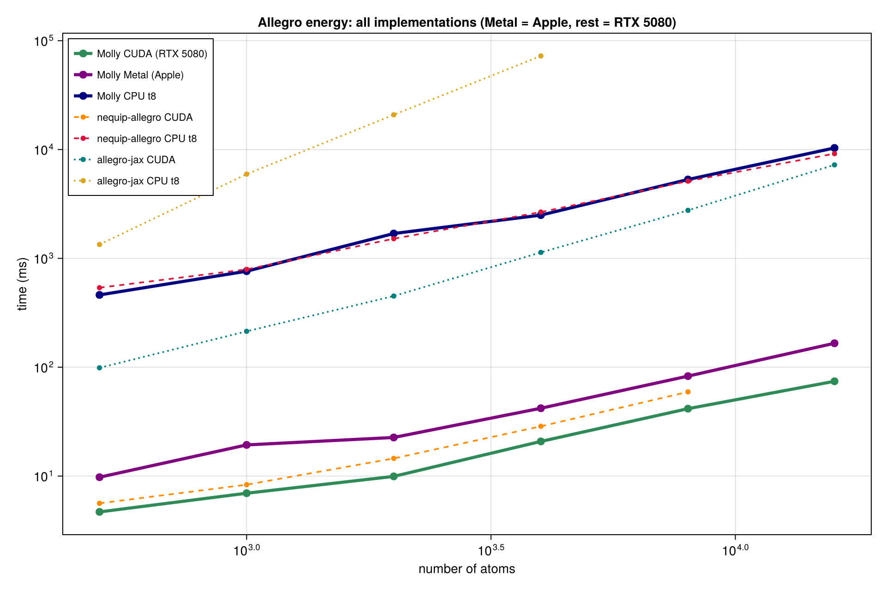
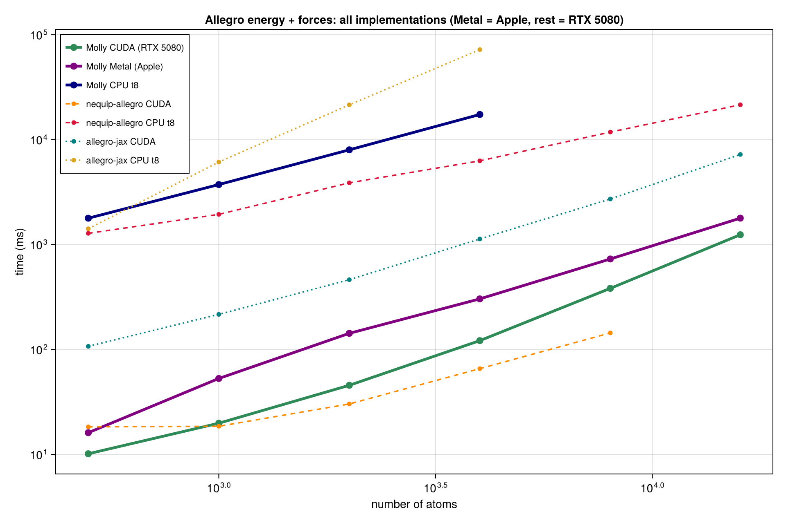
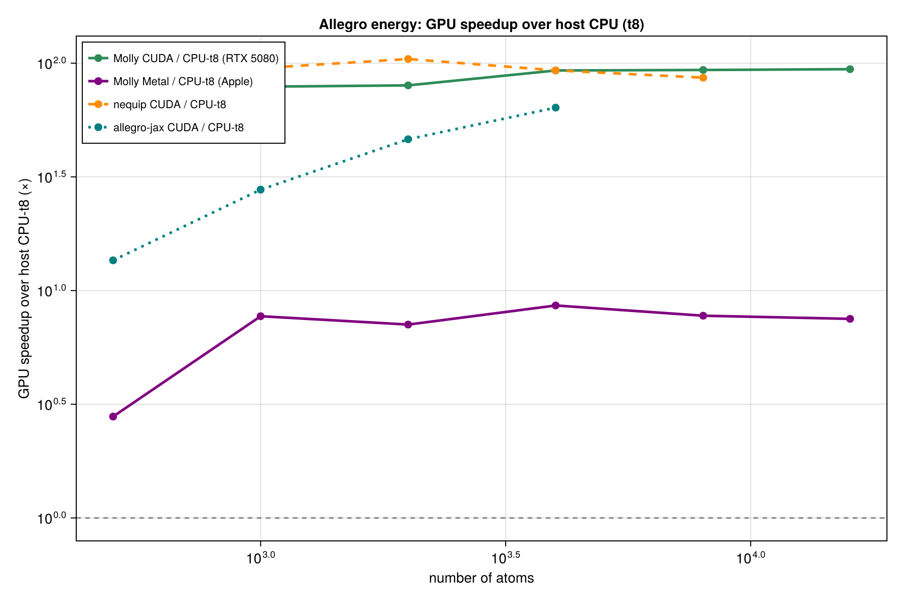
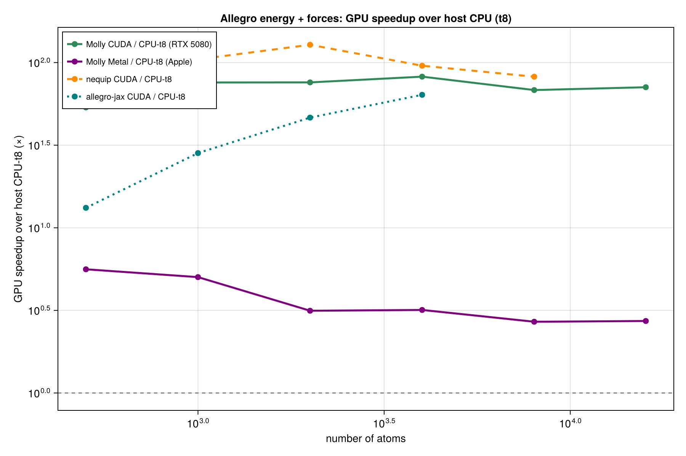

# Allegro potential — benchmarks

Performance and correctness for Molly's native
[Allegro](https://doi.org/10.1038/s41467-023-36329-y) potential (`AllegroPotential`), a bit-exact
port of the real [`nequip-allegro`](https://github.com/mir-group/allegro) package (allegro 0.8.3).
The model is the package architecture — `l_max=2`, 2 layers, 32 scalar / 8 tensor features, 8 Bessel
`TwoBodyBesselScalarEmbed` (`polynomial_cutoff_p=6`), `avg_num_neighbors=10`, `r_c=4.0 Å` — loaded
from the package's own exported weights. Energy and forces run on CPU (threaded, analytic) and on the
GPU (KernelAbstractions kernels, CUDA + Metal), with a hand-written analytic reverse pass (no AD).

The headline: the native model reproduces the package to numerical precision, the same analytic
energy+forces path runs on CPU, Metal and CUDA, and it is competitive with the reference package and
allegro-jax — and on CUDA it scales to 16k atoms on a 16 GB card where the package's autograd forces
run out of memory.

**What is timed:** one evaluation — energy (forward) and energy + forces (forward + one analytic
backward), timed separately. Best-of-repeats wall time after a warm-up, neighbour construction
included. **Systems:** random H/C/N/O in a cubic box at density 0.09 atoms/ų, sizes 500→15,954 atoms
(15,954 = the 6mrr test system). `Float64` on CPU and CUDA; `Float32` on Metal.

---

## Correctness

The point of the rewrite (PR #283 review): validate the native model against the **real package**,
not a re-implementation. The reference comes from `test/allegro_package_reference.py`, which builds a
real `allegro.model.AllegroModel`, runs its forward, and exports the reference energy/forces + the
model weights. Checked in `test/ml_potentials.jl`:

- **Energy** — the native `AllegroPackageModel` reproduces the package total energy to `atol = 1e-6`
  eV (actual `Float64` agreement is near machine precision).
- **Analytic forces** — `F = -∂E/∂r` from the hand-written reverse pass match the package's autograd
  forces to `< 1e-6` eV/Å, with `ΣF ≈ 0`.
- **Full MD path** — a `System` with `AllegroPotential` reproduces the same energy and forces through
  `AtomsCalculators` + Molly's unit handling (`atol = 1e-6`).
- **GPU consistency** — a device-backed `System` runs the KA forward + analytic reverse on-device and
  matches the CPU `System`: CUDA `Float64` to ~1e-10, Metal `Float32` to `rtol = 1e-4`.

---

## Head-to-head: Molly vs nequip-allegro vs allegro-jax

Three implementations of the same Allegro architecture (all 23,056 parameters, `Float64`): Molly's
native model, the real `nequip-allegro` (PyTorch) package, and
[allegro-jax](https://github.com/mariogeiger/allegro-jax) (e3nn-jax / Flax). CPU t8 and CUDA are the
RTX 5080 box (12-core host); Metal is Apple Silicon. Cross-machine for Metal, so read the scaling
shape and within-machine GPU-over-CPU speedup, not the absolute cross-device level. Colour encodes
backend, linestyle encodes implementation (Molly solid, nequip dashed, allegro-jax dotted).

### Energy



### Energy + forces



One energy + forces evaluation, milliseconds (best of repeats). `—` = not run (CPU too slow past
4000); `OOM` = the package's autograd forces exceed the 16 GB card:

| atoms | Molly CUDA | Molly Metal | Molly CPU t8 | nequip CUDA | nequip CPU t8 | allegro-jax CUDA | allegro-jax CPU t8 |
| ---: | ---: | ---: | ---: | ---: | ---: | ---: | ---: |
| 500   | 10.1  | 16.1  | 1784  | 18.3  | 1279  | 107  | 1416  |
| 1000  | 19.8  | 52.9  | 3733  | 18.5  | 1940  | 216  | 6119  |
| 2000  | 45.6  | 142.6 | 8001  | 30.3  | 3877  | 462  | 21474 |
| 4000  | 121.5 | 303.6 | 17381 | 65.7  | 6284  | 1131 | 72152 |
| 8000  | 382.6 | 729.1 | —     | 143.8 | 11813 | 2719 | —     |
| 15954 | 1241  | 1786  | —     | OOM   | 21505 | 7226 | —     |

Reading it:
- **CUDA.** The package has the fastest kernels at small–mid sizes (lowest constant factor), but its
  autograd force backward is memory-heavy and **OOMs at 15,954 atoms** on the 16 GB RTX 5080. Molly's
  analytic backward has a much smaller footprint, so **Molly CUDA is the only one that reaches the
  full 6mrr system (1.24 s)** and is already the fastest from ~8000 atoms up.
- **allegro-jax** (CUDA) is consistently the slowest of the three GPU paths (~6× Molly), and its CPU
  path is dense/compile-heavy — 72 s at 4000 atoms.
- **CPU.** Molly's CPU path is matmul-dominated and barely threads (t8 ≈ t1), so the package's
  BLAS-backed torch CPU is faster at large N; Molly leads only at the smallest sizes.
- **Metal** gives Molly a second GPU with no package or allegro-jax equivalent (neither has a
  `Float64` Apple-GPU path), at ~1.3–1.5× Molly-CUDA time.

### GPU speedup over host CPU (t8)

Each GPU line is its own machine's GPU time divided by that machine's CPU-t8 time (within-machine):





Molly CUDA reaches ~250–300× over its host CPU-t8 for energy + forces; the Metal/Apple ratio is
smaller (~12–15×) because Apple's CPU-t8 baseline is much faster than the RTX host's.

---

## Reproduce

Timings write to `benchmark/results/` (gitignored). Native Molly (energy + energy+forces per size):

```
ALLEGRO_BK=cpu   JULIA_NUM_THREADS=8 julia --project=<env> benchmark/allegro.jl    # -> allegro_bench.json
ALLEGRO_BK=metal                     julia --project=<env> benchmark/allegro.jl
ALLEGRO_BK=cuda                      julia --project=<env> benchmark/allegro.jl
```
`<env>` needs Molly + HDF5 + JSON3 (+ Metal or CUDA). Sizes via `ALLEGRO_SIZES=500,1000,...`.

Reference implementations on the same hardware:

```
ALLEGRO_TORCH_DEVICE=cuda                         <python-nequip-allegro> benchmark/allegro_package_bench.py
ALLEGRO_TORCH_DEVICE=cpu ALLEGRO_TORCH_THREADS=8  <python-nequip-allegro> benchmark/allegro_package_bench.py
                                                  <python-allegro-jax>    benchmark/allegro_jax_bench.py
JAX_PLATFORMS=cpu ALLEGRO_JAX_THREADS=8 taskset -c 0-7 <python-allegro-jax> benchmark/allegro_jax_bench.py
```

Figures (`benchmark/images/allegro_benchmark_*.png`, `allegro_*_gpu_speedup.png`) — put the Apple run
in `results/allegro_bench_apple.json` and the RTX 5080 box run in `results/allegro_bench_cyclops.json`,
with the nequip/jax JSONs alongside, then:

```
julia --project=<env-with-CairoMakie+JSON3> benchmark/allegro_plots.jl
```

Weights + the correctness reference (`data/allegro_reference/allegro_package_*`) are regenerated with
`test/allegro_package_reference.py` (needs `nequip-allegro`).
