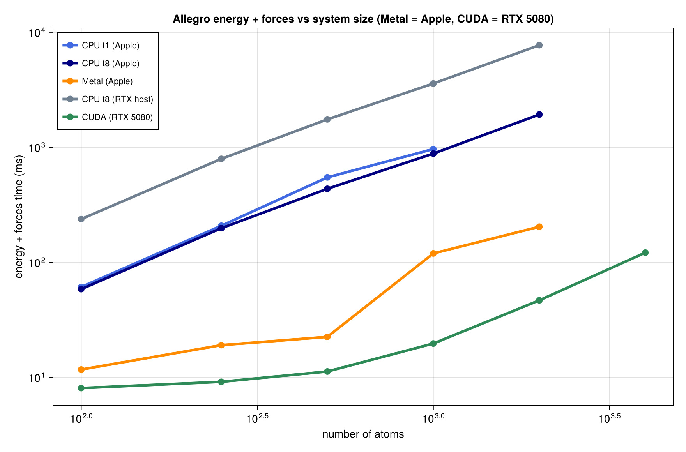
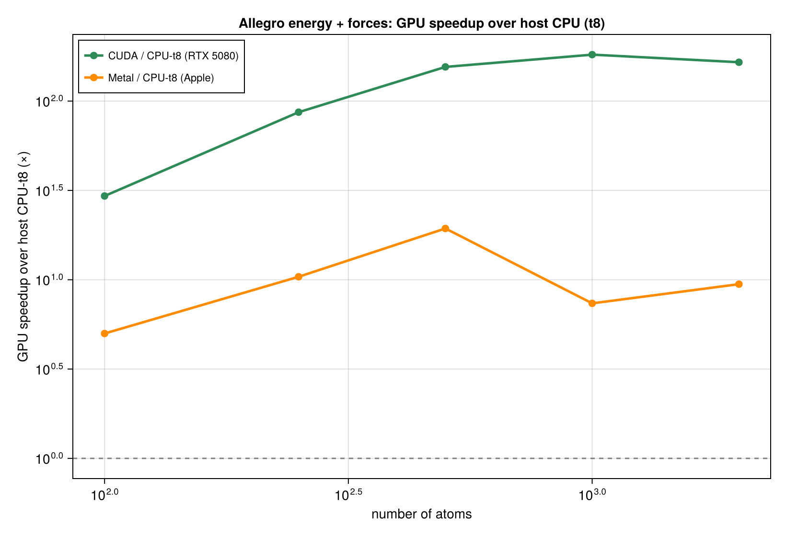
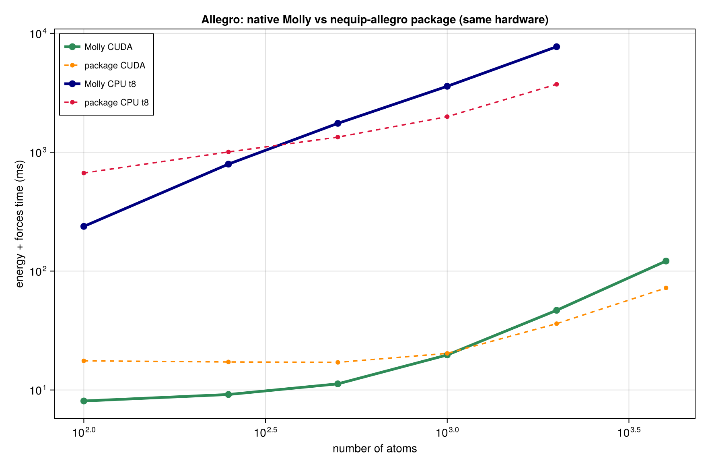

# Allegro potential — benchmarks

Performance and correctness for Molly's native
[Allegro](https://doi.org/10.1038/s41467-023-36329-y) potential (`AllegroPotential`), a bit-exact
port of the real [`nequip-allegro`](https://github.com/mir-group/allegro) package (allegro 0.8.3).
The model is the package architecture — `l_max=2`, 2 layers, 32 scalar / 8 tensor features, 8 Bessel
`TwoBodyBesselScalarEmbed` (`polynomial_cutoff_p=6`), `avg_num_neighbors=10`, `r_c=4.0 Å` — loaded
from the package's own exported weights. Energy and forces run on CPU (threaded, analytic) and on the
GPU (KernelAbstractions kernels, CUDA + Metal), with a hand-written analytic reverse pass (no AD).

The headline: the native model reproduces the package to numerical precision (not against a second
re-implementation), and the same analytic energy+forces path runs on CPU, Metal and CUDA.

**What is timed:** one `energy + forces` evaluation — a taped forward plus one analytic backward
(`allegro_package_energy_and_forces` on CPU, `compute_allegro_package_energy_and_forces_ka` on the
GPU). The timed region includes building the neighbour list from the coordinates (cutoff `r_c`), so
it is the whole cost a caller pays. Best-of-repeats wall time after a warm-up call.

**Systems:** random H/C/N/O coordinates in a cubic box at density 0.09 atoms/ų (condensed-phase-like,
so the average neighbour count is realistic), sizes 100–4000 atoms. `Float64` on CPU and CUDA,
`Float32` on Metal.

---

## Correctness

The whole point of the rewrite (PR #283 review): validate the native model against the **real
package**, not a re-implementation. The reference comes from `test/allegro_package_reference.py`,
which builds a real `allegro.model.AllegroModel`, runs its forward, and exports both the reference
energy/forces and the model weights. Checked in `test/ml_potentials.jl`:

- **Energy** — the native `AllegroPackageModel` reproduces the package total energy to `atol = 1e-6`
  eV across the H/C/N/O reference frames (actual `Float64` agreement is near machine precision).
- **Analytic forces** — `F = -∂E/∂r` from the hand-written reverse pass match the package's autograd
  forces to `< 1e-6` eV/Å, with `ΣF ≈ 0` (translation invariance).
- **Full MD path** — a `System` with `AllegroPotential` as a general interaction reproduces the same
  energy and forces through `AtomsCalculators` + Molly's unit handling (`atol = 1e-6`).
- **GPU consistency** — a device-backed `System` runs the KA forward + analytic reverse on-device and
  matches the CPU `System`: CUDA `Float64` to ~1e-10, Metal `Float32` to `rtol = 1e-4` (energy) and
  `< 1e-4·‖F‖` (forces).
- **Spherical-harmonic primitives** — pinned to e3nn's convention in `test/equivariant.jl`.

---

## Native scaling — CPU vs Metal (Apple M-series)

**Apple Silicon, Julia 1.12.** CPU is `Float64` (t1 = single thread, t8 = 8 threads); Metal is
`Float32`. One energy + analytic-forces evaluation, milliseconds (best of repeats):

| atoms | box (Å) | CPU t1 | CPU t8 | Metal |
| ---: | ---: | ---: | ---: | ---: |
| 100  | 10.4 | 61.1  | 58.6  | 11.7  |
| 250  | 14.1 | 208.3 | 198.3 | 19.1  |
| 500  | 17.7 | 548.2 | 436.3 | 22.5  |
| 1000 | 22.3 | 966.5 | 882.7 | 119.6 |
| 2000 | 28.1 | —     | 1929  | 204.2 |

Notes:
- **Threading gives little** on this model (t8 is only ~1.1× over t1): the per-edge work is dominated
  by the small dense MLP matmuls, which BLAS already runs multithreaded, so splitting centre atoms
  across Julia threads mostly overlaps that.
- **Metal** is 8–24× faster than CPU at the same size on the same machine (e.g. 24× at N=500). The
  jump between N=500 and N=1000 reflects GPU occupancy/dispatch rather than the model's `O(N·edges)`
  scaling.

## Native scaling — CPU vs CUDA (NVIDIA RTX 5080)

**cyclops (RTX 5080, 12-core CPU), Julia 1.12, Float64.** All on the same box, so the GPU-over-CPU
speedup is within-machine. One energy + analytic-forces evaluation, ms:

| atoms | box (Å) | CPU t1 | CPU t8 | CUDA | CUDA speedup (vs t8) |
| ---: | ---: | ---: | ---: | ---: | ---: |
| 100  | 10.4 | 234.7 | 237.9 | 8.1   | 29×  |
| 250  | 14.1 | 771.4 | 794.5 | 9.2   | 87×  |
| 500  | 17.7 | 1814  | 1750  | 11.3  | 155× |
| 1000 | 22.3 | 4036  | 3588  | 19.7  | 182× |
| 2000 | 28.1 | 8558  | 7723  | 46.8  | 165× |
| 4000 | 35.4 | —     | —     | 121.6 | —    |

- **CUDA is flat to ~N=500** (launch/overhead-bound), then scales linearly; the within-box speedup
  over CPU-t8 peaks at ~180× around N=1000.
- CPU t1 ≈ t8 here as well, confirming the weak threading is the model (matmul-dominated), not the
  machine.
- This cyclops CPU is markedly slower per core than the Apple M-series table above (different
  hardware) — which is why the native-vs-package comparison below is kept to one machine at a time.

### Figures

Energy + forces time vs system size across all backends (Metal = Apple, CUDA = RTX 5080; log–log):



Within-machine GPU speedup over host CPU (8 threads):



## Native Molly vs the real nequip-allegro package (same hardware)

Identical architecture and weights (23,056 parameters) — the native model loads the package's own
exported weights, so this is apples-to-apples. Both time one full energy + forces evaluation
(including neighbour construction). All on cyclops (RTX 5080 / 12-core CPU), `Float64`.

### CUDA (RTX 5080)

| atoms | Molly (ms) | package (ms) | Molly speedup |
| ---: | ---: | ---: | ---: |
| 100  | 8.1   | 17.6 | 2.2× |
| 250  | 9.2   | 17.2 | 1.9× |
| 500  | 11.3  | 17.1 | 1.5× |
| 1000 | 19.7  | 20.3 | 1.0× |
| 2000 | 46.8  | 36.2 | 0.8× |
| 4000 | 121.6 | 72.1 | 0.6× |

Molly's kernels have lower launch overhead, so it is faster up to N ≈ 1000; the package's
fused/batched kernels scale better beyond that. Crossover is around 1000 atoms.

### CPU, 8 threads

| atoms | Molly (ms) | package (ms) | Molly speedup |
| ---: | ---: | ---: | ---: |
| 100  | 237.9 | 668.6 | 2.8× |
| 250  | 794.5 | 1006  | 1.3× |
| 500  | 1750  | 1340  | 0.8× |
| 1000 | 3588  | 1992  | 0.6× |
| 2000 | 7723  | 3730  | 0.5× |

Same shape on CPU: Molly wins at small N; torch's BLAS-backed matmuls scale better at large N. The
takeaway is that the native port is competitive with — and at small system sizes faster than — the
reference package it reproduces, while being pure Julia with analytic forces.

Native Molly (solid) vs the package (dashed), CUDA and CPU-t8 on the same box — note the crossovers:



---

## Reproduce

Native timings (writes `benchmark/results/allegro_bench.json`):

```
# CPU (set threads); Metal; CUDA — pick the backend with ALLEGRO_BK
ALLEGRO_BK=cpu   JULIA_NUM_THREADS=8 julia --project=<env> benchmark/allegro.jl
ALLEGRO_BK=metal                     julia --project=<env> benchmark/allegro.jl
ALLEGRO_BK=cuda                      julia --project=<env> benchmark/allegro.jl
```
`<env>` needs Molly + HDF5 + JSON3 (+ Metal or CUDA for the GPU backends). Sizes via
`ALLEGRO_SIZES=100,250,...`.

Real-package head-to-head on the same hardware (needs `nequip-allegro`):

```
PKG_DEV=cpu  <python-with-nequip-allegro> benchmark/allegro_package_bench.py
PKG_DEV=cuda <python-with-nequip-allegro> benchmark/allegro_package_bench.py
```

Figures (writes `benchmark/images/allegro_*.png`) — put the Apple run in
`results/allegro_bench_apple.json` and the RTX 5080 box run in `results/allegro_bench_cyclops.json`
(or a single `results/allegro_bench.json` for one machine):

```
julia --project=<env-with-CairoMakie+JSON3> benchmark/allegro_plots.jl
```

Weights + reference (`data/allegro_reference/allegro_package_*`) are regenerated with
`test/allegro_package_reference.py` (needs `nequip-allegro`).
