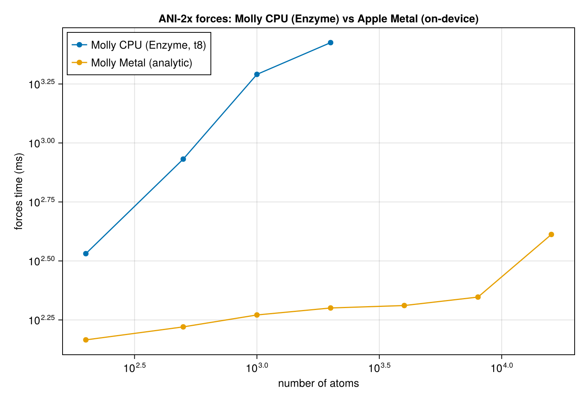
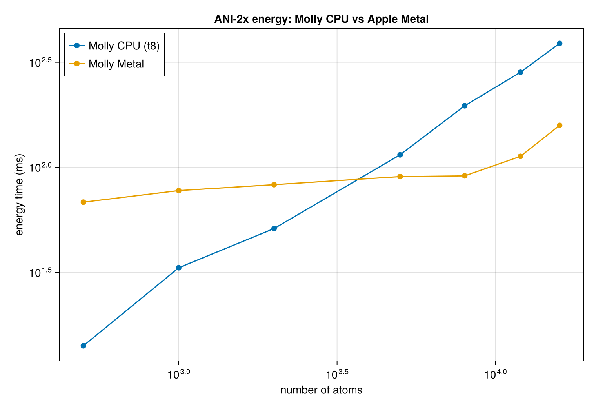

# ANI-2x potential — benchmarks

Consolidated performance and correctness results for Molly's native ANI-2x implementation.

**Setup:** Apple Silicon (12 cores: 8P + 4E), Julia 1.12, ANI-2x, Float32 AEVs. Systems are
slices of `data/6mrr_equil.pdb` with a `DistanceNeighborFinder` (cutoff `max(r_c_R,r_c_A)+1 = 6.1 Å`),
single ensemble member (`ensemble_idx=0`) unless noted. "CPU" numbers use `-t8` unless a thread
count is given.

**Reproduce:**
```
julia --project=<env> -t <N> benchmark/ani.jl              # CPU energy/forces, thread sweep, same-species
julia --project=<env> -t 8  benchmark/ani_gpu_compare.jl   # CPU vs Apple Metal energy   → results/ani_energy.json
julia --project=<env> -t 8  benchmark/ani_forces_gpu.jl    # CPU (Enzyme) vs Metal forces → results/ani_forces.json
julia --project=<env> -t 8  benchmark/ani_trajectory.jl    # 6mrr NVE trajectory (DCD)
julia --project=<env> -t 8  benchmark/run_ani_benchmarks.jl  # driver: energy+forces JSON + CairoMakie figures
python  test/torchani_reference.py --benchmark --device cpu   # TorchANI reference timing
```
Env vars: `ANI_SIZES`, `ANI_FSIZES`, `ANI_ENZYME_SIZES`, `ANI_FORCES`, `ANI_ENSEMBLE` (`0`|`full`),
`ANI_SAMESPECIES`, `ANI_SKIP_PLOTS`; `ANI_TRAJ_{N,STEPS,DT_FS,LOG,TEMP}`.

---

## Correctness

- **19/19** ANI tests pass (`test/ml_potentials.jl`) under `-t8` with Enzyme + KernelAbstractions.
- AEV vs TorchANI: ~1e-8 (N₂), 1.2e-7 (H₂O).
- Forces vs TorchANI: N₂ 4.3e-5 eV/Å, H₂O 2.4e-3 eV/Å (Float32 AEV limit).
- **On-device (Metal) forces** match the CPU Enzyme forces and TorchANI to ~1e-6 eV/Å with
  ΣF ≈ 0 (Test 19); the analytic backward AEV kernels match finite differences to ~1e-9.
- Threaded AEV is **bit-identical** to serial (Test 15). GPU kernels match the CPU path for
  Cubic and Triclinic boundaries (Test 18): 0.0 on the CPU backend, ≤1.5e-6 on Metal.
- 6mrr full protein (15,954 atoms): energy within <0.001% of the TorchANI reference (Test 13).

---

## Energy (CPU)

Single ensemble member, `potential_energy`.

### Full 6mrr (15,954 atoms)

| threads | 1       | 8         |
|---------|---------|-----------|
| time    | 1493 ms | **467 ms** |

The per-atom CSR consumption of the finder's neighbours made this **15.5×** faster than the
original all-pairs-rescan baseline (7219 ms serial). (An earlier pre-CSR thread sweep scaled
near-linearly to 8 threads: 1.9×/3.5×/5.3× at 2/4/8 threads.)

### Energy vs system size

| N atoms | 500  | 1000 | 2000 | 5000  | 8000  | 15,954 |
|---------|------|------|------|-------|-------|--------|
| CPU (t8)| 16.8 | 30.5 | 48.6 | 112.7 | 192.5 | 467    | ms

### Full 8-member ensemble

| system      | 1 thread | 8 threads |
|-------------|----------|-----------|
| 6mrr 1000   | 146 ms   | 71 ms     |
| 6mrr 15954  | 2103 ms  | 1051 ms   |

8 members cost only ~1.4× a single member — the AEV is computed once and only the per-element
NN runs 8× (species-batched).

---

## Forces (CPU, Enzyme reverse-mode AD)

- Single member, 1000 atoms: **2643 ms** (species-batched; 1.56× and 2.1× less memory than the
  per-atom baseline).
- Full 8-member ensemble, 1000 atoms — the per-member reverse passes run across threads:

  | threads | 1     | 8       |
  |---------|-------|---------|
  | time    | ~78 s | **6.4 s** |

  Correct at both counts (N₂ 5–7e-7, H₂O <5e-7 eV/Å; the ~1e-7 t1/t8 difference is Float32 BLAS
  non-associativity). On-device (Metal) forces are now available too — see **Forces (Metal)** below.

---

## Forces (Metal, on-device analytic backward)

`compute_ani_forces_ka` computes `F = -∇E` fully on the GPU: forward AEV → manual VJP through
the per-element networks (`∂E/∂G`) → backward radial/angular AEV kernels (`∂E/∂r`, atomic
equal-and-opposite scatter). No Enzyme/Zygote on the device. Single ensemble member, forces of
6mrr slices, finder `NeighborList`; CPU column is the Enzyme reverse-mode path (`-t8`).

| N atoms | CPU (Enzyme, t8) | Metal (analytic) | Metal speedup |
|---------|------------------|------------------|---------------|
| 200     | 339.6 ms         | 146.4 ms         | 2.3×          |
| 500     | 854.3 ms         | 166.2 ms         | 5.1×          |
| 1000    | 1953 ms          | 186.7 ms         | **10.5×**     |
| 2000    | 2662 ms          | 199.9 ms         | **13.3×**     |
| 4000    | —                | 204.7 ms         | —             |
| 8000    | —                | 222.3 ms         | —             |
| **15,954 (full 6mrr)** | —   | **409.5 ms**     | —             |

Metal forces are **nearly flat** (146 → 409 ms as N grows 200 → 15,954) while the CPU AD cost
grows steeply, so the gap widens with size: **13× at 2000 atoms**. Above ~2000 atoms the CPU
Enzyme path becomes impractical to benchmark, whereas Metal computes forces for the **full 6mrr
protein (15,954 atoms) in 409 ms** — about 2.6× the on-device energy (158 ms), the expected
forward-AEV + backward-AEV + NN-VJP overhead. Accuracy: ~1e-6 eV/Å vs both CPU Enzyme and
TorchANI, ΣF ≈ 0 (Test 19).



## GPU (Apple Metal)

### AEV kernels (AEV only, ms)

| N atoms | neighbour-list | write-reduced | all-pairs |
|---------|----------------|---------------|-----------|
| 1000    | 31.1           | **7.5**       | 61.3      |
| 2000    | 32.0           | 7.9           | 95.7      |
| 4000    | 33.0           | 10.1          | O(N³)     |
| 8000    | 35.4           | 20.5          | O(N³)     |

The neighbour list turns the O(N²)/O(N³) all-pairs cost into O(N·k)/O(N·k²). The write-reduced
kernel (one workgroup per atom, shared-row `@atomic` accumulation, single coalesced write) is a
further 1.8–4.4× on top. Metal supports atomic float-add on threadgroup memory.

### End-to-end energy: CPU vs Metal

Metal times the on-device path (`compute_ani_energy_ka`: GPU AEV + on-device NN):

| N atoms      | CPU (t8) | Metal   | Metal speedup |
|--------------|----------|---------|---------------|
| 500          | 16.8 ms  | 68.5 ms | 0.25×         |
| 1000         | 30.5 ms  | 76.8 ms | 0.40×         |
| 2000         | 48.6 ms  | 82.4 ms | 0.59×         |
| 5000         | 112.7 ms | 86.6 ms | **1.30×**     |
| 8000         | 198.9 ms | 91.0 ms | **2.19×**     |
| 12000        | 283.1 ms | 113.3 ms| **2.50×**     |
| **15,954 (full 6mrr)** | 400.3 ms | **158.1 ms** | **2.53×** |

Below ~4000 atoms Metal is dominated by launch/transfer/per-call param-move overhead (nearly
flat ~68–92 ms), so the threaded CPU wins. Above the ~4000-atom crossover Metal pulls ahead as
the CPU grows linearly: at the full 6mrr system (15,954 atoms) Metal is **2.5× the CPU**
(158 vs 400 ms). Caching device params would widen this further. (Forces, in contrast, run
on-GPU and are already **13× the CPU** at 2000 atoms — see above.)



---

## Periodic boundaries (minimum image)

The CPU path and all three GPU kernels compute displacements via `Molly.vector(ci, coords[j],
boundary)`, so they apply the minimum-image convention. Both `CubicBoundary` and
`TriclinicBoundary` work (the boundary is only ever touched via `vector`). Verified identical to
the CPU reference on a periodic imaged-pair system (Test 18).

---

## NVE trajectory stability

`benchmark/ani_trajectory.jl` — VelocityVerlet NVE, real element masses, DCD via `TrajectoryWriter`.

| slice | steps | dt     | ms/step | energy drift `|ΔE|/|E0|` |
|-------|-------|--------|---------|--------------------------|
| 60 atoms  | 50   | 0.5 fs | 56.5    | 6.2e-7 |
| 300 atoms | 3000 | 0.5 fs | 502     | **1.5e-7** |

Energy is conserved to ~1e-7 over 3000 steps — the fast path is stable for real dynamics.

---

## Same-species diagnostic

All-carbon vs the real mixed-species system at 1000 atoms: `mixed / all-one-species ≈ 1.0`.
Species branching is essentially free — no need to sort atoms by species.

---

## TorchANI comparison

`test/torchani_reference.py --benchmark --device {cpu,mps} --sizes 500,1000,2000,5000,8000` times
TorchANI energy+forces on the same slices (warmup + min-of-N with device sync), writing
`data/ani_reference/6mrr_timing_torchani_<device>.json` to join against the Molly numbers above.
Needs `pip install torchani==2.2.4 torch ase h5py`. CPU-to-CPU is the definitive comparison;
TorchANI GPU normally means CUDA — on a Mac it runs via PyTorch-MPS (best-effort; some ops may
fall back).

Energy (single member):

| N atoms | Molly CPU | Molly Metal | TorchANI CPU | TorchANI MPS |
|---------|-----------|-------------|--------------|--------------|
| 1000    | 30.5 ms   | 76.8 ms     | *(run script)* | *(run script)* |
| 8000    | 198.9 ms  | 91.0 ms     | *(run script)* | *(run script)* |
| 15,954  | 400.3 ms  | 158.1 ms    | *(run script)* | *(run script)* |

Forces (single member):

| N atoms | Molly CPU (Enzyme) | Molly Metal | TorchANI CPU | TorchANI MPS |
|---------|--------------------|-------------|--------------|--------------|
| 1000    | 1953 ms            | 186.7 ms    | *(run script)* | *(run script)* |
| 2000    | 2662 ms            | 199.9 ms    | *(run script)* | *(run script)* |
| 15,954  | —                  | 409.5 ms    | *(run script)* | *(run script)* |

---

## Gaps & caveats

- **TorchANI head-to-head** cells above are placeholders until `test/torchani_reference.py
  --benchmark` is run locally (needs a `pip install`); the compare-report/plots then join the
  reference JSON automatically. CPU-to-CPU is definitive; Metal↔MPS is best-effort (PyTorch-MPS
  may fall back on some ops).
- **Metal forces** are timed for a **single ensemble member**. The full 8-member ensemble reuses
  one AEV forward/backward and runs only the NN VJP 8× (species-batched), so expect ~1.4× like
  energy — not yet measured on Metal.
- **CPU Enzyme forces above ~2000 atoms** are not benchmarked — the reverse-mode AD over the CPU
  AEV grows too steeply to time repeatedly; that is exactly the regime the Metal path is for.
- **Laptop variance**: numbers are min-of-N over repeats; the JSON records the run-to-run IQR
  (typically ≤3 ms on Metal). Thermal state can shift absolute CPU numbers a few percent.

---

## Scripts

| script | what it measures |
|--------|------------------|
| `benchmark/ani.jl`               | CPU energy/forces, thread sweep, same-species diagnostic |
| `benchmark/ani_gpu_compare.jl`   | Molly energy: CPU vs Apple Metal → `results/ani_energy.json` |
| `benchmark/ani_forces_gpu.jl`    | Molly forces: CPU (Enzyme) vs Metal (analytic) → `results/ani_forces.json` |
| `benchmark/ani_trajectory.jl`    | 6mrr NVE trajectory + energy drift, DCD output |
| `benchmark/run_ani_benchmarks.jl`| driver: energy + forces JSON, then CairoMakie figures |
| `benchmark/ani_plots.jl`         | CairoMakie figures from `results/*.json` → `images/*.png` |
| `benchmark/ani_bench_common.jl`  | shared `bench()` harness (repeats + variance, JSON, run header) |
| `test/torchani_reference.py --benchmark` | TorchANI energy/forces timing |

Outputs land in `benchmark/results/*.json` (machine-readable, with an env/version header) and
`benchmark/images/*.png` (figures). The TorchANI head-to-head columns/series fill in once
`test/torchani_reference.py --benchmark --device {cpu,mps}` has written its reference JSON.
