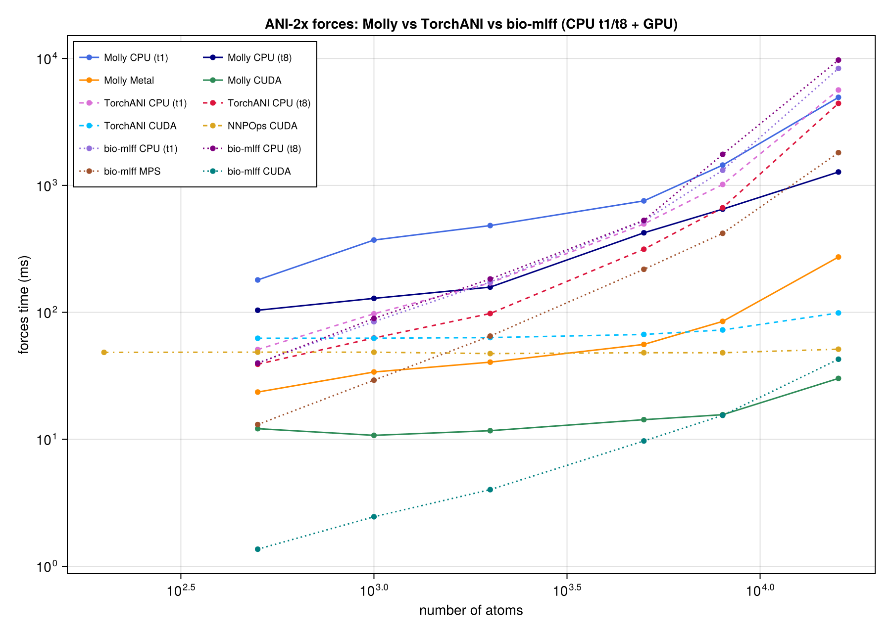
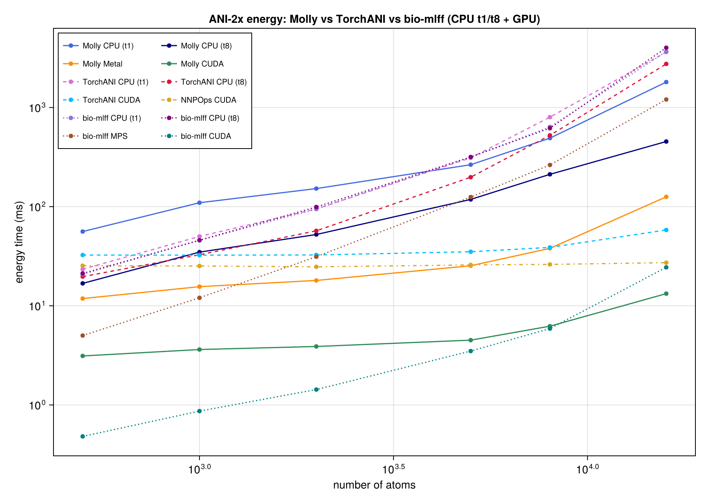
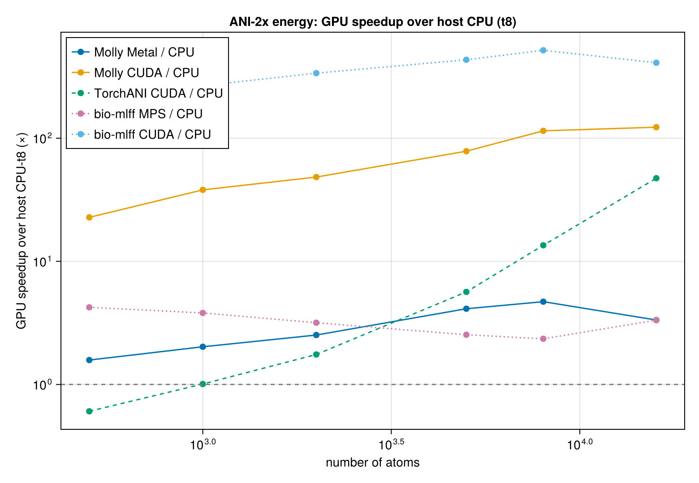
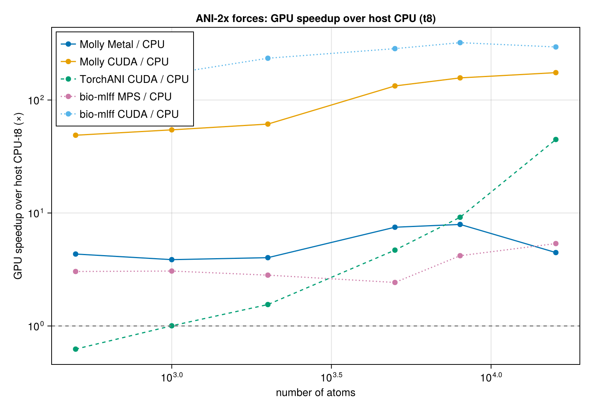

# ANI-2x potential — benchmarks

Consolidated performance and correctness results for Molly's native ANI-2x implementation.

**Setup:** Apple Silicon (12 cores: 8P + 4E), Julia 1.12, ANI-2x, Float32 AEVs. Systems are
slices of `data/6mrr_equil.pdb` with a `DistanceNeighborFinder` (cutoff `max(r_c_R,r_c_A)+1 = 6.1 Å`),
single ensemble member (`ensemble_idx=0`) unless noted. "CPU" numbers use `-t8` unless a thread
count is given. The **NVIDIA CUDA section** is measured on a separate RTX 5080 host (its CPU column
is that host, not Apple Silicon) — see that section.

**Reproduce:**
```
julia --project=<env> -t <N> benchmark/ani.jl              # CPU energy/forces, thread sweep, same-species
julia --project=<env> -t 8  benchmark/ani_gpu_compare.jl   # CPU vs Apple Metal energy   → results/ani_energy.json
julia --project=<env> -t 8  benchmark/ani_forces_gpu.jl    # CPU (analytic) vs Metal forces → results/ani_forces.json
julia --project=<env> -t 8  benchmark/ani_trajectory.jl    # 6mrr NVE trajectory (DCD)
julia --project=<env> -t 8  benchmark/run_ani_benchmarks.jl  # driver: energy+forces JSON + CairoMakie figures
julia --project=<env> -t 8  benchmark/ani_cuda_compare.jl  # CPU vs NVIDIA CUDA energy+forces → results/ani_cuda_*.json
python  test/torchani_reference.py --benchmark --device cpu   # TorchANI reference timing (or --device cuda)
```
The CUDA script needs `CUDA` + `cuDNN` added to the env (`cuDNN` is the trigger that makes
`Lux.gpu_device()` select CUDA). Set `ANI_SIZES` to pick the atom counts.
Env vars: `ANI_SIZES`, `ANI_FSIZES`, `ANI_CPU_SIZES`, `ANI_FORCES`, `ANI_ENSEMBLE` (`0`|`full`),
`ANI_SAMESPECIES`, `ANI_SKIP_PLOTS`; `ANI_TRAJ_{N,STEPS,DT_FS,LOG,TEMP}`.

---

## Correctness

- ANI tests pass (`test/ml_potentials.jl`) under `-t8` with `Lux, HDF5, KernelAbstractions` loaded.
- AEV vs TorchANI: ~1e-8 (N₂), 1.2e-7 (H₂O).
- Forces vs TorchANI: N₂ 4.3e-5 eV/Å, H₂O 2.4e-3 eV/Å (Float32 AEV limit).
- **Analytic forces** (CPU + Metal) match TorchANI's autograd forces and an independent
  finite-difference gradient to ~1e-6 eV/Å with ΣF ≈ 0 (Test 19); the backward AEV kernels match
  finite differences to ~1e-9. `forces(sys)` equals the direct `compute_ani_forces_ka` call.
- Threaded AEV is **bit-identical** to serial (Test 15). GPU kernels match the CPU path for
  Cubic and Triclinic boundaries (Test 18): 0.0 on the CPU backend, ≤1.5e-6 on Metal.
- 6mrr full protein (15,954 atoms): energy within <0.001% of the TorchANI reference (Test 13).

---

## Energy (CPU)

Single ensemble member, `potential_energy`.

### Full 6mrr (15,954 atoms)

| threads | 1       | 8         |
|---------|---------|-----------|
| time    | 1493 ms | **404 ms** |

The per-atom CSR consumption of the finder's neighbours made this **15.5×** faster than the
original all-pairs-rescan baseline (7219 ms serial). (An earlier pre-CSR thread sweep scaled
near-linearly to 8 threads: 1.9×/3.5×/5.3× at 2/4/8 threads.)

### Energy vs system size

| N atoms | 500  | 1000 | 2000 | 5000  | 8000  | 15,954 |
|---------|------|------|------|-------|-------|--------|
| CPU (t8)| 15.3 | 25.9 | 46.7 | 111.3 | 193.9 | 403.7  | ms

### Full 8-member ensemble

| system      | 1 thread | 8 threads |
|-------------|----------|-----------|
| 6mrr 1000   | 146 ms   | 71 ms     |
| 6mrr 15954  | 2103 ms  | 1051 ms   |

8 members cost only ~1.4× a single member — the AEV is computed once and only the per-element
NN runs 8× (species-batched).

---

## Forces — the single analytic path (CPU + Metal)

Forces come from a single analytic path: `AtomsCalculators.forces!` → `compute_ani_forces_ka`, an
analytic backward (forward AEV → manual NN VJP `∂E/∂G` → backward radial/angular AEV kernels
`∂E/∂r`, atomic equal-and-opposite scatter → `F = -∂E/∂r`). The same code runs on the **KA CPU
backend** and on **GPU** (Metal/CUDA), and is exact (~1e-6 eV/Å vs TorchANI's autograd forces and
vs finite differences, ΣF ≈ 0). It is also allocation-light and fast on CPU (8 members cost ~1.4×
a single member: one AEV forward/backward, NN VJP ×8).

### CPU vs Metal (single member; forces of 6mrr slices, finder `NeighborList`)

| N atoms | CPU analytic (t8) | Metal | Metal speedup |
|---------|-------------------|-------|---------------|
| 200     | 65.6 ms  | 139.9 ms | 0.5×       |
| 500     | 104.3 ms | 158.6 ms | 0.7×       |
| 1000    | 134.9 ms | 181.1 ms | 0.7×       |
| 2000    | 163.3 ms | 193.5 ms | 0.8×       |
| 4000    | 330.0 ms | 199.5 ms | **1.7×**   |
| 8000    | 671.5 ms | 213.1 ms | **3.2×**   |
| **15,954 (full 6mrr)** | 1288 ms | **394 ms** | **3.3×** |

CPU-analytic and Metal are comparable up to ~2000 atoms (both dominated by fixed overhead); above
the **~4000-atom crossover** Metal's near-flat cost wins, reaching **3.3×** the CPU at the full
6mrr protein. Metal forces for the whole 15,954-atom system take ~394 ms (~2.7× the on-device
energy, 146 ms — the forward-AEV + backward-AEV + NN-VJP overhead). Both Molly paths beat
TorchANI CPU forces at scale (see the head-to-head): at 16k, CPU-analytic is 3.0× and Metal 9.7×.



**Full ensemble.** The 8-member ensemble forces on Metal cost **~1.7×** a single member (256 vs
151 ms at 1000 atoms; 273 vs 155 at 2000): the AEV forward/backward runs once and only the NN VJP
repeats per member. (Energy is ~1.4× since it does the NN forward-only.)

**`forces(sys)` on a GPU system.** The single `forces!` path dispatches to the on-device kernels
for a Metal-backed `System` too — `forces(sys)` on a GPU system matches the CPU forces to ~1e-6
eV/Å. (Full on-device `simulate!` additionally needs Molly's GPU velocity-Verlet integrator, which
currently doesn't compile the unitful-SVector update on Metal; the `benchmark/ani_trajectory_metal.jl`
wrapper drives full-system Metal MD in the meantime.)

**Device-parameter cache.** The per-call upload of the NN weights to the GPU is cached per
potential + device (`ani_nn_dev_params`), so repeated calls (MD, benchmarks) reuse the on-device
weights. This is the small-N win: **Metal energy at 1000 atoms drops 77 → 56 ms (~27%)**; forces
improve less (their cost is dominated by the backward AEV kernels, not the NN upload).

## GPU (Apple Metal)

### AEV kernels (AEV only, ms)

| N atoms | neighbour-list | write-reduced | all-pairs |
|---------|----------------|---------------|-----------|
| 1000    | 31.1           | **7.5**       | 61.3      |
| 2000    | 32.0           | 7.9           | 95.7      |
| 4000    | 33.0           | 10.1          | O(N³)     |
| 8000    | 35.4           | 20.5          | O(N³)     |

The neighbour list turns the O(N²)/O(N³) all-pairs cost into O(N·k)/O(N·k²). The write-reduced
kernel (one workgroup per atom, shared-row `@atomic` accumulation, single coalesced write) is a
further 1.8–4.4× on top. Metal supports atomic float-add on threadgroup memory.

### End-to-end energy: CPU vs Metal

Metal times the on-device path (`compute_ani_energy_ka`: GPU AEV + on-device NN):

| N atoms      | CPU (t8) | Metal   | Metal speedup |
|--------------|----------|---------|---------------|
| 500          | 15.3 ms  | 62.7 ms | 0.24×         |
| 1000         | 25.9 ms  | 70.2 ms | 0.37×         |
| 2000         | 46.7 ms  | 75.5 ms | 0.62×         |
| 5000         | 111.3 ms | 78.5 ms | **1.42×**     |
| 8000         | 193.9 ms | 84.1 ms | **2.31×**     |
| 12000        | 297.9 ms | 101.4 ms| **2.94×**     |
| **15,954 (full 6mrr)** | 403.7 ms | **145.9 ms** | **2.77×** |

Below ~4000 atoms Metal is dominated by launch/transfer overhead (nearly flat ~63–84 ms), so the
threaded CPU wins. Above the ~4000-atom crossover Metal pulls ahead as the CPU grows linearly: at
the full 6mrr system (15,954 atoms) Metal is **2.8× the CPU** (146 vs 404 ms). (Forces, in
contrast, run on-GPU and cross over similarly — see above.)



---

## GPU (NVIDIA CUDA — RTX 5080)

Measured on an **RTX 5080** (16 GB, Blackwell sm_120, driver 610) via `benchmark/ani_cuda_compare.jl`.
The KA kernels are backend-portable, so this is the same analytic energy/forces path as Metal, just
`CuArray` + `CUDABackend()`. Julia 1.10.10, CUDA 13.3, single ensemble member. **The CPU column in
this section is the CUDA host (broadwell, `-t8`), not the Apple Silicon numbers used elsewhere**, so
read the GPU/CPU ratios as GPU-vs-its-own-host.

> `Lux.gpu_device()` needs `cuDNN` loaded to select CUDA — CUDA.jl alone leaves the NN weights on the
> CPU (on Metal, Metal.jl is the trigger). The benchmark script loads `cuDNN` for this reason.

**Correctness (CUDA vs CPU, 1000-atom slice):** energy relative diff **1.1e-10**; forces max abs diff
**2.7e-4 eV/Å**; ΣF ≈ (6e-6, −2e-5, −2e-5) — momentum conserved. Same analytic path as Metal.

Energy (single member, ms):

| N atoms | CPU (t8) | Molly CUDA | TorchANI CUDA | Molly / TorchANI |
|---------|----------|------------|---------------|------------------|
| 500     | 50.5   | 33.5  | 32.5 | 1.03× |
| 1000    | 113.8  | 37.6  | 32.4 | 1.16× |
| 2000    | 157.6  | 41.4  | 32.6 | 1.27× |
| 5000    | 428.1  | 42.8  | 35.1 | 1.22× |
| 8000    | 735.3  | 48.3  | 38.8 | 1.24× |
| **15,954** | 1572.4 | **73.7** | 58.2 | 1.27× |

Forces (single member, ms):

| N atoms | CPU (t8) | Molly CUDA | TorchANI CUDA | Molly / TorchANI |
|---------|----------|------------|---------------|------------------|
| 500     | 303.7  | 55.9  | 62.5 | **0.89×** |
| 1000    | 352.8  | 67.0  | 62.5 | 1.07× |
| 2000    | 453.7  | 78.2  | 63.3 | 1.24× |
| 5000    | 1303.4 | 99.2  | 67.0 | 1.48× |
| 8000    | 2113.9 | 130.1 | 72.6 | 1.79× |
| **15,954** | 4295.5 | **230.5** | 98.9 | 2.33× |

CUDA stays nearly flat while the host CPU grows linearly: at the full 6mrr protein Molly-CUDA is
**21× the host CPU on energy and 19× on forces**. Against TorchANI on the *same* GPU, Molly's native
Julia path is within **~1.25×** on energy at every size, and competitive on forces at small N (faster
at 500 atoms), widening to ~2.3× slower at 16k — a solid result for a first native implementation
against a mature, hand-optimised CUDA library.

The [energy](#energy-cpu) and [forces](#forces--the-single-analytic-path-cpu--metal) vs-N figures
above overlay all five series (Molly CPU/Metal/CUDA + TorchANI CPU/CUDA) on one chart each. NB Molly
CPU/Metal + TorchANI CPU are Apple Silicon while Molly CUDA + TorchANI CUDA are the RTX 5080 host, so
read the scaling shape rather than the absolute cross-machine level.

**GPU speedup over host CPU-t8, both backends in one view** (Metal's baseline is Apple Silicon,
CUDA's is the cyclops host — each line is GPU-vs-its-own-host, so compare the scaling shape):




---

## Cross-implementation comparison (Molly vs TorchANI vs bio-mlff)

All three native ANI-2x implementations, at matched CPU thread counts (t1 and t8) plus each GPU
backend, on 6mrr slices (min-of-N). **CPU / Metal / MPS = Apple M3; CUDA = RTX 5080** (cross-machine
on the GPU columns, so compare scaling shape, not absolute cross-device level). bio-mlff is Mit
Kotak's JAX implementation (CPU/MPS via `jax-mps`, CUDA via `jax[cuda12]`); timings exclude
neighbour-list construction for every implementation.

Energy (ms):

| N atoms | Molly t1 | Molly t8 | Molly Metal | Molly CUDA | TorchANI t1 | TorchANI t8 | TorchANI CUDA | bio-mlff t1 | bio-mlff t8 | bio-mlff MPS | bio-mlff CUDA |
|---------|----------|----------|-------------|------------|-------------|-------------|---------------|-------------|-------------|--------------|---------------|
| 1000    | 101.4 | 25.9  | 71.1  | 37.6 | 50.1  | 32.7  | 32.4 | 45.7  | 45.9  | 12.0  | 0.9  |
| 8000    | 409.1 | 186.3 | 86.8  | 48.3 | 799.4 | 524.1 | 38.8 | 636.5 | 618.6 | 263.3 | 5.9  |
| 15,954  | 1550  | 411.4 | 146.9 | 73.7 | 3629  | 2753  | 58.2 | 3663  | 4011  | 1205  | 24.4 |

Forces (ms):

| N atoms | Molly t1 | Molly t8 | Molly Metal | Molly CUDA | TorchANI t1 | TorchANI t8 | TorchANI CUDA | bio-mlff t1 | bio-mlff t8 | bio-mlff MPS | bio-mlff CUDA |
|---------|----------|----------|-------------|------------|-------------|-------------|---------------|-------------|-------------|--------------|---------------|
| 1000    | 389.5 | 137.9 | 179.9 | 67.0  | 97.4   | 62.8  | 62.5 | 84.4  | 89.5  | 29.2   | 2.4  |
| 8000    | 1452  | 662.1 | 215.9 | 130.1 | 1017   | 665.8 | 72.6 | 1315  | 1756  | 419.3  | 15.4 |
| 15,954  | 5049  | 1308  | 365.4 | 230.5 | 5641   | 4424  | 98.9 | 8343  | 9709  | 1810   | 42.7 |

**Threading** (the interesting part): Molly scales well with threads (energy ~3.5× t1→t8, forces
~3.8× at 16k); TorchANI scales modestly (~1.3× energy, ~1.3× forces); bio-mlff (JAX/XLA on CPU) is
essentially thread-insensitive (t1 ≈ t8 — XLA's CPU threadpool did not respond to
`intra_op_parallelism_threads`). **At t8, Molly is the fastest CPU implementation at scale** on both
energy (411 vs 2753 vs 4011 ms at 16k) and forces (1308 vs 4424 vs 9709). **On GPU**, bio-mlff's
XLA-fused CUDA path is the fastest overall, with TorchANI CUDA and Molly CUDA next; Molly Metal and
bio-mlff MPS give Apple-GPU coverage (Molly Metal is flattest — 147 ms energy / 365 ms forces at the
full protein). See the energy/forces vs-N figures above for all eleven series.

---

## Periodic boundaries (minimum image)

The CPU path and all three GPU kernels compute displacements via `Molly.vector(ci, coords[j],
boundary)`, so they apply the minimum-image convention. Both `CubicBoundary` and
`TriclinicBoundary` work (the boundary is only ever touched via `vector`). Verified identical to
the CPU reference on a periodic imaged-pair system (Test 18).

---

## NVE trajectory stability

`benchmark/ani_trajectory.jl` — VelocityVerlet NVE, real element masses, DCD via `TrajectoryWriter`.

| slice | steps | dt     | ms/step | energy drift `|ΔE|/|E0|` |
|-------|-------|--------|---------|--------------------------|
| 60 atoms  | 50   | 0.5 fs | 56.5    | 6.2e-7 |
| 300 atoms | 3000 | 0.5 fs | 502     | **1.5e-7** |

Energy is conserved to ~1e-7 over 3000 steps — the fast path is stable for real dynamics.

---

## Same-species diagnostic

All-carbon vs the real mixed-species system at 1000 atoms: `mixed / all-one-species ≈ 1.0`.
Species branching is essentially free — no need to sort atoms by species.

---

## TorchANI comparison

`test/torchani_reference.py --benchmark --device cpu --sizes 500,1000,2000,5000,8000` times
TorchANI energy+forces on the same slices (warmup + min-of-N with device sync), writing
`data/ani_reference/6mrr_timing_torchani_cpu.json` to join against the Molly numbers above.
Needs `pip install torchani==2.2.4 torch ase h5py`. This project is **Metal-only** on the GPU
side, and TorchANI cannot run on the Apple GPU anyway (see the next paragraph), so the *Apple* GPU
comparison is Molly Metal vs TorchANI CPU. A **direct GPU-vs-GPU head-to-head on the same NVIDIA
RTX 5080** (Molly CUDA vs TorchANI CUDA) is in the [NVIDIA CUDA section](#gpu-nvidia-cuda--rtx-5080)
above: Molly is within ~1.25× of TorchANI on energy and ~0.9–2.3× on forces across 500–15,954 atoms.

Measured on this machine (TorchANI 2.2.4, `--samples 5`). **TorchANI has no usable Apple-GPU
path**: its forward needs float64 (which PyTorch-MPS cannot store) and the angular AEV uses a 5-D
`MPSNDArrayScan` that MetalPerformanceShaders does not implement, so it only limps along on MPS via
CPU fallback (slower than plain CPU, not a real GPU number). We therefore do not benchmark TorchANI
on MPS; the GPU comparison is Molly Metal vs TorchANI CPU. On the Apple GPU specifically, only Molly
runs the whole ANI-2x model natively.

Energy (single member):

| N atoms | Molly CPU | Molly Metal | TorchANI CPU | Molly Metal vs TorchANI CPU |
|---------|-----------|-------------|--------------|-----------------------------|
| 1000    | 25.9 ms   | 70.2 ms     | 27.2 ms      | 0.4×          |
| 8000    | 193.9 ms  | 84.1 ms     | 480.1 ms     | **5.7×**      |
| 15,954  | 403.7 ms  | 145.9 ms    | 2893 ms      | **20×**       |

Forces (single member):

| N atoms | Molly CPU (analytic) | Molly Metal | TorchANI CPU | Molly Metal vs TorchANI CPU |
|---------|----------------------|-------------|--------------|-----------------------------|
| 1000    | 134.9 ms | 181.1 ms    | 51.9 ms      | 0.29×         |
| 2000    | 163.3 ms | 193.5 ms    | 90.6 ms      | 0.47×         |
| 15,954  | 1288 ms  | 394 ms      | 3823 ms      | **9.7×**      |

**Takeaway:** TorchANI's heavily-optimised CPU kernels win at small N (its C++/vectorised AEV
beats Molly there), but Molly scales far better: on the **full 6mrr protein** Molly's on-device
energy is **20×** faster than TorchANI CPU and forces are **9.7×** faster. Molly CPU energy is
already competitive at 1k (25.9 vs 27.2 ms) and ~7× faster at 16k (404 vs 2893 ms); Molly's CPU
analytic forces are also 3× faster than TorchANI CPU at the full protein (1288 vs 3823 ms). On the
Apple GPU specifically, TorchANI has no usable path, so Molly's native Metal implementation stands
alone.

---

## Gaps & caveats

- **TorchANI head-to-head** uses `test/torchani_reference.py --benchmark --device cpu` (needs a
  `pip install`); the compare-report/plots then join the reference JSON automatically. CPU-to-CPU
  is the definitive comparison; TorchANI has no usable Apple-GPU path (see above). The **NVIDIA
  GPU-vs-GPU** comparison (Molly CUDA vs TorchANI CUDA on the same RTX 5080) is now measured — see
  the CUDA section. Both GPU sections are single-machine snapshots, not cross-machine claims.
- **Metal forces** are timed for a **single ensemble member**. The full 8-member ensemble reuses
  one AEV forward/backward and runs only the NN VJP 8× (species-batched), so expect ~1.4× like
  energy — not yet measured on Metal.
- **CPU analytic forces** are measured up to the full protein (1288 ms at 15,954 atoms); above the
  ~4000-atom crossover the Metal path is faster, which is the regime it is meant for.
- **Laptop variance**: numbers are min-of-N over repeats; the JSON records the run-to-run IQR
  (typically ≤3 ms on Metal). Thermal state can shift absolute CPU numbers a few percent.

---

## Scripts

| script | what it measures |
|--------|------------------|
| `benchmark/ani.jl`               | CPU energy/forces, thread sweep, same-species diagnostic |
| `benchmark/ani_gpu_compare.jl`   | Molly energy: CPU vs Apple Metal → `results/ani_energy.json` |
| `benchmark/ani_forces_gpu.jl`    | Molly forces: CPU (analytic) vs Metal → `results/ani_forces.json` |
| `benchmark/ani_cuda_compare.jl`  | Molly energy+forces: CPU vs NVIDIA CUDA → `results/ani_cuda_*.json` |
| `benchmark/ani_trajectory.jl`    | 6mrr NVE trajectory + energy drift, DCD output |
| `benchmark/run_ani_benchmarks.jl`| driver: energy + forces JSON, then CairoMakie figures |
| `benchmark/ani_plots.jl`         | CairoMakie figures from `results/*.json` → `images/*.png` |
| `benchmark/ani_bench_common.jl`  | shared `bench()` harness (repeats + variance, JSON, run header) |
| `test/torchani_reference.py --benchmark` | TorchANI energy/forces timing |

Outputs land in `benchmark/results/*.json` (machine-readable, with an env/version header) and
`benchmark/images/*.png` (figures). The TorchANI head-to-head columns/series fill in once
`test/torchani_reference.py --benchmark --device cpu` has written its reference JSON.
