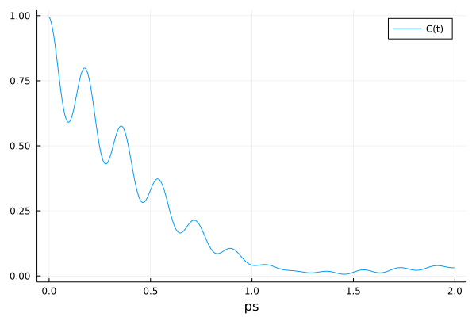

# Molly documentation

This documentation will first introduce the main features of the package with some examples, then will give details on each component of a simulation.
There are further examples in the [Molly examples](@ref) section.
For more information on specific types or functions, see the [Molly API](@ref) section or call `?function_name` in Julia.
The [Differentiable simulation with Molly](@ref) section describes taking gradients through simulations.

The package takes a modular approach to molecular simulation.
To run a simulation you create a [`System`](@ref) object and call [`simulate!`](@ref) on it.
The different components of the system and simulation can be used as defined by the package, or you can define your own versions.
An important principle of the package is that your custom components, particularly force and potential energy functions, should be easy to define and just as performant as the built-in versions.

## Simulation basics

Let's look at the simulation of a fluid acting under the [Lennard-Jones](https://en.wikipedia.org/wiki/Lennard-Jones_potential) potential to start with.
First, we'll need some atoms with the relevant parameters defined.
```julia
using Molly

n_atoms = 100
atom_mass = 10.0u"g/mol"
atoms = [Atom(mass=atom_mass, σ=0.3u"nm", ϵ=0.2u"kJ * mol^-1") for i in 1:n_atoms]
```
See the [Unitful.jl](https://github.com/PainterQubits/Unitful.jl) documentation for more information on the unit annotations.
Molly re-exports Unitful.jl, [StaticArrays.jl](https://github.com/JuliaArrays/StaticArrays.jl) and [AtomsBase.jl](https://github.com/JuliaMolSim/AtomsBase.jl) since they are often required to run simulations.
You can use your own atom types in Molly, provided that the [`mass`](@ref) function is defined and any fields required by the interactions are present.
Next, we'll need some starting coordinates and velocities.
```julia
boundary = CubicBoundary(2.0u"nm") # Periodic boundary conditions with a 2 nm cube
coords = place_atoms(n_atoms, boundary; min_dist=0.3u"nm") # Random placement without clashing

temp = 100.0u"K"
velocities = [random_velocity(atom_mass, temp) for i in 1:n_atoms]
```
We store the coordinates and velocities as [static arrays](https://github.com/JuliaArrays/StaticArrays.jl) for performance.
They can be of 2 or 3 dimensions and of any number type, e.g. `Float64` or `Float32`.
Setting individual dimensions in a [`CubicBoundary`](@ref) to `Inf * u"nm"` makes the simulation have no boundary in that dimension.
You can also use a [`TriclinicBoundary`](@ref).
Simulations in 2 dimensions should use a [`RectangularBoundary`](@ref).

The [`vector`](@ref) function calculates the vector from one coordinate to another accounting for periodic boundary conditions by using the minimum image convention:
```julia
vector(coords[1], coords[2], boundary)
```
```
3-element SVector{3, Quantity{Float64, 𝐋, Unitful.FreeUnits{(nm,), 𝐋, nothing}}} with indices SOneTo(3):
 -0.8619698558762985 nm
 -0.9475020064484192 nm
  0.8359421827141784 nm
```

Now we can define our pairwise interactions, i.e. those between most or all atom pairs.
Because we have defined the relevant parameters for the atoms, we can use the built-in [`LennardJones`](@ref) type.
```julia
pairwise_inters = (LennardJones(),) # Don't forget the trailing comma!
```
Finally, we can define the system and run the simulation.
We use an [`AndersenThermostat`](@ref) to keep a constant temperature, and we log the temperature and coordinates every 10 steps.
Periodic boundary conditions are automatically used with the cubic box we defined earlier.
```julia
sys = System(
    atoms=atoms,
    coords=coords,
    boundary=boundary,
    velocities=velocities,
    pairwise_inters=pairwise_inters,
    loggers=(
        temp=TemperatureLogger(10),
        coords=CoordinateLogger(10),
    ),
)

simulator = VelocityVerlet(
    dt=0.002u"ps",
    coupling=AndersenThermostat(temp, 1.0u"ps"),
)

simulate!(sys, simulator, 1_000)
```
`atoms`, `coords` and `boundary` are the minimum required properties to define a [`System`](@ref), though you would generally want to add interactions to a [`System`](@ref) to do something useful with it.
The `data` keyword argument can give arbitrary data to the [`System`](@ref) that can be accessed with `sys.data`, for example metadata or properties to be used with a custom simulator.
[`System`](@ref) implements the `AbstractSystem` [interface from AtomsBase.jl](https://juliamolsim.github.io/AtomsBase.jl/stable).
Various functions can be used on a [`System`](@ref):
```julia
potential_energy(sys) # -40.91077282719628 kJ mol^-1
kinetic_energy(sys)   # 119.47758705080862 kJ mol^-1
total_energy(sys)     #  78.56681422361234 kJ mol^-1

forces(sys)
accelerations(sys)

masses(sys)
temperature(sys) # 96.76667184796673 K
random_velocities(sys, 300.0u"K")

float_type(sys) # Float64
is_on_gpu(sys)  # false

# AtomsBase.jl interface
atomic_mass(sys, 5) # 10.0 u
position(sys, 10)

# Access properties
sys.atoms
sys.coords
sys.boundary
sys.velocities
sys.topology
sys.pairwise_inters
sys.constraints
sys.neighbor_finder
sys.loggers

# For certain systems
virial(sys)
pressure(sys)

# Define a new system with certain properties changed
System(sys; coords=(sys.coords .* 0.5))
```

By default the simulation is run in parallel on the [number of threads](https://docs.julialang.org/en/v1/manual/parallel-computing/#man-multithreading-1) available to Julia, but this behaviour can be changed by giving the keyword argument `n_threads` to [`simulate!`](@ref).
For example, `n_threads=1` uses no parallelization.

The values stored by the loggers can be accessed using `values`, e.g. `values(sys.loggers.coords)`.
An animation of the stored coordinates can be saved by using [`visualize`](@ref), which is available when [GLMakie.jl](https://github.com/JuliaPlots/Makie.jl) is imported.
```julia
using GLMakie
visualize(sys.loggers.coords, boundary, "sim_lj.mp4")
```


## GPU acceleration

To run simulations on the GPU you will need to have a CUDA-compatible device.
[CUDA.jl](https://github.com/JuliaGPU/CUDA.jl) is used to run on the device.
Simulation setup is similar to above, but with the coordinates, velocities and atoms moved to the GPU.
This example also shows setting up a simulation to run with `Float32`, which gives better performance on GPUs.
Of course, you will need to determine whether this level of numerical accuracy is appropriate in your case.
```julia
using Molly
using CUDA

n_atoms = 100
atom_mass = 10.0f0u"g/mol"
boundary = CubicBoundary(2.0f0u"nm")
temp = 100.0f0u"K"
atoms = CuArray([Atom(mass=atom_mass, σ=0.3f0u"nm", ϵ=0.2f0u"kJ * mol^-1") for i in 1:n_atoms])
coords = CuArray(place_atoms(n_atoms, boundary; min_dist=0.3u"nm"))
velocities = CuArray([random_velocity(atom_mass, temp) for i in 1:n_atoms])
simulator = VelocityVerlet(dt=0.002f0u"ps")

sys = System(
    atoms=atoms,
    coords=coords,
    boundary=boundary,
    velocities=velocities,
    pairwise_inters=(LennardJones(),),
    loggers=(
        temp=TemperatureLogger(typeof(1.0f0u"K"), 10),
        coords=CoordinateLogger(typeof(1.0f0u"nm"), 10),
    ),
)

simulate!(deepcopy(sys), simulator, 20) # Compile function
simulate!(sys, simulator, 1_000)
```
The device to run on can be changed with `device!`, e.g. `device!(1)`.
The GPU code path is currently designed to be compatible with differentiable simulation and runs slower than related software, but this is an active area of development.
Nonetheless, GPU performance is significantly better than CPU performance and is good enough for many applications.

The number of GPU threads used for the GPU kernels can be tuned with the environmental variables `MOLLY_GPUNTHREADS_PAIRWISE`, `MOLLY_GPUNTHREADS_SPECIFIC`, `MOLLY_GPUNTHREADS_DISTANCENF` and `MOLLY_GPUNTHREADS_IMPLICIT`.
In general these should only be changed if GPU memory errors occur on smaller GPUs.

## Simulating diatomic molecules

If we want to define specific interactions between atoms, for example bonds, we can do this as well.
Using the same definitions as the first example, let's set up the coordinates so that paired atoms are 1 Å apart.
```julia
atoms = [Atom(mass=atom_mass, σ=0.3u"nm", ϵ=0.2u"kJ * mol^-1") for i in 1:n_atoms]

coords = place_atoms(n_atoms ÷ 2, boundary; min_dist=0.3u"nm")
for i in 1:length(coords)
    push!(coords, coords[i] .+ [0.1, 0.0, 0.0]u"nm")
end

velocities = [random_velocity(atom_mass, temp) for i in 1:n_atoms]
```
We could have used [`place_diatomics`](@ref) instead here.
Now we can use the built-in interaction list and bond types to place harmonic bonds between paired atoms.
```julia
bonds = InteractionList2Atoms(
    collect(1:(n_atoms ÷ 2)),           # First atom indices
    collect((1 + n_atoms ÷ 2):n_atoms), # Second atom indices
    [HarmonicBond(k=300_000.0u"kJ * mol^-1 * nm^-2", r0=0.1u"nm") for i in 1:(n_atoms ÷ 2)],
)

specific_inter_lists = (bonds,)
```
This time we are also going to use a neighbor list to speed up the Lennard-Jones calculation since we don't care about interactions beyond a certain distance.
We can use the built-in [`DistanceNeighborFinder`](@ref).
The arguments are a 2D array of eligible interacting pairs, the number of steps between each update and the distance cutoff to be classed as a neighbor.
Since the neighbor finder is run every 10 steps we should also use a distance cutoff for the neighbor list that is larger than the cutoff for the interaction.
```julia
# All pairs apart from bonded pairs are eligible for non-bonded interactions
eligible = trues(n_atoms, n_atoms)
for i in 1:(n_atoms ÷ 2)
    eligible[i, i + (n_atoms ÷ 2)] = false
    eligible[i + (n_atoms ÷ 2), i] = false
end

neighbor_finder = DistanceNeighborFinder(
    eligible=eligible,
    n_steps=10,
    dist_cutoff=1.5u"nm",
)

cutoff = DistanceCutoff(1.2u"nm")
pairwise_inters = (LennardJones(use_neighbors=true, cutoff=cutoff),)
```
Now we can simulate as before.
```julia
sys = System(
    atoms=atoms,
    coords=coords,
    boundary=boundary,
    velocities=velocities,
    pairwise_inters=pairwise_inters,
    specific_inter_lists=specific_inter_lists,
    neighbor_finder=neighbor_finder,
    loggers=(
        temp=TemperatureLogger(10),
        coords=CoordinateLogger(10),
    ),
)

simulator = VelocityVerlet(
    dt=0.002u"ps",
    coupling=AndersenThermostat(temp, 1.0u"ps"),
)
simulate!(sys, simulator, 1_000)
```
This time when we view the trajectory we can add lines to show the bonds.
```julia
visualize(
    sys.loggers.coords,
    boundary,
    "sim_diatomic.mp4";
    connections=[(i, i + (n_atoms ÷ 2)) for i in 1:(n_atoms ÷ 2)],
)
```

The neighbors can be found using `find_neighbors(sys)`, which returns a [`NeighborList`](@ref).
When using a neighbor finder, functions such as [`forces`](@ref) and [`potential_energy`](@ref) require the neighbors to be passed as a second argument, e.g. `forces(sys, find_neighbors(sys))`.

## Simulating gravity

Molly is geared primarily to molecular simulation, but can also be used to simulate other physical systems.
Let's set up a gravitational simulation.
This example also shows a 2D simulation and no specified units.
```julia
atoms = [Atom(mass=1.0f0), Atom(mass=1.0f0)]
coords = [SVector(0.3f0, 0.5f0), SVector(0.7f0, 0.5f0)]
velocities = [SVector(0.0f0, 1.0f0), SVector(0.0f0, -1.0f0)]
pairwise_inters = (Gravity(use_neighbors=false, G=1.5f0),)
simulator = VelocityVerlet(dt=0.002f0)
boundary = RectangularBoundary(1.0f0)

sys = System(
    atoms=atoms,
    coords=coords,
    boundary=boundary,
    velocities=velocities,
    pairwise_inters=pairwise_inters,
    loggers=(coords=CoordinateLogger(Float32, 10; dims=2),),
    force_units=NoUnits,
    energy_units=NoUnits,
)

simulate!(sys, simulator, 2_000)
```
When we view the simulation we can use some extra options:
```julia
visualize(
    sys.loggers.coords,
    boundary,
    "sim_gravity.mp4";
    trails=4,
    framerate=15,
    color=[:orange, :lightgreen],
)
```


## Simulating a protein

The recommended way to run a macromolecular simulation is to read in a force field in [OpenMM XML format](http://docs.openmm.org/latest/userguide/application/05_creating_ffs.html) to a [`MolecularForceField`](@ref) and then read in a coordinate file in a format [supported by Chemfiles.jl](https://chemfiles.org/chemfiles/latest/formats.html).
Files for common force fields can be found at [OpenMM](https://github.com/openmm/openmm) and [OpenMM force fields](https://github.com/openmm/openmmforcefields).
This sets up a system in the same data structures as above and that is simulated in the same way.
Here we carry out an energy minimization, simulate with a Langevin integrator in the NPT ensemble and use a [`StructureWriter`](@ref) to write the trajectory as a PDB file.
```julia
data_dir = joinpath(dirname(pathof(Molly)), "..", "data")
ff = MolecularForceField(
    joinpath(data_dir, "force_fields", "ff99SBildn.xml"),
    joinpath(data_dir, "force_fields", "tip3p_standard.xml"),
    joinpath(data_dir, "force_fields", "his.xml"),
)

sys = System(
    joinpath(data_dir, "6mrr_equil.pdb"),
    ff;
    loggers=(
        energy=TotalEnergyLogger(10),
        writer=StructureWriter(10, "traj_6mrr_1ps.pdb", ["HOH"]),
    ),
    gpu=false,
)

minimizer = SteepestDescentMinimizer()
simulate!(sys, minimizer)

temp = 298.0u"K"
random_velocities!(sys, temp)
simulator = Langevin(
    dt=0.001u"ps",
    temperature=temp,
    friction=1.0u"ps^-1",
    coupling=MonteCarloBarostat(1.0u"bar", temp, sys.boundary),
)

simulate!(sys, simulator, 5_000)
```
The OpenMM setup procedure is tested against OpenMM in terms of matching forces and energies.
However it is not thoroughly tested with respect to ligands or special residues and requires that atom names exactly match residue templates.
By default, terminal residues are renamed to match the appropriate templates.
For example, the first (N-terminal) residue could be changed from "MET" to "NMET".
This can be turned off by giving `rename_terminal_res=false` to [`System`](@ref) if the residue names in the input file are appropriate.
Currently atom classes are not supported, only atom types.
Residue patches, virtual sites, file includes and any force types other than `HarmonicBondForce`/`HarmonicAngleForce`/`PeriodicTorsionForce`/`NonbondedForce` are currently ignored.

!!! tip "Obtaining compatible structure files"

    Future work will increase the features and robustness when reading in structure files. In the mean time, the following tips may help you to read in a file correctly and without errors:

    * Make sure there are no missing residues or heavy atoms. Tools such as [MODELLER](https://salilab.org/modeller) and [SCWRL4](http://dunbrack.fccc.edu/lab/scwrl) can fix these issues.
    * Remove the hydrogen atoms and add them back [using OpenMM](http://docs.openmm.org/latest/userguide/application/03_model_building_editing.html#adding-hydrogens), which will ensure they have atom names compatible with the OpenMM force field files.
    * Make sure that all residue names match the corresponding residue template name and that all atom names match the appropriate atom in the residue template.
    * Non-standard residues also require `CONECT` records for Chemfiles to assign bonds correctly, see for example [a compatible alanine dipeptide file](https://github.com/noeblassel/SINEQSummerSchool2023/blob/main/notebooks/dipeptide_nowater.pdb).

    Some PDB files that read in fine can be found [here](https://github.com/greener-group/GB99dms/tree/main/structures/training/conf_1).

To run on the GPU, set `gpu=true`.
You can use an implicit solvent method by giving the `implicit_solvent` keyword argument to [`System`](@ref).
The options are `"obc1"`, `"obc2"` and `"gbn2"`, corresponding to the Onufriev-Bashford-Case GBSA model with parameter set I or II and the GB-Neck2 model.
Other options include overriding the boundary dimensions in the file (`boundary`) and modifying the non-bonded interaction and neighbor list cutoff distances (`dist_cutoff` and `dist_neighbors`).

Molly also has a rudimentary parser of [Gromacs](http://www.gromacs.org) topology and coordinate files. For example:
```julia
sys = System(
    joinpath(dirname(pathof(Molly)), "..", "data", "5XER", "gmx_coords.gro"),
    joinpath(dirname(pathof(Molly)), "..", "data", "5XER", "gmx_top_ff.top");
    loggers=(
        temp=TemperatureLogger(10),
        writer=StructureWriter(10, "traj_5XER_1ps.pdb"),
    ),
)

temp = 298.0u"K"
random_velocities!(sys, temp)
simulator = Verlet(
    dt=0.0002u"ps",
    coupling=BerendsenThermostat(temp, 1.0u"ps"),
)

simulate!(sys, simulator, 5_000)
```
Harmonic position restraints can be added to a [`System`](@ref) for equilibration using [`add_position_restraints`](@ref):
```julia
sys_res = add_position_restraints(
    sys,
    100_000.0u"kJ * mol^-1 * nm^-2";
    atom_selector=is_heavy_atom,
)
```

The Gromacs setup procedure should be considered experimental.
Currently Ewald summation methods, constraint algorithms and high GPU performance are missing from the package, so Molly is not suitable for production simulations of biomolecules.
Stay tuned for developments in this area.

## Enhanced sampling

Molly has the [`ReplicaSystem`](@ref) struct and simulators such as [`TemperatureREMD`](@ref) to carry out replica exchange molecular dynamics (REMD).
On CPU these are run in parallel by dividing up the number of available threads.
For example, to run temperature REMD on a protein with 4 replicas and attempt exchanges every 1 ps:
```julia
using Statistics

data_dir = joinpath(dirname(pathof(Molly)), "..", "data")
ff = MolecularForceField(
    joinpath(data_dir, "force_fields", "ff99SBildn.xml"),
    joinpath(data_dir, "force_fields", "tip3p_standard.xml"),
    joinpath(data_dir, "force_fields", "his.xml"),
)

sys = System(joinpath(data_dir, "6mrr_equil.pdb"), ff)

minimizer = SteepestDescentMinimizer()
simulate!(sys, minimizer)

n_replicas = 4

rep_sys = ReplicaSystem(
    atoms=sys.atoms,
    replica_coords=[copy(sys.coords) for _ in 1:n_replicas],
    boundary=sys.boundary,
    n_replicas=n_replicas,
    atoms_data=sys.atoms_data,
    pairwise_inters=sys.pairwise_inters,
    specific_inter_lists=sys.specific_inter_lists,
    general_inters=sys.general_inters,
    neighbor_finder=sys.neighbor_finder,
    replica_loggers=[(temp=TemperatureLogger(10),) for _ in 1:n_replicas],
)

temps = [240.0u"K", 280.0u"K", 320.0u"K", 360.0u"K"]
dt = 0.0005u"ps"
simulators = [Langevin(dt=dt, temperature=temp, friction=1.0u"ps^-1") for temp in temps]

sim = TemperatureREMD(
    dt=dt,
    temperatures=temps,
    simulators=simulators,
    exchange_time=1.0u"ps",
)

simulate!(rep_sys, sim, 40_000; assign_velocities=true)

println(rep_sys.exchange_logger.n_attempts)
# 30

for i in 1:n_replicas
    final_temps = values(rep_sys.replicas[i].loggers.temp)[(end - 10):end]
    println(mean(final_temps))
end
# 240.1691457033836 K
# 281.3783250460198 K
# 320.44985840482974 K
# 357.710520769689 K
```

## Monte Carlo sampling

Molly has the [`MetropolisMonteCarlo`](@ref) simulator to carry out Monte Carlo sampling with Metropolis selection rates.
For example, to perform simulated annealing on charged particles to form a crystal lattice:
```julia
n_atoms = 100
atoms = [Atom(mass=10.0u"g/mol", charge=1.0) for i in 1:n_atoms]
boundary = RectangularBoundary(4.0u"nm")

coords = place_atoms(n_atoms, boundary; min_dist=0.2u"nm")
pairwise_inters = (Coulomb(),)

temperatures = [1198.0, 798.0, 398.0, 198.0, 98.0, 8.0]u"K"
sys = System(
    atoms=atoms,
    coords=coords,
    boundary=boundary,
    pairwise_inters=pairwise_inters,
    loggers=(
        coords=CoordinateLogger(n_atoms, dims=n_dimensions(boundary)),
        montecarlo=MonteCarloLogger(),
    ),
)

trial_args = Dict(:shift_size => 0.1u"nm")
for t in temperatures
    sim = MetropolisMonteCarlo(; 
        temperature=t,
        trial_moves=random_uniform_translation!,
        trial_args=trial_args,
    )

    simulate!(sys, sim, 10_000)
end

println(sys.loggers.montecarlo.n_accept)
# 15234

visualize(sys.loggers.coords, boundary, "sim_montecarlo.gif")
```


`trial_moves` should be a function that takes a [`System`](@ref) as its argument and optional keyword arguments `trial_args`.
It should modify the coordinates as appropriate, accounting for any boundary conditions.
[`random_uniform_translation!`](@ref) and [`random_normal_translation!`](@ref) are provided as common trial move functions.
[`MonteCarloLogger`](@ref) records various properties throughout the simulation.

## Units

Molly is fairly opinionated about using [Unitful.jl](https://github.com/PainterQubits/Unitful.jl) units as shown above: you don't have to use them, but it is better if you do.
Any consistent unit scheme can be used, or no units at all.
Molly is most strict about the mixture of molar and non-molar types.
For example, if your energy and force units are molar then your atom masses should be `g/mol` or similar.
If you are not using units then no quantities can have Unitful annotations and you are responsible for ensuring a consistent unit system.
Whilst you occasionally may run into friction with dimension mismatches, using units has the major advantages of catching whole classes of errors and letting you physically interpret the numbers in your system.
The performance overhead of using units is minimal.
Units are not currently compatible with differentiable simulations.

All your interaction types need to return the same units of force and energy or the simulation will not run.
By default these are `kJ * mol^-1 * nm^-1` for force and `kJ * mol^-1` for energy, but this can be changed using the `force_units` and `energy_units` arguments to [`System`](@ref) and some interactions.
These arguments should be `NoUnits` if you are not using units.
If you need to strip units for downstream analysis, use the `ustrip` or [`ustrip_vec`](@ref) functions.
It should be noted that charges are stored as dimensionless, i.e. 1.0 represents an atomic charge of +1.

## Atom types

Molly has a built-in [`Atom`](@ref) type with a few properties commonly used in molecular simulation defined.
The [`mass`](@ref) and [`charge`](@ref) functions can be used on an [`Atom`](@ref).
Custom atom types can be used just as effectively provided that either the [`mass`](@ref) function is defined on the type or the type has a `mass` field (the fallback for the [`mass`](@ref) function).
The type should also have all fields required by any interactions.
The list of atoms passed to the [`System`](@ref) constructor should be concretely typed.

Custom atom types should generally be bits types, i.e. `isbitstype(MyAtom)` should be `true`, to work on the GPU.
Additional non-bits type data for the atoms that is not directly used when calculating the interactions can be passed to the [`System`](@ref) constructor with the `atoms_data` keyword argument.
For example the built-in [`AtomData`](@ref) type contains fields such as the atom name that are useful when writing trajectories.

## Forces and energies

Interactions define how different parts of the system interact.
The force on each particle in the system is derived from the potential corresponding to the interaction.
```math
\vec{F}_i = -\sum_j \frac{dV_{ij}(r_{ij})}{dr_{ij}}\frac{\vec{r}_{ij}}{r_{ij}}
```

In Molly there are three types of interactions:
- [`PairwiseInteraction`](@ref)s are present between all or most atom pairs, and account for example for non-bonded terms in molecular mechanics force fields.
- [`SpecificInteraction`](@ref)s are present between specific atoms, and account for example for bonded terms in molecular mechanics force fields.
- General interactions are a free-form interaction type that can access the whole system and outputs forces for all atoms. This is useful for neural network potentials, implicit solvent models and other cases that require maximum flexibility. General interactions should be compatible with the [AtomsCalculators.jl](https://github.com/JuliaMolSim/AtomsCalculators.jl) interface.

The available pairwise interactions are:
- [`LennardJones`](@ref)
- [`LennardJonesSoftCore`](@ref)
- [`SoftSphere`](@ref)
- [`Mie`](@ref)
- [`Buckingham`](@ref)
- [`Coulomb`](@ref)
- [`CoulombSoftCore`](@ref)
- [`CoulombReactionField`](@ref)
- [`Gravity`](@ref)

The available specific interactions are:
- [`HarmonicPositionRestraint`](@ref) - 1 atom
- [`HarmonicBond`](@ref) - 2 atoms
- [`MorseBond`](@ref) - 2 atoms
- [`FENEBond`](@ref) - 2 atoms
- [`HarmonicAngle`](@ref) - 3 atoms
- [`CosineAngle`](@ref) - 3 atoms
- [`PeriodicTorsion`](@ref) - 4 atoms
- [`RBTorsion`](@ref) - 4 atoms

The available general interactions are:
- [`ImplicitSolventOBC`](@ref)
- [`ImplicitSolventGBN2`](@ref)
- [`MullerBrown`](@ref)

### Pairwise interactions

To define your own [`PairwiseInteraction`](@ref), first define the `struct`:
```julia
struct MyPairwiseInter <: PairwiseInteraction
    # Any properties, e.g. constants for the interaction or cutoff parameters
end
```
You can also define a [`use_neighbors`](@ref) method, which determines whether the neighbor list is used to omit distant atoms (`true`) or whether all atom pairs are always considered (`false`):
```julia
Molly.use_neighbors(inter::MyPairwiseInter) = true
```
This is `false` by default.
If it is `true`, you must specify a neighbor finder when setting up the [`System`](@ref).
For built-in interactions this function accesses the `use_neighbors` field of the struct.
To work on the GPU the `struct` should be a bits type, i.e. `isbitstype(MyPairwiseInter)` should be `true`.

Next, you need to define a method for the [`force`](@ref) function acting between a pair of atoms.
This has a set series of arguments:
```julia
function Molly.force(inter::MyPairwiseInter,
                        vec_ij,
                        coord_i,
                        coord_j,
                        atom_i,
                        atom_j,
                        boundary)
    # Replace this with your force calculation
    # A positive force causes the atoms to move apart
    f = 0.0

    # Obtain a vector for the force
    fdr = f * normalize(vec_ij)
    return fdr
end
```
`vec_ij` is the vector between the closest images of atoms `i` and `j` accounting for the periodic boundary conditions.
Atom properties can be accessed, e.g. `atom_i.σ`.
Typically the force function is where most computation time is spent during the simulation, so consider optimising this function if you want high performance.
One nice feature of Molly is that this function will work on both the CPU and the GPU.

An optional final argument `special` is a `Bool` determining whether the atom pair interaction should be treated as special.
This is specified during neighbor finder construction.
When simulating molecules, for example, non-bonded interactions for atoms in a 1-4 bonding arrangement (i-x-x-j) are often weighted by a factor such as 0.5.
For interactions where this is relevant, `special` can be used to apply this weighting in the interaction.
It can have a variety of uses depending on the context, for example if you have multiple interactions and want to exclude certain atom pairs from one of the interactions only.

To use your custom interaction in a simulation, add it to the list of pairwise interactions:
```julia
pairwise_inters = (MyPairwiseInter(),)
```
Then create a [`System`](@ref) and simulate as above.
Note that you can also use a named tuple instead of a tuple if you want to access interactions by name:
```julia
pairwise_inters = (MyPairwiseInter=MyPairwiseInter(),)
```
For performance reasons it is best to [avoid containers with abstract type parameters](https://docs.julialang.org/en/v1/manual/performance-tips/#man-performance-abstract-container-1), such as `Vector{PairwiseInteraction}`.

If you wish to calculate potential energies or log the energy throughout a simulation, you will need to define a method for the [`potential_energy`](@ref) function.
This has the same arguments as [`force`](@ref) and should return a single value corresponding to the potential energy.

### Specific interactions

To define your own [`SpecificInteraction`](@ref), first define the `struct`:
```julia
struct MySpecificInter <: SpecificInteraction
    # Properties, e.g. a bond distance corresponding to the energy minimum
end
```
Next, you need to define a method for the [`force`](@ref) function.
The form of this will depend on whether the interaction involves 1, 2, 3 or 4 atoms.
For example in the 2 atom case:
```julia
function Molly.force(inter::MySpecificInter, coords_i, coords_j, boundary)
    dr = vector(coords_i, coords_j, boundary)

    # Replace this with your force calculation
    # A positive force causes the atoms to move apart
    f = 0.0

    fdr = f * normalize(dr)
    return SpecificForce2Atoms(-fdr, fdr)
end
```
The 3 atom case would define `Molly.force(inter::MySpecificInter, coords_i, coords_j, coords_k, boundary)` and return `SpecificForce3Atoms(f1, f2, f3)`.
To use your custom interaction, add it to the specific interaction lists along with the atom indices:
```julia
specific_inter_lists = (
    InteractionList2Atoms(
        [1, 3],
        [2, 4],
        [MySpecificInter(), MySpecificInter()],
    ),
)
```
For 3 atom interactions use [`InteractionList3Atoms`](@ref) and pass 3 sets of indices.
If using the GPU, the inner list of indices and interactions should be moved to the GPU with `CuArray`.
The number in the interaction list and the return type from [`force`](@ref) must match, e.g. [`InteractionList3Atoms`](@ref) must always return [`SpecificForce3Atoms`](@ref) from the corresponding [`force`](@ref) function.
If some atoms are required in the interaction for force calculation but have no force applied to them by the interaction, give a zero force vector for those atoms.
Again a method for the [`potential_energy`](@ref) function with the same arguments can be defined.

### General interactions

To define your own general interaction, first define the `struct`:
```julia
struct MyGeneralInter
    # Properties, e.g. a neural network model
end
```
Next, you need to define a method for the `AtomsCalculators.forces` function (note this is different to the [`force`](@ref) function above).
```julia
import AtomsCalculators

function AtomsCalculators.forces(sys,
                                 inter::MyGeneralInter;
                                 neighbors=nothing,
                                 n_threads=Threads.nthreads(),
                                 kwargs...)
    # kwargs... is required, neighbors and n_threads can be omitted if not used

    # Calculate the forces on all atoms using the interaction and the system
    # The output should have the same shape as the coordinates
    # For example, a neural network might do something like this
    return inter.model(sys.coords, sys.atoms)
end
```
The neighbors calculated from the neighbor list are available in this function, but may or may not be used depending on context.
You could carry out your own neighbor finding in this function if required.
Note that this function calculates forces not accelerations; if you have a neural network that calculates accelerations you should multiply these by `masses(sys)` to get the forces according to F=ma.

A method for the `AtomsCalculators.potential_energy` function that takes the same arguments and returns a single value can also be defined.
A method for the [`virial`](@ref) function can also be defined, allowing virial and pressure calculation when using custom general interactions.
To use your custom interaction in a simulation, add it to the list of general interactions:
```julia
general_inters = (MyGeneralInter(),)
```
`general_inters=general_inters` can be given as a keyword argument when setting up the [`System`](@ref).

## Cutoffs

The total potential energy of a system is given as a sum of the individual inter-particle potentials
```math
V(\vec{r}_1, \dotsc, \vec{r}_N) = \sum_{i<j}V_{ij}(r_{ij})
```

The forces acting on the particles are given by
```math
\vec{F}_i = -\sum_j \frac{dV_{ij}(r_{ij})}{dr_{ij}}\frac{\vec{r}_{ij}}{r_{ij}}
```

In the case of the Lennard-Jones potential, the inter-particle potential is given by
```math
V_{ij}(r_{ij}) = 4\varepsilon_{ij} \left[\left(\frac{\sigma_{ij}}{r_{ij}}\right)^{12} - \left(\frac{\sigma_{ij}}{r_{ij}}\right)^{6}\right]
```
and the forces are given by
```math
\begin{aligned}
\vec{F}_i &= 24\varepsilon_{ij} \left(2\frac{\sigma_{ij}^{12}}{r_{ij}^{13}} - \frac{\sigma_{ij}^6}{r_{ij}^{7}}\right) \frac{\vec{r}_{ij}}{r_{ij}} \\
&= \frac{24\varepsilon_{ij}}{r_{ij}^2} \left[2\left(\frac{\sigma_{ij}^{6}}{r_{ij}^{6}}\right)^2 -\left(\frac{\sigma_{ij}}{r_{ij}}\right)^{6}\right] \vec{r}_{ij}
\end{aligned}
```

As the potential, and thus also the force decreases rapidly with the distance, in almost every implementation of the Lennard-Jones force calculation there is a cutoff radius beyond which the force is set to 0.

While this is often a sensible approach, it introduces a discontinuity in the force function and it requires us to also modify the potential, as beyond the cutoff radius the force would be 0, but the derivative of the unmodified potential is not. One way to truncate the potential is to shift the potential by its cutoff value.
```math
\begin{aligned}
\vec{F}_{SP}(\vec{r}) &= \begin{cases}
\vec{F}(\vec{r}), r < r_c \\
0, r > r_c
\end{cases} \\
V_{SP}(r) &= \begin{cases}
V(r) - V(r_c), r \le r_c \\
0, r > r_c
\end{cases}
\end{aligned}
```

This way the potential function is continuous and the relation between forces and potentials is satisfied. This truncation method is called shifted potential cutoff.

Another option is to shift the force in order to make it continuous
```math
\begin{aligned}
F_{SF}(r) &= \begin{cases}
F(r) - F(r_c), r \le r_c \\
0, r > r_c
\end{cases} \\
V_{SF}(r) &= \begin{cases}
V(r) - (r-r_c) V'(r_c) - V(r_c), r \le r_c \\
0, r > r_c
\end{cases}
\end{aligned}
```
This requires a more complicated change in the potential in order to satisfy the relation between them. This method is called the shifted force cutoff. The continuity of the force is desirable as it may give better energy conservation properties as shown in [Toxvaerd 2011](http://aip.scitation.org/doi/10.1063/1.3558787).

There are also more complicated truncation methods that interpolate between the original potential and 0, but we will consider those two for the moment.
The truncation approximations that we use can significantly alter the qualitative features of the simulation as shown in many articles in the molecular dynamics literature ([Fitzner 2017](https://aip.scitation.org/doi/full/10.1063/1.4997698), [van der Spoel 2006](https://pubs.acs.org/doi/10.1021/ct0502256) and others).

Since the truncation algorithm is independent of the interaction for which is used, each compatible interaction is defined without including cutoffs.
The corresponding interaction constructor has a `cutoff` field (default [`NoCutoff`](@ref)) which is then used via dispatch to apply the chosen cutoff, e.g. `SoftSphere(cutoff=ShiftedPotentialCutoff(1.2u"nm"))`.
The available cutoffs are:
- [`NoCutoff`](@ref)
- [`DistanceCutoff`](@ref)
- [`ShiftedPotentialCutoff`](@ref)
- [`ShiftedForceCutoff`](@ref)
- [`CubicSplineCutoff`](@ref)

The following interactions can use a cutoff:
- [`LennardJones`](@ref)
- [`LennardJonesSoftCore`](@ref)
- [`SoftSphere`](@ref)
- [`Mie`](@ref)
- [`Buckingham`](@ref)
- [`Coulomb`](@ref)
- [`CoulombSoftCore`](@ref)
In addition, [`CoulombReactionField`](@ref) and the implicit solvent models have a `dist_cutoff` argument for a cutoff distance.

## Boundaries

Molly allows the use of various periodic and infinite boundary conditions.
The available 3D boundaries are:
- [`CubicBoundary`](@ref)
- [`TriclinicBoundary`](@ref)

The available 2D boundaries are:
- [`RectangularBoundary`](@ref)

Some examples of using boundaries:
```julia
CubicBoundary(2.0u"nm"                             ) # Periodic cube with 2 nm sides
CubicBoundary(2.0u"nm"   , 2.0u"nm"   , 2.0u"nm"   ) # Periodic cube with 2 nm sides
CubicBoundary(4.0u"nm"   , 5.0u"nm"   , 6.0u"nm"   ) # Periodic cuboid
CubicBoundary(2.0u"nm"   , 2.0u"nm"   , Inf * u"nm") # Infinite boundary in z direction
CubicBoundary(Inf * u"nm", Inf * u"nm", Inf * u"nm") # Infinite boundary, no periodicity
CubicBoundary(Inf * u"nm"                          ) # Infinite boundary, no periodicity

RectangularBoundary(2.0u"nm"             ) # Periodic square
RectangularBoundary(4.0u"nm", 5.0u"nm"   ) # Periodic rectangle
RectangularBoundary(2.0u"nm", Inf * u"nm") # Infinite boundary in y direction

# Periodic triclinic from basis vectors
TriclinicBoundary(SVector(
    SVector(2.2      , 0.0      , 0.0      )u"nm",
    SVector(1.0      , 1.7320508, 0.0      )u"nm",
    SVector(1.37888  , 0.5399122, 1.0233204)u"nm",
))

# Periodic triclinic from basis vector lengths and angles α/β/γ
b = TriclinicBoundary(
    SVector(2.2, 2.0, 1.8)u"nm",
    deg2rad.(SVector(50.0, 40.0, 60.0)),
)

# Volume of bounding box
box_volume(b) # 3.8993746318188633 nm^3

# Random coordinate uniformly distributed within boundary
random_coord(b) # SVector(2.651062310435411, 2.1702306804433973, 0.9518105403051831)u"nm"

# Wrap a coordinate back into the boundary if it is outside
wrap_coords(SVector(1.0, 1.0, 1.0)u"nm", b) # SVector(3.2, 1.0, 1.0)u"nm"
```

The [`box_center`](@ref), [`n_dimensions`](@ref), [`float_type`](@ref), [`place_atoms`](@ref) and [`place_diatomics`](@ref) functions are also available for boundaries.

The appropriate boundary to use will depend on your simulation.
For example, having different lengths in each dimension would usually only make sense in a situation where forces or restraints depended on the dimension.

## Simulators

Simulators define what type of simulation is run.
This could be anything from a simple energy minimization to complicated replica exchange MD.
The available simulators are:
- [`SteepestDescentMinimizer`](@ref)
- [`VelocityVerlet`](@ref)
- [`Verlet`](@ref)
- [`StormerVerlet`](@ref)
- [`Langevin`](@ref)
- [`LangevinSplitting`](@ref)
- [`OverdampedLangevin`](@ref)
- [`NoseHoover`](@ref)
- [`TemperatureREMD`](@ref)
- [`HamiltonianREMD`](@ref)
- [`MetropolisMonteCarlo`](@ref)

Many of these require a time step `dt` as an argument.
Many also remove the center of mass motion every time step, which can be tuned with the `remove_CM_motion` argument.

The [`LangevinSplitting`](@ref) simulator can be used to define a variety of integrators such as velocity Verlet (splitting `"BAB"`), the Langevin implementation in [`Langevin`](@ref) (`"BAOA"`), and symplectic Euler integrators (`"AB"` and `"BA"`).

To define your own simulator, first define a `struct`:
```julia
struct MySimulator
    # Any properties, e.g. the time step or coupling methods
end
```
Then, define a method for [`simulate!`](@ref) that carries out the simulation.
This example shows some helper functions that you can use:
```julia
function Molly.simulate!(sys,
                         sim::MySimulator,
                         n_steps::Integer;
                         n_threads::Integer=Threads.nthreads(),
                         run_loggers=true)
    # Find neighbors like this
    neighbors = find_neighbors(sys, sys.neighbor_finder; n_threads=n_threads)

    for step_n in 1:n_steps
        # Calculate accelerations like this
        accels_t = accelerations(sys, neighbors; n_threads=n_threads)

        # Ensure coordinates stay within the simulation box like this
        sys.coords = wrap_coords.(sys.coords, (sys.boundary,))

        # Example velocity update
        # Includes appropriate unit conversion for when the force units are per mol
        sys.velocities += (accels_t .+ accels_t_dt) .* sim.dt / 2

        # Apply coupling like this
        recompute_forces = apply_coupling!(sys, sim.coupling, sim, neighbors, step_n;
                                           n_threads=n_threads)

        # Remove center of mass motion like this
        remove_CM_motion!(sys)

        # Apply the loggers like this
        run_loggers!(sys, neighbors, step_n, run_loggers; n_threads=n_threads)

        # Find new neighbors like this
        neighbors = find_neighbors(sys, sys.neighbor_finder, neighbors, step_n, recompute_forces;
                                   n_threads=n_threads)
    end

    return sys
end
```
See more in the source code, for example how to apply constraints to coordinates and velocities.
To use your custom simulator, give it as the second argument when calling [`simulate!`](@ref).

To define your own replica exchange simulator, first define a `struct`:
```julia
struct MyREMDSimulator
    dt # Time step
    exchange_time # Time between exchanges
    simulators # A list of simulators to use for each replica e.g. Langevin
    # Other properties of the simulation
end
```
Then define the function that carries out the exchange, [`remd_exchange!`](@ref):
```julia
function Molly.remd_exchange!(sys::ReplicaSystem,
                              sim::MyREMDSimulator,
                              n::Integer,
                              m::Integer;
                              n_threads::Integer=Threads.nthreads(),
                              rng=Random.GLOBAL_RNG)
    # Attempt to exchange the replicas with index n and m
    # First define Δ for the REMD scheme
    make_exchange = Δ <= 0 || rand(rng) < exp(-Δ) # Example of Metropolis acceptance rate
    if make_exchange
        # Exchange coordinates and velocities of replicas
        # Also scale the velocities to match the temperature if required
    end

    return Δ, make_exchange
end
```
The above function returns `Δ`, the argument of the acceptance rate that is logged by [`ReplicaExchangeLogger`](@ref), and a boolean indicating whether the exchange was successful.

Then, define a method for the [`simulate!`](@ref) function to perform the parallel simulation.
This does any initial setup such as assigning velocities then uses [`simulate_remd!`](@ref) to run the simulation:
```julia
function Molly.simulate!(sys::ReplicaSystem,
                         sim::MyREMDSimulator,
                         n_steps::Integer;
                         rng=Random.GLOBAL_RNG,
                         n_threads::Integer=Threads.nthreads())
    # Do any initial setup if necessary
    simulate_remd!(sys, sim, n_steps; rng=rng, n_threads=n_threads)
end
```

Under the hood there are two implementations for the [`forces`](@ref) function, used by [`accelerations`](@ref), and for [`potential_energy`](@ref): a version geared towards CPUs and parallelism, and a version geared towards GPUs.
You can define different versions of a simulator for CPU and GPU systems by dispatching on `System{D, false}` or `System{D, true}` respectively.
This also applies to coupling methods, neighbor finders and analysis functions.
You do not have to define two versions though: you may only intend to use the simulator one way, or one version may be performant in all cases.

## Coupling

Some simulators can be modified by adding coupling methods to allow properties like temperature and pressure to be controlled during a simulation.
The available couplers are:
- [`AndersenThermostat`](@ref)
- [`RescaleThermostat`](@ref)
- [`BerendsenThermostat`](@ref)
- [`MonteCarloBarostat`](@ref)
- [`MonteCarloAnisotropicBarostat`](@ref)
- [`MonteCarloMembraneBarostat`](@ref)
Currently the [`VelocityVerlet`](@ref), [`Verlet`](@ref), [`StormerVerlet`](@ref), [`Langevin`](@ref) and [`NoseHoover`](@ref) simulators support coupling methods, with the default being [`NoCoupling`](@ref).
Couplers are given to the `coupling` keyword argument during simulator construction:
```julia
temp = 300.0u"K"
press = 1.0u"bar"
thermostat = AndersenThermostat(temp, 1.0u"ps")
barostat = MonteCarloBarostat(press, temp, sys.boundary)

# Velocity Verlet with Andersen thermostat
VelocityVerlet(dt=0.001u"ps", coupling=thermostat)

# Velocity Verlet with Andersen thermostat and Monte Carlo barostat
VelocityVerlet(dt=0.001u"ps", coupling=(thermostat, barostat))
```

The appropriate coupling to use will depend on the situation.
For example, the [`MonteCarloBarostat`](@ref) for controlling pressure assumes a constant temperature but does not actively control the temperature.
It should be used alongside a temperature coupling method such as the [`Langevin`](@ref) simulator or [`AndersenThermostat`](@ref) coupling.

To define your own coupling method, first define the `struct`:
```julia
struct MyCoupler
    # Any properties, e.g. a target temperature or coupling constant
end
```
Then, define the function that implements the coupling every time step:
```julia
function Molly.apply_coupling!(sys, coupling::MyCoupler, sim, neighbors, step_n;
                               n_threads=Threads.nthreads())
    # Do something to the simulation, e.g. scale the velocities
    # Return whether the coupling has invalidated the currently stored forces,
    #   for example by changing the coordinates
    recompute_forces = false
    return recompute_forces
end
```
The functions [`random_velocity`](@ref), [`maxwell_boltzmann`](@ref) and [`temperature`](@ref) may be useful here.
To use your custom coupler, give it as the `coupling` argument to the simulator as above.

## Loggers

Loggers record properties of the simulation to allow monitoring and analysis.
The available loggers are:
- [`GeneralObservableLogger`](@ref)
- [`TemperatureLogger`](@ref)
- [`CoordinateLogger`](@ref)
- [`VelocityLogger`](@ref)
- [`TotalEnergyLogger`](@ref)
- [`KineticEnergyLogger`](@ref)
- [`PotentialEnergyLogger`](@ref)
- [`ForceLogger`](@ref)
- [`StructureWriter`](@ref)
- [`TimeCorrelationLogger`](@ref)
- [`AutoCorrelationLogger`](@ref)
- [`AverageObservableLogger`](@ref)
- [`ReplicaExchangeLogger`](@ref)
- [`MonteCarloLogger`](@ref)

Many of the loggers can be initialised with just the number of steps between recorded values, e.g. `CoordinateLogger(10)`.
An optional first argument is the type of the recorded value; the above is equivalent to `CoordinateLogger(typeof(1.0u"nm"), 10)` but if the simulation did not use units then `CoordinateLogger(Float64, 10)` would be required.
If the simulation is in 2D, giving `dims=2` as a keyword argument is required for some loggers.
A logger's history can be accessed with `values(my_logger)`.

To define your own logger, first define the `struct` and a method for `values` to access the stored values:
```julia
struct MyLogger
    n_steps::Int
    history::Vector{Float64}
    # Any other properties
end

Base.values(logger::MyLogger) = logger.history
```
Then, define the logging function that is called every step by the simulator:
```julia
function Molly.log_property!(logger::MyLogger,
                                sys,
                                neighbors,
                                step_n;
                                n_threads=Threads.nthreads(),
                                kwargs...)
    if step_n % logger.n_steps == 0
        # Record some property or carry out some action
    end
end
```
The use of `n_steps` is optional and is an example of how to record a property periodically throughout the simulation.
To use your custom logger, add it to the named tuple of loggers given when creating the [`System`](@ref):
```julia
loggers = (mylogger=MyLogger(10, []),) # Don't forget the trailing comma!
```
In addition to being run at the end of each step, loggers are run before the first step, i.e. at step 0.
This means that a logger that records a value every step for a simulation with 100 steps will end up with 101 values.
Running loggers before the first step can be disabled by giving `run_loggers=:skipzero` as a keyword argument to [`simulate!`](@ref), which can be useful when splitting up simulations into multiple [`simulate!`](@ref) calls.
For example, this runs the loggers 301 times:
```julia
simulate!(sys, simulator, 100) # Default run_loggers=true
simulate!(sys, simulator, 100; run_loggers=:skipzero)
simulate!(sys, simulator, 100; run_loggers=:skipzero)
```
Running loggers can be disabled entirely with `run_loggers=false`, which is the default for [`SteepestDescentMinimizer`](@ref).
Loggers are currently ignored for the purposes of taking gradients, so if a logger is used in the gradient calculation the gradients will appear to be nothing.

Many times, a logger will just record an observation to an `Array` containing a record of past observations.
For this purpose, you can use the [`GeneralObservableLogger`](@ref) without defining a custom logging function. Simply define your observation function as
```julia
function my_observable(sys::System, neighbors; n_threads::Integer)
    # Probe the system for some desired property
    return observation
end
```
A logger which records this property every `n_steps` can be constructed through 
```julia
my_logger = GeneralObservableLogger(my_observable, T, n_steps)
```
where `T = typeof(observation)` is the type of the return value for `my_observable`.
[`AverageObservableLogger`](@ref) is similar but records a running average rather than storing observations.

The [`TimeCorrelationLogger`](@ref) logger can be used to compute correlation functions of the form
```math
C(t) = \frac{\langle A_t \cdot B_0 \rangle}{\sqrt{\langle |A|^2 \rangle \langle |B|^2 \rangle}}
```
where *A* and *B* are scalar or vector centered observables and the brackets are ensemble averages.
This includes the computations of autocorrelation functions, which can be used to gather insight into the dynamical properties of the system, for instance using Green-Kubo formulas, or the statistical properties of a sampling method.

Let's look at a simple example, computing the velocity autocorrelation function for a simple system consisting of diatomic molecules defined by [`HarmonicBond`](@ref) potentials between pairs of atoms, and an additional [`SoftSphere`](@ref) potential between all pairs of atoms.
Let's start by defining the system.
```julia
n_atoms = 400
atom_mass = 10.0u"g/mol"
atoms = [Atom(mass=atom_mass, σ=0.2u"nm", ϵ=0.2u"kJ * mol^-1") for i in 1:n_atoms]

# Initialization
boundary = CubicBoundary(6.0u"nm")
coords = place_diatomics(n_atoms ÷ 2, boundary, 0.2u"nm"; min_dist=0.2u"nm")

temp = 50.0u"K"
velocities = [random_velocity(atom_mass, temp) .* 0.01 for i in 1:n_atoms]

# Interaction potentials
pairwise_inters = (SoftSphere(use_neighbors=true, cutoff=DistanceCutoff(0.6u"nm")),)

bonds = [HarmonicBond(k=10000u"kJ * mol^-1 * nm^-2", r0=0.2u"nm") for i in 1:(n_atoms ÷ 2)]
specific_inter_lists = (InteractionList2Atoms(
    collect(1:2:n_atoms),
    collect(2:2:n_atoms),
    bonds,
),)

# Define system
nf = DistanceNeighborFinder(eligible=trues(n_atoms, n_atoms), dist_cutoff=0.6u"nm")

sys = System(
    atoms=atoms,
    coords=coords,
    boundary=boundary,
    velocities=velocities,
    pairwise_inters=pairwise_inters,
    specific_inter_lists=specific_inter_lists,
    neighbor_finder=nf,
)
```

We leave the loggers empty until we thermalize the system using Langevin dynamics.
```julia
dt = 0.002u"ps"
simulator = LangevinSplitting(
    dt=dt,
    temperature=temp,
    friction=10.0u"g * mol^-1 * ps^-1",
    splitting="BAOAB",
)
simulate!(sys, simulator, 10_000)
@show temperature(sys)
```
```console
temperature(sys) = 48.76795299825687 K
```
Good.
Next we define our correlation logger, add it to the system's loggers and run a longer simulation.
Note that we need to redeclare the system when adding a logger.
```julia
# Velocity observable
# args and kwargs because more complex observables may require neighbors and parallelism
V(s::System, args...; kwargs...) = s.velocities
V_Type = eltype(sys.velocities)
logger = TimeCorrelationLogger(V, V, V_Type, V_Type, n_atoms, 1_000)

sys = System(
    atoms=atoms,
    coords=sys.coords,
    boundary=boundary,
    velocities=sys.velocities,
    pairwise_inters=pairwise_inters,
    specific_inter_lists=specific_inter_lists,
    neighbor_finder=nf,
    loggers=(velocity_autocorrelation=logger,)
)
simulate!(sys, simulator, 100_000)
```

Check the output:
```julia
show(sys.loggers)
```
```console
(velocity_autocorrelation = AutoCorrelationLogger with n_correlation 1000 and 100001 samples collected for observable V,)
```
Note we also could have used the convenience function [`AutoCorrelationLogger`](@ref) to define our logger since the two observables we are correlating are the same.
```julia
using GLMakie
f = Figure()
ax = Axis(f[1, 1], xlabel="Time / ps", ylabel="Correlation")
lines!((1:1000) .* ustrip(dt), values(sys.loggers.velocity_autocorrelation))
```
\
As expected, the velocities are highly correlated at small time offsets and the correlation decays rapidly.
The oscillatory behavior is due to the harmonic bond interactions.

## Constraints

Molly implements SHAKE and its extension, RATTLE, to perform constrained molecular dynamics (see [`SHAKE_RATTLE`](@ref)).
These methods are useful for maintaining bond lengths and angles during a simulation, often allowing the use of longer time steps and therefore more efficient use of computing resources.
The constraints satisfied by SHAKE are solely on the atomic coordinates:
```math
\begin{aligned}
\vec{r}_{ij} \cdot \vec{r}_{ij} = d^2_{ij}
\end{aligned}
```
whereas RATTLE also constrains the velocities:
```math
\begin{aligned}
\vec{r}_{ij} \cdot \vec{v}_{ij} = 0
\end{aligned}
```
Here $\vec{r}_{ij}$ is the vector between atoms i and j in a constraint, $d_{ij}$ is the bond length to be maintained and $\vec{v}_{ij}$ is the difference in the velocity vectors for atoms i and j.
SHAKE was originally derived for the Verlet integration scheme ([Ryckaert et al. 1977](https://doi.org/10.1016/0021-9991(77)90098-5)) with RATTLE extending SHAKE to work for velocity Verlet where the velocities are also integrated ([Andersen 1983](https://doi.org/10.1016/0021-9991(83)90014-1)).

Currently, constraints are supported by the following simulators:
- [`SteepestDescentMinimizer`](@ref)
- [`VelocityVerlet`](@ref)
- [`Verlet`](@ref)
- [`StormerVerlet`](@ref)
- [`Langevin`](@ref)

Simulators incompatible with constraints will print a warning and continue when used with systems containing constraints.
Constraints are not currently compatible with GPU simulation.

In Molly, the SHAKE constraints for diatomic molecules are solved analytically while all larger constraints are solved iteratively.
The velocity constraints imposed by RATTLE form a linear system of equations which could be solved exactly; however, this operation is expensive for clusters of more than 4 constraints.
Therefore, RATTLE constraints can be solved by direct matrix inversion for small clusters (4 or fewer constraints) and iteratively otherwise (currently only solved iteratively).
The number of constraints here does not refer to the total number of constraints in the system, rather to the total number of constraints in an independent cluster/molecule.
For example, a water molecule can be constrained by 2 distance constraints and 1 angle constraint which is only 3 constraints.
However, a C-C backbone of an organic molecule like octane would need 7 constraints to maintain all the C-C bond lengths.
Constraining large clusters will result in a performance penalty.

## Neighbor finders

Neighbor finders find close atoms periodically throughout the simulation, saving on computation time by allowing the force calculation between distant atoms to be omitted.
When using a neighbor finder you should in general also use a cutoff (see [Cutoffs](@ref)) with a cutoff distance less than the neighbor finder distance.
The available neighbor finders are:
- [`NoNeighborFinder`](@ref)
- [`CellListMapNeighborFinder`](@ref)
- [`TreeNeighborFinder`](@ref)
- [`DistanceNeighborFinder`](@ref)

To define your own neighbor finder, first define the `struct`:
```julia
struct MyNeighborFinder
    eligible::BitArray{2}
    special::BitArray{2}
    n_steps::Int
    # Any other properties, e.g. a distance cutoff
end
```
Examples of three useful properties are given here: a matrix indicating atom pairs eligible for pairwise interactions, a matrix indicating atoms in a special arrangement such as 1-4 bonding, and a value determining how many time steps occur between each evaluation of the neighbor finder.
Then, define the neighbor finding function that is called every step by the simulator:
```julia
function Molly.find_neighbors(sys,
                              nf::MyNeighborFinder,
                              current_neighbors=nothing,
                              step_n::Integer=0,
                              force_recompute::Bool=false;
                              n_threads::Integer=Threads.nthreads())
    if force_recompute || step_n % nf.n_steps == 0
        if isnothing(current_neighbors)
            neighbors = NeighborList()
        else
            neighbors = current_neighbors
        end
        empty!(neighbors)
        # Add to neighbors, for example
        push!(neighbors, (1, 2, false)) # atom i, atom j and whether they are in a special interaction
        return neighbors
    else
        return current_neighbors
    end
end
```
To use your custom neighbor finder, give it as the `neighbor_finder` argument when creating the [`System`](@ref).

## Analysis

Molly contains some tools for analysing the results of simulations.
Functions that may be useful for analysis include:
- [`visualize`](@ref)
- [`rdf`](@ref)
- [`distances`](@ref)
- [`displacements`](@ref)
- [`velocity_autocorr`](@ref)
- [`rmsd`](@ref)
- [`radius_gyration`](@ref)
- [`hydrodynamic_radius`](@ref)
- [`bond_angle`](@ref)
- [`torsion_angle`](@ref)

Julia is a language well-suited to implementing all kinds of analysis for molecular simulations.
