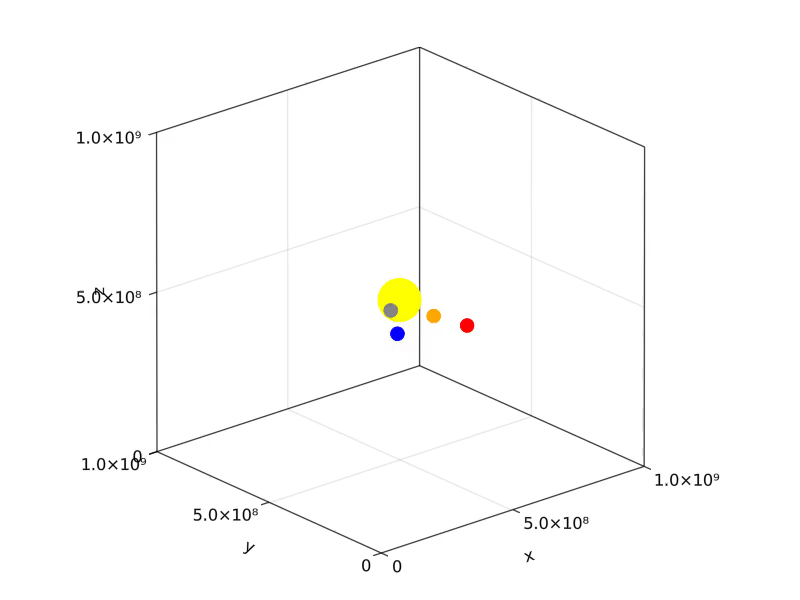
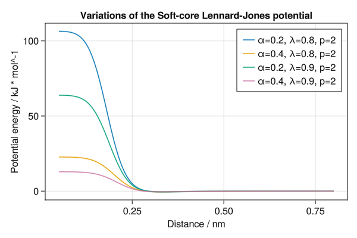

# Molly examples

The best examples for learning how the package works are in the [Molly documentation](@ref) section.
Here we give further examples showing what you can do with the package.
Each is a self-contained block of code.
Made something cool yourself?
Make a PR to add it to this page.

## Simulated annealing

You can change the thermostat temperature of a simulation by changing the simulator.
Here we reduce the temperature of a simulation in stages from 300 K to 0 K.
```julia
using Molly
using GLMakie

data_dir = joinpath(dirname(pathof(Molly)), "..", "data")
ff = MolecularForceField(
    joinpath(data_dir, "force_fields", "ff99SBildn.xml"),
    joinpath(data_dir, "force_fields", "tip3p_standard.xml"),
    joinpath(data_dir, "force_fields", "his.xml"),
)

sys = System(
    joinpath(data_dir, "6mrr_equil.pdb"),
    ff;
    nonbonded_method="cutoff",
    loggers=(temp=TemperatureLogger(100),),
)

minimizer = SteepestDescentMinimizer()
simulate!(sys, minimizer)

temps = [300.0, 200.0, 100.0, 0.0]u"K"
random_velocities!(sys, temps[1])

for temp in temps
    simulator = Langevin(
        dt=0.001u"ps",
        temperature=temp,
        friction=1.0u"ps^-1",
    )
    simulate!(sys, simulator, 5_000; run_loggers=:skipzero)
end

f = Figure(size=(600, 400))
ax = Axis(
    f[1, 1],
    xlabel="Step",
    ylabel="Temperature",
    title="Temperature change during simulated annealing",
)
for (i, temp) in enumerate(temps)
    lines!(
        ax,
        [5000 * i - 5000, 5000 * i],
        [ustrip(temp), ustrip(temp)],
        linestyle="--",
        color=:orange,
    )
end
scatter!(
    ax,
    100 .* (1:length(values(sys.loggers.temp))),
    ustrip.(values(sys.loggers.temp)),
    markersize=5,
)
save("annealing.png", f)
```


## Solar system

Orbits of the four closest planets to the sun can be simulated.
```julia
using Molly
using GLMakie

# Using get_body_barycentric_posvel from Astropy
coords = [
    SVector(-1336052.8665050615,  294465.0896030796 ,  158690.88781384667)u"km",
    SVector(-58249418.70233503 , -26940630.286818042, -8491250.752464907 )u"km",
    SVector( 58624128.321813114, -81162437.2641475  , -40287143.05760552 )u"km",
    SVector(-99397467.7302648  , -105119583.06486066, -45537506.29775053 )u"km",
    SVector( 131714235.34070954, -144249196.60814604, -69730238.5084304  )u"km",
]

velocities = [
    SVector(-303.86327859262457, -1229.6540090943934, -513.791218405548  )u"km * d^-1",
    SVector( 1012486.9596885007, -3134222.279236384 , -1779128.5093088674)u"km * d^-1",
    SVector( 2504563.6403826815,  1567163.5923297722,  546718.234192132  )u"km * d^-1",
    SVector( 1915792.9709661514, -1542400.0057833872, -668579.962254351  )u"km * d^-1",
    SVector( 1690083.43357355  ,  1393597.7855017239,  593655.0037930267 )u"km * d^-1",
]

body_masses = [
    1.989e30u"kg",
    0.330e24u"kg",
    4.87e24u"kg" ,
    5.97e24u"kg" ,
    0.642e24u"kg",
]

boundary = CubicBoundary(1e9u"km")

# Convert the gravitational constant to the appropriate units
inter = Gravity(G=convert(typeof(1.0u"km^3 * kg^-1 * d^-2"), Unitful.G))

sys = System(
    atoms=[Atom(mass=m) for m in body_masses],
    coords=coords .+ (SVector(5e8, 5e8, 5e8)u"km",),
    boundary=boundary,
    velocities=velocities,
    pairwise_inters=(inter,),
    loggers=(coords=CoordinatesLogger(typeof(1.0u"km"), 10),),
    force_units=u"kg * km * d^-2",
    energy_units=u"kg * km^2 * d^-2",
)

simulator = Verlet(
    dt=0.1u"d",
    remove_CM_motion=false,
)

simulate!(sys, simulator, 3650) # 1 year

visualize(
    sys.loggers.coords,
    boundary,
    "sim_planets.mp4";
    trails=5,
    color=[:yellow, :grey, :orange, :blue, :red],
    markersize=[0.25, 0.08, 0.08, 0.08, 0.08],
    transparency=false,
)
```


## Agent-based modelling

Agent-based modelling (ABM) is conceptually similar to molecular dynamics.
Julia has [Agents.jl](https://juliadynamics.github.io/Agents.jl/stable/) for ABM, but Molly can also be used to simulate arbitrary agent-based systems in continuous space.
Here we simulate a toy [SIR model](https://en.wikipedia.org/wiki/Compartmental_models_in_epidemiology#The_SIR_model) for disease spread.
This example shows how atom properties can be mutable, i.e. change during the simulation, and includes custom forces and loggers (see below for more info).
```julia
using Molly
using GLMakie

@enum Status susceptible infected recovered

# Custom atom type
mutable struct Person
    i::Int
    status::Status
    mass::Float64
    σ::Float64
    ϵ::Float64
end

# Custom pairwise interaction
struct SIRInteraction
    dist_infection::Float64
    prob_infection::Float64
    prob_recovery::Float64
end

# Custom force function
function Molly.force(inter::SIRInteraction,
                        vec_ij,
                        atom_i,
                        atom_j,
                        args...)
    if (atom_i.status == infected && atom_j.status == susceptible) ||
                (atom_i.status == susceptible && atom_j.status == infected)
        # Infect close people randomly
        r2 = sum(abs2, vec_ij)
        if r2 < inter.dist_infection^2 && rand() < inter.prob_infection
            atom_i.status = infected
            atom_j.status = infected
        end
    end
    # Workaround to obtain a self-interaction
    if atom_i.i == (atom_j.i - 1)
        # Recover randomly
        if atom_i.status == infected && rand() < inter.prob_recovery
            atom_i.status = recovered
        end
    end
    return zero(vec_ij)
end

# Custom logger
function fracs_SIR(s::System, args...;  kwargs...)
    counts_sir = [
        count(p -> p.status == susceptible, s.atoms),
        count(p -> p.status == infected   , s.atoms),
        count(p -> p.status == recovered  , s.atoms)
    ]
    return counts_sir ./ length(s)
end

SIRLogger(n_steps) = GeneralObservableLogger(fracs_SIR, Vector{Float64}, n_steps)

temp = 1.0
boundary = RectangularBoundary(10.0)
n_steps = 1_000
n_people = 500
n_starting = 2
atoms = [Person(i, i <= n_starting ? infected : susceptible, 1.0, 0.1, 0.02) for i in 1:n_people]
coords = place_atoms(n_people, boundary; min_dist=0.1)
velocities = [random_velocity(1.0, temp; dims=2) for i in 1:n_people]

lj = LennardJones(cutoff=DistanceCutoff(1.6), use_neighbors=true)
sir = SIRInteraction(0.5, 0.06, 0.01)
pairwise_inters = (LennardJones=lj, SIR=sir)
neighbor_finder = DistanceNeighborFinder(
    eligible=trues(n_people, n_people),
    n_steps=10,
    dist_cutoff=2.0,
)
simulator = VelocityVerlet(
    dt=0.02,
    coupling=AndersenThermostat(temp, 5.0),
)

sys = System(
    atoms=atoms,
    coords=coords,
    boundary=boundary,
    velocities=velocities,
    pairwise_inters=pairwise_inters,
    neighbor_finder=neighbor_finder,
    loggers=(
        coords=CoordinatesLogger(Float64, 10; dims=2),
        SIR=SIRLogger(10),
    ),
    force_units=NoUnits,
    energy_units=NoUnits,
)

simulate!(sys, simulator, n_steps)

visualize(sys.loggers.coords, boundary, "sim_agent.mp4"; markersize=0.1)
```


We can use the logger to plot the fraction of people susceptible, infected and recovered over the course of the simulation:

```julia
using GLMakie

f = Figure()
ax = Axis(f[1, 1], xlabel="Snapshot", ylabel="Fraction")

lines!([l[1] for l in values(sys.loggers.SIR)], label="Susceptible")
lines!([l[2] for l in values(sys.loggers.SIR)], label="Infected")
lines!([l[3] for l in values(sys.loggers.SIR)], label="Recovered")
axislegend()
```


## Polymer melt

Here we use [`FENEBond`](@ref), [`CosineAngle`](@ref) and [`LennardJones`](@ref) to simulate interacting polymers.
We also analyse the end-to-end polymer distances and chain angles across the trajectory.
```julia
using Molly
using GLMakie
using Colors
using LinearAlgebra

# Simulate 10 polymers each consisting of 6 monomers
n_polymers = 10
n_monomers = 6
n_atoms = n_monomers * n_polymers
n_bonds_mon = n_monomers - 1
n_bonds_tot = n_bonds_mon * n_polymers
n_angles_mon = n_monomers - 2
n_angles_tot = n_angles_mon * n_polymers

starting_length = 1.1u"nm"
boundary = CubicBoundary(20.0u"nm")

# Random placement of polymer centers at the start
start_coords = place_atoms(n_polymers, boundary; min_dist=6.0u"nm")

# Polymers start almost completely extended
coords = []
for pol_i in 1:n_polymers
    for mon_i in 1:n_monomers
        push!(coords, start_coords[pol_i] .+ SVector(
            starting_length * (mon_i - 1 - n_monomers / 2),
            rand() * 0.1u"nm",
            rand() * 0.1u"nm",
        ))
    end
end
coords = [coords...] # Ensure the array is concretely typed

# Create FENEBonds between adjacent monomers
bond_is, bond_js = Int[], Int[]
for pol_i in 1:n_polymers
    for bi in 1:n_bonds_mon
        push!(bond_is, (pol_i - 1) * n_monomers + bi    )
        push!(bond_js, (pol_i - 1) * n_monomers + bi + 1)
    end
end

fene_k = 250.0u"kJ * mol^-1 * nm^-2"
fene_r0 = 1.6u"nm"
bonds = InteractionList2Atoms(
    bond_is,
    bond_js,
    [FENEBond(k=fene_k, r0=fene_r0, σ=1.0u"nm", ϵ=2.5u"kJ * mol^-1") for _ in 1:n_bonds_tot],
)

# Create CosineAngles between adjacent monomers
angle_is, angle_js, angle_ks = Int[], Int[], Int[]
for pol_i in 1:n_polymers
    for bi in 1:n_angles_mon
        push!(angle_is, (pol_i - 1) * n_monomers + bi    )
        push!(angle_js, (pol_i - 1) * n_monomers + bi + 1)
        push!(angle_ks, (pol_i - 1) * n_monomers + bi + 2)
    end
end

angles = InteractionList3Atoms(
    angle_is,
    angle_js,
    angle_ks,
    [CosineAngle(k=2.0u"kJ * mol^-1", θ0=0.0) for _ in 1:n_angles_tot],
)

atoms = [Atom(mass=10.0u"g/mol", σ=1.0u"nm", ϵ=0.5u"kJ * mol^-1") for _ in 1:n_atoms]

# Since we are using a generic pairwise Lennard-Jones potential too we need to
#   exclude adjacent monomers from the neighbor list
eligible = trues(n_atoms, n_atoms)
for pol_i in 1:n_polymers
    for mon_i in 1:n_bonds_mon
        i = (pol_i - 1) * n_monomers + mon_i
        j = (pol_i - 1) * n_monomers + mon_i + 1
        eligible[i, j] = false
        eligible[j, i] = false
    end
end

lj = LennardJones(
    cutoff=DistanceCutoff(5.0u"nm"),
    use_neighbors=true,
)
neighbor_finder = DistanceNeighborFinder(
    eligible=eligible,
    n_steps=10,
    dist_cutoff=5.5u"nm",
)

sys = System(
    atoms=atoms,
    coords=coords,
    boundary=boundary,
    pairwise_inters=(lj,),
    specific_inter_lists=(bonds, angles),
    neighbor_finder=neighbor_finder,
    loggers=(coords=CoordinatesLogger(200),),
)

sim = Langevin(dt=0.002u"ps", temperature=300.0u"K", friction=1.0u"ps^-1")

simulate!(sys, sim, 100_000)

colors = distinguishable_colors(n_polymers, [RGB(1, 1, 1), RGB(0, 0, 0)]; dropseed=true)

visualize(
    sys.loggers.coords,
    boundary,
    "sim_polymer.gif";
    connections=zip(bond_is, bond_js),
    color=repeat(colors; inner=n_monomers),
    connection_color=repeat(colors; inner=n_bonds_mon),
)
```

```julia
logged_coords = values(sys.loggers.coords)
n_frames = length(logged_coords)

# Calculate end-to-end polymer distances for second half of trajectory
end_to_end_dists = Float64[]
for traj_coords in logged_coords[(n_frames ÷ 2):end]
    for pol_i in 1:n_polymers
        start_i = (pol_i - 1) * n_monomers + 1
        end_i = pol_i * n_monomers
        dist = norm(vector(traj_coords[start_i], traj_coords[end_i], boundary))
        push!(end_to_end_dists, ustrip(dist))
    end
end

f = Figure(size=(600, 400))
ax = Axis(
    f[1, 1],
    xlabel="End-to-end distance / nm",
    ylabel="Density",
    title="End-to-end polymer distance over the trajectory",
)
hist!(ax, end_to_end_dists, normalization=:pdf)
xlims!(ax, low=0)
ylims!(ax, low=0)
save("polymer_dist.png", f)
```

```julia
# Calculate angles to adjacent monomers for second half of trajectory
chain_angles = Float64[]
for traj_coords in logged_coords[(n_frames ÷ 2):end]
    for pol_i in 1:n_polymers
        for mon_i in 2:(n_monomers - 1)
            ang = bond_angle(
                traj_coords[(pol_i - 1) * n_monomers + mon_i - 1],
                traj_coords[(pol_i - 1) * n_monomers + mon_i    ],
                traj_coords[(pol_i - 1) * n_monomers + mon_i + 1],
                boundary,
            )
            push!(chain_angles, rad2deg(ang))
        end
    end
end

f = Figure(size=(600, 400))
ax = Axis(
    f[1, 1],
    xlabel="Angle with adjacent monomers / degrees",
    ylabel="Density",
    title="Chain angles over the trajectory",
)
hist!(ax, chain_angles, normalization=:pdf)
xlims!(ax, 0, 180)
ylims!(ax, low=0)
save("polymer_angle.png", f)
```


## ACE potentials

There is [an example](https://acesuit.github.io/ACEmd.jl/stable/molly) of using ACE potentials in Molly via [ACEmd.jl](https://github.com/ACEsuit/ACEmd.jl).

## Python ASE calculator

[`ASECalculator`](@ref) can be used along with [PythonCall.jl](https://github.com/JuliaPy/PythonCall.jl) to use a Python [ASE](https://wiki.fysik.dtu.dk/ase) calculator with Molly.
Here we simulate a dipeptide molecule in a vacuum with [MACE-OFF23](https://github.com/ACEsuit/mace-off):
```julia
using Molly
using PythonCall # Python packages ase and mace need to be installed beforehand
using Downloads

Downloads.download(
    "https://raw.githubusercontent.com/noeblassel/SINEQSummerSchool2023/main/notebooks/dipeptide_nowater.pdb",
    "dipeptide_nowater.pdb",
)

data_dir = joinpath(dirname(pathof(Molly)), "..", "data")
ff = MolecularForceField(joinpath(data_dir, "force_fields", "ff99SBildn.xml"))
sys = System("dipeptide_nowater.pdb", ff; rename_terminal_res=false)

mc = pyimport("mace.calculators")
ase_calc = mc.mace_off(model="medium", device="cuda")

calc = ASECalculator(
    ase_calc=ase_calc,
    atoms=sys.atoms,
    coords=sys.coords,
    boundary=sys.boundary,
    atoms_data=sys.atoms_data,
)

sys = System(
    sys;
    general_inters=(calc,),
    loggers=(TrajectoryWriter(20, "mace_dipeptide.pdb"),) # Every 10 fs
)
potential_energy(sys)

minimizer = SteepestDescentMinimizer(log_stream=stdout)
simulate!(sys, minimizer)

temp = 298.0u"K"
random_velocities!(sys, temp)
simulator = Langevin(
    dt=0.0005u"ps", # 0.5 fs
    temperature=temp,
    friction=1.0u"ps^-1",
)

simulate!(deepcopy(sys), simulator, 5; run_loggers=false)
@time simulate!(sys, simulator, 2000)
```

Another example using [psi4](https://wiki.fysik.dtu.dk/ase/ase/calculators/psi4.html) to get the potential energy of a water molecule:
```julia
using Molly
using PythonCall # Python packages ase and psi4 need to be installed beforehand

build = pyimport("ase.build")
psi4 = pyimport("ase.calculators.psi4")

py_atoms = build.molecule("H2O")
ase_calc = psi4.Psi4(
    atoms=py_atoms,
    method="b3lyp",
    basis="6-311g_d_p_",
)

atoms = [Atom(mass=16.0u"u"), Atom(mass=1.0u"u"), Atom(mass=1.0u"u")]
coords = SVector{3, Float64}.(eachrow(pyconvert(Matrix, py_atoms.get_positions()))) * u"Å"
boundary = CubicBoundary(100.0u"Å")

calc = ASECalculator(
    ase_calc=ase_calc,
    atoms=atoms,
    coords=coords,
    boundary=boundary,
    elements=["O", "H", "H"],
)

sys = System(
    atoms=atoms,
    coords=coords,
    boundary=boundary,
    general_inters=(calc,),
    energy_units=u"eV",
    force_units=u"eV/Å",
)

potential_energy(sys) # -2080.2391023908813 eV
```

## Density functional theory

[DFTK.jl](https://github.com/JuliaMolSim/DFTK.jl) can be used to calculate forces using density functional theory (DFT), allowing the simulation of quantum systems in Molly.
This example uses the [DFTK.jl tutorial](https://docs.dftk.org/stable/guide/tutorial) to simulate two silicon atoms with atomic units.
A general interaction is used since the whole force calculation is offloaded to DFTK.jl.
```julia
using Molly
using DFTK
import AtomsCalculators

struct DFTKInteraction{L, A}
    lattice::L
    atoms::A
end

# Define lattice and atomic positions
a = 5.431u"Å"                 # Silicon lattice constant
lattice = a / 2 * [[0 1 1.];  # Silicon lattice vectors
                   [1 0 1.];  # specified column by column
                   [1 1 0.]];

# Load HGH pseudopotential for Silicon
Si = ElementPsp(:Si, psp=load_psp("hgh/lda/Si-q4"))

# Specify type of atoms
atoms_dftk = [Si, Si]

dftk_interaction = DFTKInteraction(lattice, atoms_dftk)

function AtomsCalculators.forces(sys, inter::DFTKInteraction; kwargs...)
    # Select model and basis
    model = model_LDA(inter.lattice, inter.atoms, sys.coords)
    kgrid = [4, 4, 4]     # k-point grid (Regular Monkhorst-Pack grid)
    Ecut = 7              # kinetic energy cutoff
    basis = PlaneWaveBasis(model; Ecut=Ecut, kgrid=kgrid)

    # Run the SCF procedure to obtain the ground state
    scfres = self_consistent_field(basis; tol=1e-5)

    return compute_forces_cart(scfres)
end

atoms = fill(Atom(mass=28.0), 2)
coords = [SVector(1/8, 1/8, 1/8), SVector(-1/8, -1/8, -1/8)]
velocities = [randn(SVector{3, Float64}) * 0.1 for _ in 1:2]
boundary = CubicBoundary(Inf)
loggers = (coords=CoordinatesLogger(Float64, 1),)

sys = System(
    atoms=atoms,
    coords=coords,
    boundary=boundary,
    velocities=velocities,
    general_inters=(dftk_interaction,),
    loggers=loggers,
    force_units=NoUnits,
    energy_units=NoUnits,
)

simulator = Verlet(dt=0.0005, remove_CM_motion=false)

simulate!(sys, simulator, 100)

values(sys.loggers.coords)[end]
# 2-element Vector{SVector{3, Float64}}:
#  [0.12060853912863925, 0.12292128337998731, 0.13100409788691614]
#  [-0.13352575661477334, -0.11473039463130282, -0.13189544838731393]
```

## Making and breaking bonds

There is an example of mutable atom properties in the main documentation, but what if you want to make and break bonds during the simulation?
In this case you can use a pairwise interaction to make, break and apply the bonds.
The partners of the atom can be stored in the atom type.
We make a logger to record when the bonds are present, allowing us to visualize them with the `connection_frames` keyword argument to [`visualize`](@ref) (this can take a while to plot).
```julia
using Molly
using GLMakie
using LinearAlgebra

struct BondableAtom
    i::Int
    mass::Float64
    σ::Float64
    ϵ::Float64
    partners::Set{Int}
end

struct BondableInteraction
    prob_formation::Float64
    prob_break::Float64
    dist_formation::Float64
    k::Float64
    r0::Float64
end

Molly.use_neighbors(::BondableInteraction) = true

function Molly.force(inter::BondableInteraction,
                        dr,
                        atom_i,
                        atom_j,
                        args...)
    # Break bonds randomly
    if atom_j.i in atom_i.partners && rand() < inter.prob_break
        delete!(atom_i.partners, atom_j.i)
        delete!(atom_j.partners, atom_i.i)
    end
    # Make bonds between close atoms randomly
    r2 = sum(abs2, dr)
    if r2 < inter.r0 * inter.dist_formation && rand() < inter.prob_formation
        push!(atom_i.partners, atom_j.i)
        push!(atom_j.partners, atom_i.i)
    end
    # Apply the force of a harmonic bond
    if atom_j.i in atom_i.partners
        c = inter.k * (norm(dr) - inter.r0)
        fdr = -c * normalize(dr)
        return fdr
    else
        return zero(dr)
    end
end

function bonds(sys::System, args...; kwargs...)
    bonds = BitVector()
    for i in 1:length(sys)
        for j in 1:(i - 1)
            push!(bonds, j in sys.atoms[i].partners)
        end
    end
    return bonds
end

BondLogger(n_steps) = GeneralObservableLogger(bonds, BitVector, n_steps)

n_atoms = 200
boundary = RectangularBoundary(10.0)
n_steps = 2_000
temp = 1.0

atoms = [BondableAtom(i, 1.0, 0.1, 0.02, Set([])) for i in 1:n_atoms]
coords = place_atoms(n_atoms, boundary; min_dist=0.1)
velocities = [random_velocity(1.0, temp; dims=2) for i in 1:n_atoms]
pairwise_inters = (
    SoftSphere(cutoff=DistanceCutoff(2.0), use_neighbors=true),
    BondableInteraction(0.1, 0.1, 1.1, 2.0, 0.1),
)
neighbor_finder = DistanceNeighborFinder(
    eligible=trues(n_atoms, n_atoms),
    n_steps=10,
    dist_cutoff=2.2,
)
simulator = VelocityVerlet(
    dt=0.02,
    coupling=AndersenThermostat(temp, 5.0),
)

sys = System(
    atoms=atoms,
    coords=coords,
    boundary=boundary,
    velocities=velocities,
    pairwise_inters=pairwise_inters,
    neighbor_finder=neighbor_finder,
    loggers=(
        coords=CoordinatesLogger(Float64, 20; dims=2),
        bonds=BondLogger(20),
    ),
    force_units=NoUnits,
    energy_units=NoUnits,
)

simulate!(sys, simulator, n_steps; n_threads=1) # One thread to ensure thread safety

connections = Tuple{Int, Int}[]
for i in 1:length(sys)
    for j in 1:(i - 1)
        push!(connections, (i, j))
    end
end

visualize(
    sys.loggers.coords,
    boundary,
    "sim_mutbond.mp4";
    connections=connections,
    connection_frames=values(sys.loggers.bonds),
    markersize=0.1,
)
```


## Comparing forces to AD

The force is the negative derivative of the potential energy with respect to position.
MD packages, including Molly, implement the force functions directly for performance.
However it is also possible to compute the forces using AD.
Here we compare the two approaches for the Lennard-Jones potential and see that they give the same result.
```julia
using Molly
using Zygote
using GLMakie

inter = LennardJones()
boundary = CubicBoundary(5.0)
a1, a2 = Atom(σ=0.3, ϵ=0.5), Atom(σ=0.3, ϵ=0.5)

function force_direct(dist)
    c1 = SVector(1.0, 1.0, 1.0)
    c2 = SVector(dist + 1.0, 1.0, 1.0)
    vec = vector(c1, c2, boundary)
    F = force(inter, vec, a1, a2, NoUnits)
    return F[1]
end

function force_grad(dist)
    grad = gradient(dist) do dist
        c1 = SVector(1.0, 1.0, 1.0)
        c2 = SVector(dist + 1.0, 1.0, 1.0)
        vec = vector(c1, c2, boundary)
        potential_energy(inter, vec, a1, a2, NoUnits)
    end
    return -grad[1]
end

dists = collect(0.2:0.01:1.2)
forces_direct = force_direct.(dists)
forces_grad = force_grad.(dists)

f = Figure(size=(600, 400))
ax = Axis(
    f[1, 1],
    xlabel="Distance / nm",
    ylabel="Force / kJ * mol^-1 * nm^-1",
    title="Comparing gradients from direct calculation and AD",
)
scatter!(ax, dists, forces_direct, label="Direct", markersize=8)
scatter!(ax, dists, forces_grad  , label="AD"    , markersize=8, marker='x')
xlims!(ax, low=0)
ylims!(ax, -6.0, 10.0)
axislegend()
save("force_comparison.png", f)
```


## AtomsCalculators.jl compatibility

The [AtomsCalculators.jl](https://github.com/JuliaMolSim/AtomsCalculators.jl) package provides a consistent interface that allows forces, energies etc. to be calculated with different packages.
Calculators can be used with a Molly [`System`](@ref) by giving them as `general_inters` during system setup. It is also possible to use a [`MollyCalculator`](@ref) to calculate properties on [AtomsBase.jl](https://github.com/JuliaMolSim/AtomsBase.jl) systems:
```julia
using Molly
import AtomsBase
using AtomsBaseTesting
using AtomsCalculators

ab_sys = AtomsBase.AbstractSystem(
    make_test_system().system; 
    cell_vectors = [[1.54732, 0.0      , 0.0      ],
                    [0.0    , 1.4654985, 0.0      ],
                    [0.0    , 0.0      , 1.7928950]]u"Å",
)

coul = Coulomb(coulomb_const=2.307e-21u"kJ*Å")
calc = MollyCalculator(pairwise_inters=(coul,), force_units=u"kJ/Å", energy_units=u"kJ")

AtomsCalculators.potential_energy(ab_sys, calc)
```
```
9.112207692184968e-21 kJ
```
```julia
AtomsCalculators.forces(ab_sys, calc)
```
```
5-element Vector{SVector{3, Quantity{Float64, 𝐋 𝐌 𝐓^-2, Unitful.FreeUnits{(Å^-1, kJ), 𝐋 𝐌 𝐓^-2, nothing}}}}:
 [5.052086904272771e-21 kJ Å^-1, 1.0837307191961731e-20 kJ Å^-1, -5.366866699852613e-21 kJ Å^-1]
 [5.252901001053284e-22 kJ Å^-1, -2.3267009382813732e-21 kJ Å^-1, 9.276115314848821e-21 kJ Å^-1]
 [-8.613462805775053e-21 kJ Å^-1, 5.726650141840073e-21 kJ Å^-1, -2.072868074170469e-20 kJ Å^-1]
 [3.0360858013969523e-21 kJ Å^-1, -1.423725639552043e-20 kJ Å^-1, 1.681943212670848e-20 kJ Å^-1]
 [0.0 kJ Å^-1, 0.0 kJ Å^-1, 0.0 kJ Å^-1]
```
We can also convert the AtomsBase.jl system to a Molly [`System`](@ref):
```julia
System(ab_sys; force_units=u"kJ/Å", energy_units=u"kJ")
```
```
System with 5 atoms, boundary CubicBoundary{Quantity{Float64, 𝐋, Unitful.FreeUnits{(Å,), 𝐋, nothing}}}(Quantity{Float64, 𝐋, Unitful.FreeUnits{(Å,), 𝐋, nothing}}[1.54732 Å, 1.4654985 Å, 1.792895 Å])
```

## Variations of the Morse potential

The Morse potential for bonds has a parameter *a* that determines the width of the potential.
It can also be compared to the harmonic bond potential.
```julia
using Molly
using GLMakie

boundary = CubicBoundary(5.0)
dists = collect(0.12:0.005:2.0)

function energies(inter)
    return map(dists) do dist
        c1 = SVector(1.0, 1.0, 1.0)
        c2 = SVector(dist + 1.0, 1.0, 1.0)
        potential_energy(inter, c1, c2, boundary)
    end
end

f = Figure(size=(600, 400))
ax = Axis(
    f[1, 1],
    xlabel="Distance / nm",
    ylabel="Potential energy / kJ * mol^-1",
    title="Variations of the Morse potential",
)
lines!(
    ax,
    dists,
    energies(HarmonicBond(k=20_000.0, r0=0.2)),
    label="Harmonic",
)
for a in [2.5, 5.0, 10.0]
    lines!(
        ax,
        dists,
        energies(MorseBond(D=100.0, a=a, r0=0.2)),
        label="Morse a=$a nm^-1",
    )
end
ylims!(ax, 0.0, 120.0)
axislegend(position=:rb)
save("morse.png", f)
```


## Variations of the Mie potential

The Mie potential is parameterised by *m* describing the attraction and *n* describing the repulsion.
When *m*=6 and *n*=12 this is equivalent to the Lennard-Jones potential.
```julia
using Molly
using GLMakie

boundary = CubicBoundary(5.0)
a1, a2 = Atom(σ=0.3, ϵ=0.5), Atom(σ=0.3, ϵ=0.5)
dists = collect(0.2:0.005:0.8)

function energies(m, n)
    inter = Mie(m=m, n=n)
    return map(dists) do dist
        c1 = SVector(1.0, 1.0, 1.0)
        c2 = SVector(dist + 1.0, 1.0, 1.0)
        vec = vector(c1, c2, boundary)
        potential_energy(inter, vec, a1, a2, NoUnits)
    end
end

f = Figure(size=(600, 400))
ax = Axis(
    f[1, 1],
    xlabel="Distance / nm",
    ylabel="Potential energy / kJ * mol^-1",
    title="Variations of the Mie potential",
)
for m in [4, 6]
    for n in [10, 12]
        lines!(
            ax,
            dists,
            energies(Float64(m), Float64(n)),
            label="m=$m, n=$n",
        )
    end
end
xlims!(ax, low=0.2)
ylims!(ax, -0.6, 0.3)
axislegend(position=:rb)
save("mie.png", f)
```


## Variations of the soft-core LJ potential

The soft-core Lennard-Jones potential is parameterised by ``\alpha``, ``\lambda`` and ``p`` in addition to the standard Lennard-Jones parameters.
These parameters shift the value of ``r_{ij}`` to ``\left(r_{ij}^6 + \sigma_{ij} \alpha \lambda^{p} \right)^{\frac{1}{6}}``.
This gives a soft core, i.e. the potential does not diverge for ``r_{ij} \rightarrow 0``.
```julia
using Molly
using GLMakie

boundary = CubicBoundary(5.0)
a1, a2 = Atom(σ=0.3, ϵ=0.5), Atom(σ=0.3, ϵ=0.5)
dists = collect(0.05:0.005:0.8)

function energies(α, λ, p)
    inter = LennardJonesSoftCore(α=α, λ=λ, p=p)
    return map(dists) do dist
        c1 = SVector(1.0, 1.0, 1.0)
        c2 = SVector(dist + 1.0, 1.0, 1.0)
        vec = vector(c1, c2, boundary)
        potential_energy(inter, vec, a1, a2, NoUnits)
    end
end

f = Figure(size=(600, 400))
ax = Axis(
    f[1, 1],
    xlabel="Distance / nm",
    ylabel="Potential energy / kJ * mol^-1",
    title="Variations of the soft-core Lennard-Jones potential",
)
for λ in [0.8, 0.9]
    for α in [0.2, 0.4]
        for p in [2]
            lines!(
                ax,
                dists,
                energies(α, λ, p),
                label="α=$α, λ=$λ, p=$p",
            )
        end
    end
end

lines!(ax, dists, energies(0, 1, 2), label="standard LJ potential")

ylims!(-5, 25)
axislegend(position=:rt)
save("lennard_jones_sc.png", f)
```


The form of the potential is approximately the same as standard Lennard-Jones for ``r_{ij} > \sigma_{ij}`` if some fractional values are used for ``\lambda`` and ``\alpha``.

## Crystal structures

Molly can make use of [SimpleCrystals.jl](https://github.com/ejmeitz/SimpleCrystals.jl) to generate crystal structures for simulation.
All 3D Bravais lattices and most 2D Bravais lattices are supported as well as user-defined crystals through the SimpleCrystals API.
The only unsupported crystal types are those with a triclinic 2D simulation domain or crystals with lattice angles larger than 90°.

Molly provides a constructor for [`System`](@ref) that takes in a `Crystal` struct:
```julia
using Molly
import SimpleCrystals

a = 0.52468u"nm" # Lattice parameter for FCC Argon at 10 K
atom_mass = 39.948u"g/mol"
temp = 10.0u"K"
fcc_crystal = SimpleCrystals.FCC(a, atom_mass, SVector(4, 4, 4))

n_atoms = length(fcc_crystal)
velocities = [random_velocity(atom_mass, temp) for i in 1:n_atoms]

r_cut = 0.85u"nm"
sys = System(
    fcc_crystal;
    velocities=velocities,
    pairwise_inters=(LennardJones(cutoff=ShiftedForceCutoff(r_cut)),),
    loggers=(
        kinetic_eng=KineticEnergyLogger(100),
        pot_eng=PotentialEnergyLogger(100),
    ),
    energy_units=u"kJ * mol^-1",
    force_units=u"kJ * mol^-1 * nm^-1",
)
```
Certain potentials such as [`LennardJones`](@ref) and [`Buckingham`](@ref) require extra atomic paramaters (e.g. `σ`) that are not implemented by the SimpleCrystals API.
These paramaters must be added to the [`System`](@ref) manually by making use of the copy constructor:
```julia
σ = 0.34u"nm"
ϵ = (4.184 * 0.24037)u"kJ * mol^-1"
updated_atoms = []

for i in eachindex(sys)
    push!(updated_atoms, Atom(index=sys.atoms[i].index, atom_type=sys.atoms[i].atom_type,
                              mass=sys.atoms[i].mass, charge=sys.atoms[i].charge,
                              σ=σ, ϵ=ϵ))
end

sys = System(sys; atoms=[updated_atoms...])
```

Now the system can be simulated using any of the available simulators:
```julia
simulator = Langevin(
    dt=2.0u"fs",
    temperature=temp,
    friction=1.0u"ps^-1",
)
simulate!(sys, simulator, 200_000)
```

## Constrained dynamics

Molly supports the SHAKE and RATTLE constraint algorithms.
The code below shows an example where molecules of hydrogen are randomly placed in a box and constrained during a simulation.
```julia
using Molly
using Test

r_cut = 8.5u"Å"
temp = 300.0u"K"
atom_mass = 1.00794u"g/mol"

n_atoms_half = 200
atoms = [Atom(index=i, mass=atom_mass, σ=2.8279u"Å", ϵ=0.074u"kcal* mol^-1") for i in 1:n_atoms_half]
max_coord = 200.0u"Å"
coords = [max_coord .* rand(SVector{3}) for i in 1:n_atoms_half]
boundary = CubicBoundary(200.0u"Å")
lj = LennardJones(cutoff=ShiftedPotentialCutoff(r_cut), use_neighbors=true)

# Add bonded atoms
bond_length = 0.74u"Å" # Hydrogen bond length
constraints = []
for j in 1:n_atoms_half
    push!(atoms, Atom(index=(j + n_atoms_half), mass=atom_mass, σ=2.8279u"Å", ϵ=0.074u"kcal* mol^-1"))
    push!(coords, coords[j] .+ SVector(bond_length, 0.0u"Å", 0.0u"Å"))
    push!(constraints, DistanceConstraint(j, j + n_atoms_half, bond_length))
end

shake = SHAKE_RATTLE([constraints...], length(atoms), 1e-8u"Å", 1e-8u"Å^2 * ps^-1")

neighbor_finder = DistanceNeighborFinder(
    eligible=trues(length(atoms), length(atoms)),
    dist_cutoff=1.5*r_cut,
)
disable_constrained_interactions!(neighbor_finder, shake.clusters)

sys = System(
    atoms=atoms,
    coords=coords,
    boundary=boundary,
    pairwise_inters=(lj,),
    neighbor_finder=neighbor_finder,
    constraints=(shake,),
    energy_units=u"kcal * mol^-1",
    force_units=u"kcal * mol^-1 * Å^-1",
)

random_velocities!(sys, temp)

simulator = VelocityVerlet(dt=0.001u"ps")

simulate!(sys, simulator, 10_000)

# Check that the constraints are satisfied at the end of the simulation
@test check_position_constraints(sys, shake)
@test check_velocity_constraints(sys, shake)
```
