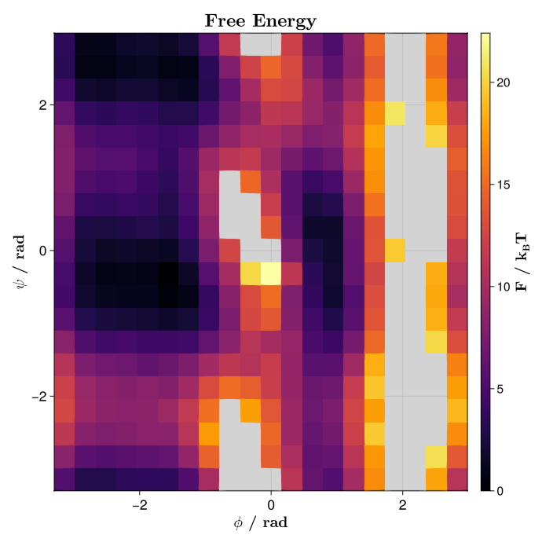
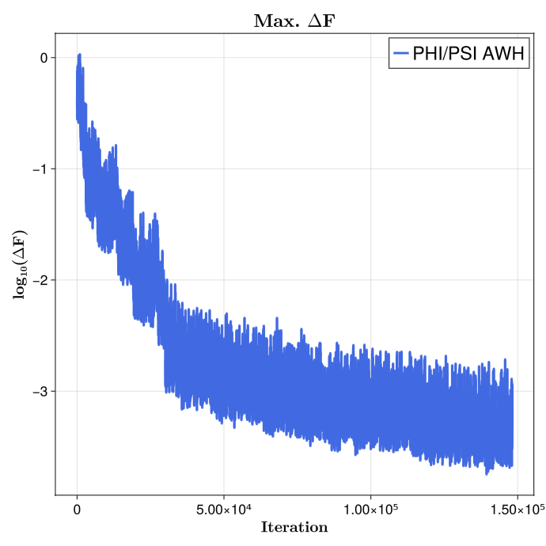
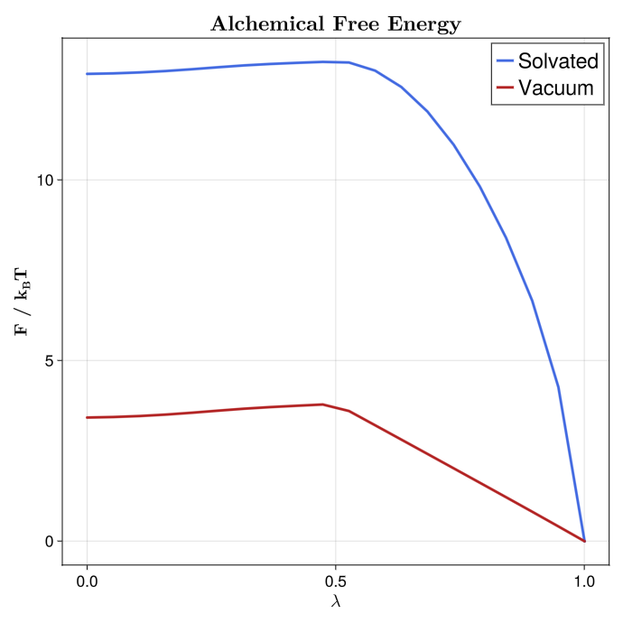
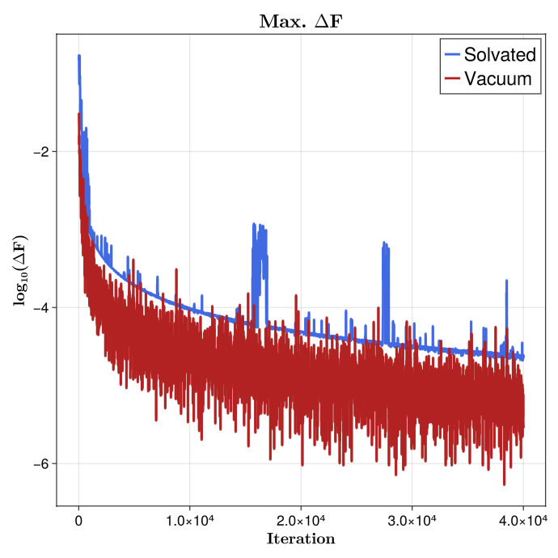
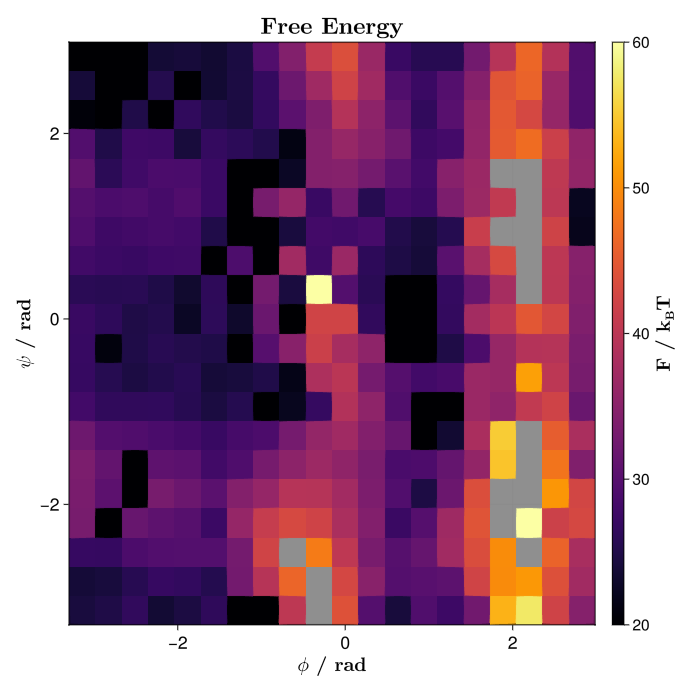
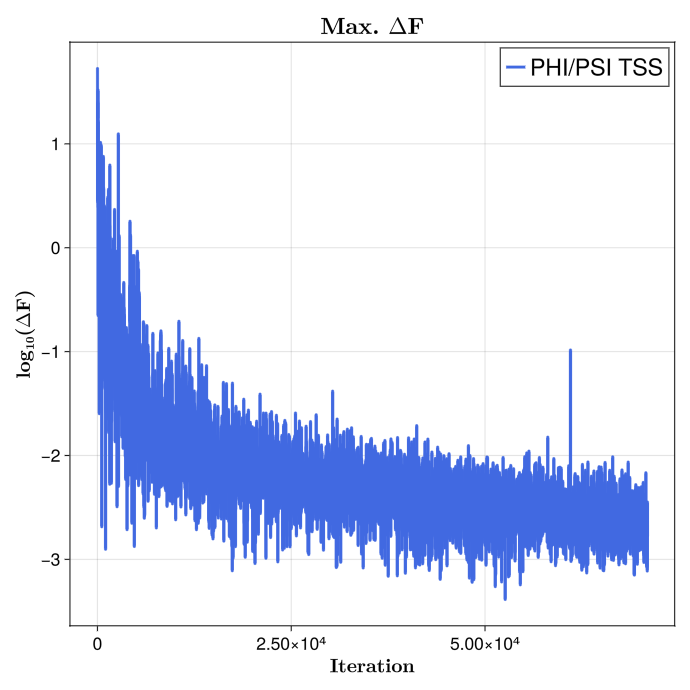
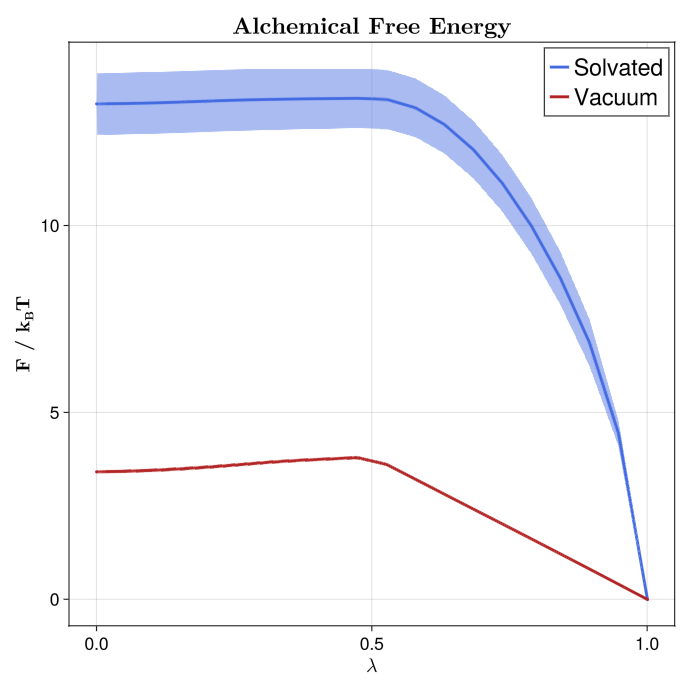
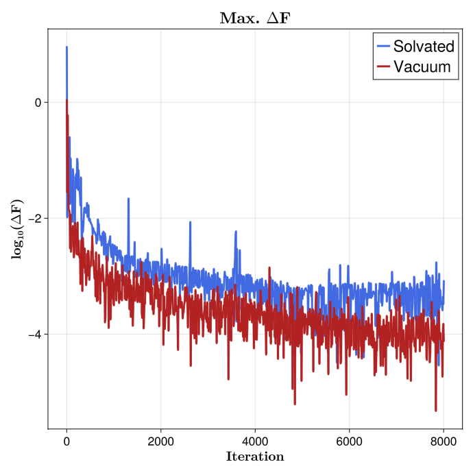

# Free energy calculation

## Free energies with MBAR

### A brief introduction

One of the most relevant uses of molecular dynamics (MD) is the estimation of free energy (FE) changes along a given reaction coordinate. One may be interested in, for example, how favorable the binding of a ligand to a target protein is; or which conformer of a molecule is the most stable. These are the kind of questions that can be addressed with FE techniques.

Through the years, researchers have developed a collection of techniques to solve these problems. As early as 1954, Robert W Zwanzig introduced the [FE perturbation](https://doi.org/10.1063/1.1740409) method, leading to the Zwanzig equation:

```math
\Delta F_{A \rightarrow B} = F_B - F_A = k_B T \ln \left \langle \exp\left( - \frac{E_B - E_A}{k_B T} \right) \right \rangle _A
```

This states that, for a given system, the change of FE in going from state *A* to state *B* is equal to the FE difference between the two states and, more importantly, directly related to the total energy difference of states *A* and *B* through Botzmann statistics. In this equation, the angle brackets represent the expected value of the Boltzmann-weighted energy difference of the two states, but sampled only from conformations extracted from state *A*. This implies that, even when sampling only one state, we are able to infer information from the other, given that some niceness criteria is met, i.e. the energy difference between the two states is small enough. This reasoning about unsampled states by re-evaluating sampled states is known as reweighting.

A little over 20 years after Zwanzig introduced FE perturbation, Charles H Bennett expanded on this and developed the [Bennett Acceptance Ratio](https://doi.org/10.1016/0021-9991(76)90078-4) (BAR). Bennett built directly upon the statistical foundation of the Zwanzig equation, and recognized that both forward and reverse energy differences between two states contain complementary information; that is, while Zwanzig’s formulation reweights configurations from a single ensemble to estimate the free energy of another, BAR symmetrizes this process. It combines samples from both states and determines the free energy shift $\Delta F$ that makes each ensemble equally probable under some weighting derived from Boltzmann statistics. In this sense, BAR can be viewed as a generalization of Zwanzig’s exponential averaging, reducing to the Zwanzig equation when only one direction of sampling is available. However, it is because of this that BAR still suffers from the same issue as Zwanzig's reweighting method: the energy difference between states $A$ and $B$ must be small enough such that there is sufficient overlap between their configurational spaces, otherwise the necessary statistics for FE estimation will be very poor and intermediate steps between $A$ and $B$ are needed.

Thus, in 2008 Michael R Shirts and John D Chodera introduced the [Multistate Bennett Acceptance Ratio](https://doi.org/10.1063/1.2978177) (MBAR) method. MBAR expands on BAR by instead of just using two states *A* and *B*, considering a collection of *k* $\in$ *K* different thermodynamic states. The only thing that is expected from these states is that they must be sampled from equivalent thermodynamic ensembles, this is, all states should be NVT or NPT, etc.; but other than that, the specific Hamiltonian for each evaluated state can differ in an arbitrary manner. Then, a series of $n_k$ samples are drawn from each thermodynamic state, until a total of $N = \sum_{k}^{K} n_k$ samples are obtained. By evaluating each sample $n \in N$ with each Hamiltonian $\mathcal{H}_{k}; k \in K$, one obtains a matrix of reduced potentials $u_{nk} = \beta_{k} \left[ E_{k}(n)+p_{k}V(n) \right]$. MBAR then solves a set of self-consistent equations that yield the relative free energies $f_k$ of all states simultaneously, using every sample across all simulations to estimate each state’s free energy in a statistically optimal way. In this sense, MBAR generalizes BAR to an arbitrary number of thermodynamic states and provides the maximum-likelihood, minimum-variance estimator for free energies and ensemble averages, efficiently combining data from overlapping simulations into a unified framework. MBAR also allows the reweighting of any observable to a completely unsampled thermodynamic state. Because this themodynamic state is compared to a collection of sampled states, instead of just one, the conformational space between states is much more likely to overlap, therefore increasing the probability of the reweighting to be meaningful.

## How to run MBAR with Molly

### Defining the restraint interactions

In this example, we will use MBAR to calculate the Potential of Mean Force (PMF) along the central torsion of an alanine dipeptide molecule. In order to do that, we will have to run a series of independent biased simulations, where each will apply an umbrella potential to restrain the peptide torsion fixed around a given angle. We will first define the restraint interaction:


```julia
# restraints.jl file

using LinearAlgebra

struct DihedralRestraint{A, K}
    ϕ0::A # Radians, dimensionless number
    Δϕ::A # Radians, dimensionless number
    k::K  # Energy (e.g. kJ/mol)
end

# Store angles as plain Float64 radians, k should be energy
function DihedralRestraint(ϕ0::Unitful.AbstractQuantity, Δϕ::Unitful.AbstractQuantity, k)
    ϕ0r = ustrip(u"rad", ϕ0)
    Δϕr = ustrip(u"rad", Δϕ)
    return DihedralRestraint(ϕ0r, Δϕr, k)
end
```

Then, we have to define the potential energy and force functions that Molly will call when it encounters such an interaction. We will make use of the machinery present in Molly and define the restraint as a specific interaction, returning the force as a [`SpecificForce4Atoms`](@ref). The functional form used as the bias potential is a quadratic flat bottom angle restraint, using:

```math
\varphi^{\prime} = (\varphi - \varphi^0)\ \%\ 2\pi
```

```math
V\left( \varphi^{\prime} \right) = \begin{cases}
    \frac{1}{2} \cdot k \cdot \left( \varphi^{\prime} - \Delta\varphi \right)^2 & \mathrm{for} \ \lvert \varphi^{\prime} \rvert \ge \Delta\varphi \\
    0 & \mathrm{for} \ \lvert \varphi^{\prime} \rvert \lt \Delta\varphi
\end{cases}
```

Where $\varphi$ and $\varphi^0$ are the current and reference dihedral angles, respectively; $\Delta\varphi$ is the width of the flat bottom of the potential, and $k$ is the energy constant associated with the interaction. The analytic derivation of the force acting on each atom defining the dihedral, given the previous potential, is quite involved and beyond the scope of this tutorial. We do provide here, however, the Julia code used to define the potential energy and force:

```julia
# restraints.jl file

# Robust geometry with clamped inverses
function _dihedral_geom(ci, cj, ck, cl, boundary)
    b1 = vector(cj, ci, boundary)
    b2 = vector(cj, ck, boundary)
    b3 = vector(ck, cl, boundary)

    n1 = cross(b1, b2)
    n2 = cross(b2, b3)

    b2n  = norm(b2)
    n1n2 = dot(n1, n1)
    n2n2 = dot(n2, n2)

    # Angle via atan2
    y = b2n * dot(b1, n2)
    x = dot(n1, n2)
    ϕ = atan(y, x)

    return ϕ, b1, b2, b3, n1, n2, b2n, n1n2, n2n2, x, y
end

_wrap_pi(x::Real) = (x + π) % (2π) - π # Take into account periodicity
_rad(x::Real) = Float64(x)
_rad(x) = Float64(ustrip(u"rad", x))

function Molly.potential_energy(inter::DihedralRestraint{FT, K},
                                ci, cj, ck, cl, boundary, args...) where {FT, K}
    b1 = vector(cj, ci, boundary)
    b2 = vector(cj, ck, boundary)
    b3 = vector(ck, cl, boundary)
    n1 = cross(b1, b2)
    n2 = cross(b2, b3)

    b2n  = norm(b2)
    n1n2 = dot(n1, n1)
    n2n2 = dot(n2, n2)

    y = b2n * dot(b1, n2)
    x = dot(n1, n2)
    ϕ = atan(y, x)

    # Scale-aware tolerances
    Ls = max(ustrip(norm(b1) + norm(b2) + norm(b3)), 1.0) * oneunit(norm(b1))
    tol_b  = 1e-12 * Ls
    tol_xy = 1e-24 * (Ls^4)

    if !isfinite(ϕ) || b2n ≤ tol_b || abs(x) ≤ tol_xy || abs(y) ≤ tol_xy ||
                    sqrt(n1n2) ≤ tol_b^2 || sqrt(n2n2) ≤ tol_b^2
        return zero(inter.k)
    end

    ϕ0 = _rad(inter.ϕ0)
    Δ  = _rad(inter.Δϕ)
    d  = _wrap_pi(ϕ - ϕ0)
    ad = abs(d)

    if ad ≤ Δ
        return zero(inter.k)
    else
        diff = ad - Δ
        return FT(inter.k * (diff * diff) / 2)
    end
end

function Molly.force(inter::DihedralRestraint{FT, K},
                     ci, cj, ck, cl, boundary, args...) where {FT, K}
    b1 = vector(cj, ci, boundary)
    b2 = vector(cj, ck, boundary)
    b3 = vector(ck, cl, boundary)
    n1 = cross(b1, b2)
    n2 = cross(b2, b3)

    b2n  = norm(b2)
    n1n2 = dot(n1, n1)
    n2n2 = dot(n2, n2)

    y = b2n * dot(b1, n2)
    x = dot(n1, n2)
    ϕ = atan(y, x)

    # Zero force with correct units (energy/length)
    F0 = FT(zero(inter.k) / oneunit(norm(b1)))
    Fz = SVector(F0, F0, F0)

    # Tolerances
    Ls = max(ustrip(norm(b1) + norm(b2) + norm(b3)), 1.0) * oneunit(norm(b1))
    tol_b  = 1e-12 * Ls
    tol_xy = 1e-24 * (Ls^4)

    if !isfinite(ϕ) || b2n ≤ tol_b || abs(x) ≤ tol_xy || abs(y) ≤ tol_xy ||
                    sqrt(n1n2) ≤ tol_b^2 || sqrt(n2n2) ≤ tol_b^2
        return SpecificForce4Atoms(Fz, Fz, Fz, Fz)
    end

    ϕ0 = _rad(inter.ϕ0)
    Δ  = _rad(inter.Δϕ)
    d  = _wrap_pi(ϕ - ϕ0)
    ad = abs(d)
    if ad ≤ Δ
        return SpecificForce4Atoms(Fz, Fz, Fz, Fz)
    end

    # dU/dϕ as energy
    dU_dϕ = inter.k * (ad - Δ) * (d ≥ 0 ? 1.0 : -1.0)

    # Safe inverses
    εL4 = 1e-32 * (Ls^4)
    εL2 = 1e-32 * (Ls^2)
    inv_n1  = 1 / max(n1n2, εL4)
    inv_n2  = 1 / max(n2n2, εL4)
    b22     = dot(b2, b2)
    inv_b22 = 1 / max(b22,  εL2)

    # Gradients (all ~ 1/L)
    g1 = (b2n * inv_n1) * n1
    g4 = (b2n * inv_n2) * n2
    s1 = dot(b1, b2) * inv_b22
    s3 = dot(b3, b2) * inv_b22
    g2 = -g1 + s1*g1 - s3*g4
    g3 = -g4 + s3*g4 - s1*g1

    F1 = -(dU_dϕ) * g1
    F2 = -(dU_dϕ) * g2
    F3 = -(dU_dϕ) * g3
    F4 = -(dU_dϕ) * g4
    return SpecificForce4Atoms(FT.(F1), FT.(F2), FT.(F3), FT.(F4))
end
```

### Setting up simulations

With this in hand, we are ready to set up the individual biased simulations. We will explore a full torsion around the dihedral, i.e. spanning 360 degrees. We will do so in 60 independent biased simulations, so 360 degrees / 60 simulations = 6 degrees increments per simulation. The system is quite well-behaved, so we can get away with using Float32 precision on GPU. We will use a time step of 1 fs to integrate the equations of motion, and will run the simulations in the NPT ensemble at 310 K and 1 bar of pressure.

```julia
# pulling.jl

using Molly
using CUDA

include("restraints.jl")

FT     = Float32               # Float precision
AT     = CuArray               # Array type, run simulations on CUDA GPU
N_WIN  = 60                    # Number of umbrella windows to generate
dR     = FT(6)u"deg"           # Increment in CV (torsion angle) in each consecutive window
ΔR     = FT(3)u"deg"           # Width of flat bottom potential
K_bias = FT(250)u"kJ * mol^-1" # Energy constant for restraint potential
Δt     = FT(1)u"fs"            # Simulation timestep
T0     = FT(310)u"K"           # Simulation temperature
P0     = FT(1)u"bar"           # Simulation pessure
```

One must take into account that the simulations will start from an initial (ideally equilibrated) configuration, and therefore an arbitrarirly imposed restraint may be too far away from the equilibrium distribution of the CV to be biased, causing numerical issues. Thus, we will begin our setup by gently pulling the system along the CV in a series of short, sequential simulations. How short? The answer to that question depends on the system to be simulated; the pulling simulations should be long enough so that the system has time to move towards and stabilize around the imposed biased equilibrium, but also sufficiently short as to not waste time in this initial sequential part, as once each umbrella window is equilibrated it can run in parallel with the rest. For this simple study case, equilibrating each window for 0.5 ns is enough. We can define:

```julia
# pulling.jl

tu      = unit(Δt)                   # Time units used for timestep
max_t   = uconvert(u, FT(0.5)u"ns")  # Simulation time in appropriate time units
N_STEPS = Int(floor(max_t / Δt))     # Number of simulation steps
```

We can now load the initial configuration into a [`System`](@ref):

```julia
# pulling.jl

data_dir = joinpath(dirname(pathof(Molly)), "..", "data")
ff_dir = joinpath(data_dir, "force_fields")

ff = MolecularForceField(
    FT,
    joinpath.(ff_dir, ["ff99SBildn.xml", "tip3p_standard.xml"])...;
    units=true,
)

sys_0 = System(
    joinpath(data_dir, "..", "exercises", "dipeptide_equil.pdb"),
    ff;
    array_type=AT,
    nonbonded_method=:cutoff,
)

random_velocities!(sys_0, T0) # Initialize velocities from M-B distribution at target temperature
```

Now, before starting to produce the pulling simulations, we need to know what is the value of the CV (remember, the torsion angle) for an equilibrated system. We can make use of the functions defined in `restraints.jl`. Remember to take note of this value, it will be important later!

```julia
# pulling.jl

# Indices of the atoms defining the dihedral
i = 17
j = 15
k = 9
l = 7

coords_cpu = Molly.from_device(sys_0.coords)
eq_θ,      = _dihedral_geom(coords_cpu[i], coords_cpu[j], coords_cpu[k], coords_cpu[l], sys_0.boundary)
eq_θ       = _wrap_pi(eq_θ) # = -0.48948112328583804 rad
```

We are getting very close to running the pulling simulations. The only remaining things to define are the coupling algorithms to keep a constant temperature and pressure, which integrator to use, and also tell Molly every how many integration steps should we write the coordinates to a trajectory file:

```julia
# pulling.jl

τ_T        = FT(1)u"ps" # Thermostat coupling constant
# Apply thermostat every simulation step, required for Verlet-type integrators
thermostat = VelocityRescaleThermostat(T0, τ_T, n_steps = 1)

τ_P        = FT(1)u"ps" # Barostat coupling constant
# Apply barostat 10 times per τ_P, good balance of precision and computational overhead
frac       = uconvert(tu, 0.1 * τ_P)
n_P        = Int(floor(frac/Δt)) # The number of simulation steps
barostat   = CRescaleBarostat(P0, τ_P; n_steps = n_P)

# Create the integrator, remove COM motion every 100 steps
vverlet    = VelocityVerlet(Δt, (thermostat, barostat,), 100)

save_t     = uconvert(tu, FT(1)u"ps") # Save coordinates every picosecond
save_steps = Int(floor(save_t / Δt))  # The number of simulation steps
```

With all of this ready, we only need to sequentially run the pulling simulations. We use the coordinates and velocities at the end of simulation n to seed the beginning of simulation n + 1:

```julia
# pulling.jl

old_sys = deepcopy(sys_0) # Get a copy of the initial system
sils    = deepcopy(sys_0.specific_inter_lists) # Get the interactions lists of the unbiased system
for w in 1:N_WIN
    # Calculate where is the potential well located for a given window
    rest_θ = FT(eq_θ - (w-1) * uconvert(u"rad", dR))
    # Create the Dihedral restraint given our parameters
    dRest = DihedralRestraint(rest_θ*u"rad", uconvert(u"rad", ΔR) , K_bias)

    # Pack restraint into an independent interaction list
    rest_inter = InteractionList4Atoms(
        Molly.to_device([i], AT),
        Molly.to_device([j], AT),
        Molly.to_device([k], AT),
        Molly.to_device([l], AT),
        Molly.to_device([dRest], AT),
    )

    rest_inter = (sils..., rest_inter,) # Merge unbiased and biased into single tuple

    sys_w = System(
        deepcopy(old_sys); # Get the same layout as the unbiased system
        specific_inter_lists=rest_inter, # Overwrite interaction list with the one containing the bias
        loggers=(TrajectoryWriter(save_steps, "./pull_$(w).dcd"),),
    )

    simulate!(sys_w, vverlet, N_STEPS)

    # We also write the very last structure to a pdb file
    write_structure("./pull_$(w).pdb", sys_w)

    global old_sys = sys_w # Override old system with the newly simulated one
end
```

### Running umbrella simulations

Once we have run the pulling, we can write a small standalone script to produce the umbrella sampling simulations. These can be run in parallel as they are independent. The simulation setup must be exactly the same used to produce the pulling, except for the amount of time the simulations will be run for. In our case, each simulation was run for a total of 50 ns:

```julia
# individual_simulation.jl

using Molly
using CUDA

include("restraints.jl")

SIM_N = parse(Int, ARGS[1])      # Take the umbrella index as the first argument

FT     = Float32               # Float precision
AT     = CuArray               # Array type, run simulations on CUDA GPU
N_WIN  = 60                    # Number of umbrella windows to generate
dR     = FT(6)u"deg"           # Increment in CV (torsion angle) in each consecutive window
ΔR     = FT(3)u"deg"           # Width of flat bottom potential
K_bias = FT(250)u"kJ * mol^-1" # Energy constant for restraint potential
Δt     = FT(1)u"fs"            # Simulation timestep
T0     = FT(310)u"K"           # Simulation temperature
P0     = FT(1)u"bar"           # Simulation pessure

data_dir = joinpath(dirname(pathof(Molly)), "..", "data")
ff_dir = joinpath(data_dir, "force_fields")

ff = MolecularForceField(
    FT,
    joinpath.(ff_dir, ["ff99SBildn.xml", "tip3p_standard.xml"])...;
    units=true,
)

sys = System(
    "pull_$(SIM_N).pdb", # Now we load the final structure for a given pull simulation
    ff;
    array_type=AT,
    nonbonded_method=:cutoff,
)

random_velocities!(sys, T0)

# Indices of atoms defining the dihedral
i = 17
j = 15
k = 9
l = 7

eq_θ = FT(-0.48948112328583804) # We get this from the equilibrium structure

tu         = unit(Δt)                 # Time units used for timestep
max_t      = uconvert(u, FT(50)u"ns") # Simulation time in appropriate time units
N_STEPS    = Int(floor(max_t / Δt))   # Number of simulation steps

τ_T        = FT(1)u"ps"               # Thermostat coupling constant
thermostat = VelocityRescaleThermostat(T0, τ_T, n_steps=1) # Apply thermostat every simulation step

τ_P        = FT(1)u"ps"               # Barostat coupling constant
frac       = uconvert(tu, 0.1 * τ_P)  # Apply barostat 10 times per τ_P, good balance of precision and computational overhead
n_P        = Int(floor(frac/Δt))      # To number of simulation steps
barostat   = CRescaleBarostat(P0, τ_P; n_steps=n_P)

vverlet    = VelocityVerlet(Δt, (thermostat, barostat,), 100) # Create the integrator, remove COM motion every 100 steps

save_t     = uconvert(tu, FT(1)u"ps")  # Save coordinates every picosecond
save_steps = Int(floor(save_t / Δt))   # To number of simulation steps

rest_θ = FT(eq_θ - (SIM_N-1) * uconvert(u"rad", dR)) # The equilibrium value for the bias
dRest  = DihedralRestraint(rest_θ*u"rad", uconvert(u"rad", ΔR) , K_bias) # Create interaction

# Pack into interaction list
rest_inter = InteractionList4Atoms(
    Molly.to_device([i], AT),
    Molly.to_device([j], AT),
    Molly.to_device([k], AT),
    Molly.to_device([l], AT),
    Molly.to_device([dRest], AT),
)

sils       = deepcopy(sys.specific_inter_lists) # Unbiased
rest_inter = (sils..., rest_inter,)             # Merge biased and unbiased

sys = System(
    deepcopy(sys); # Everything from the unbiased system
    specific_inter_lists=rest_inter, # Overwrite specific interactions
    loggers=(trj=TrajectoryWriter(save_steps, "./umbrella_$(SIM_N).dcd"),),
)

simulate!(sys, vverlet, N_STEPS)
```

### Calculating free energies with MBAR

Once all of the individual umbrella simulations are finished, we are ready to run MBAR on the results and estimate the free energy along our reaction coordinate. Remember from the first section of this tutorial that the MBAR equations are solved by evaluating every generated conformation with every used Hamiltonian. It follows, then, that we will first have to set up an array of [`System`](@ref) structs that represent each Hamiltonian. Moreover, we will be reading data from trajectories, so those Systems will actually be wrapped inside [`EnsembleSystem`](@ref) structs, which allow IO operations from trajectory files into data structures usable by Molly.

We start by defining variables that will be shared by all thermodynamic states. Notice how many things are shared with the parameters used to produce the simulations!

```julia
# MBAR.jl

using Molly
using CUDA

include("restraints.jl")

AT = CuArray
FT = Float32

# Bias parameters
dR     = FT(6)u"deg"           # Increment of CV in each umbrella window
ΔR     = FT(3)u"deg"           # Width for flat bottom potential
K_bias = FT(250)u"kJ * mol^-1" # Force used in the restraint

temp = FT(310)u"K"
pres = FT(1)u"bar"

data_dir = joinpath(dirname(pathof(Molly)), "..", "data")
ff_dir = joinpath(data_dir, "force_fields")

trajs_dir = "./" # Or wherever you have saved the umbrella simulations

ff = MolecularForceField(
    FT,
    joinpath.(ff_dir, ["ff99SBildn.xml", "tip3p_standard.xml"])...;
    units=true,
)

sys_nobias = System(
    joinpath(data_dir, "..", "exercises", "dipeptide_equil.pdb"),
    ff;
    array_type=AT,
    nonbonded_method=:cutoff,
)

# Atom indices defining dihedral
i = 17
j = 15
k = 9
l = 7

eq_θ  = FT(-0.48948112328583804) # We get this from the equilibrium structure

N_TRJ       = 60 # The number of umbrella simulations produced
TRJ_SYSTEMS = Vector{EnsembleSystem}(undef, N_TRJ)

Threads.@threads for trj_n in 1:N_TRJ
    traj_path = joinpath(trajs_dir, "umbrella_$(trj_n).dcd")

    # Note that the restraint and specific interactions list must be created
    # in exactly the same way as for the umbrella simulations, we need exactly
    # the same Hamiltonian
    rest_θ = FT(eq_θ - (trj_n-1) * uconvert(u"rad", dR))
    dRest = DihedralRestraint(rest_θ*u"rad", uconvert(u"rad", ΔR) , K_bias)

    rest_inter = InteractionList4Atoms(
        Molly.to_device([i], AT),
        Molly.to_device([j], AT),
        Molly.to_device([k], AT),
        Molly.to_device([l], AT),
        Molly.to_device([dRest], AT),
    )

    sils = deepcopy(sys_nobias.specific_inter_lists)

    rest_sils = (sils..., rest_inter,)
    sys_rest = System(sys_nobias; specific_inter_lists=rest_sils)

    # Store in struct that allows reading trajectories
    sys_trj = EnsembleSystem(sys_rest, traj_path)

    TRJ_SYSTEMS[trj_n] = sys_trj
end
```

We now have a vector of structs that represent each system and its trajectory. The next step is to read the trajectories and sample the relevant magnitudes to solve MBAR and get our PMF. We will need the coordinates, the system boundaries (needed to calculate the volume for the $pV$ terms of the Hamiltonian, as we have run the simulations in the NPT ensemble) and, of course, the CV of interest. Note that MBAR assumes statistical independence of samples, so the selected conformations must be subsampled from decorrelated states. Molly does provide the functionality to estimate the statistical inefficiency of a given timeseries and subsequent subsampling.

```julia
# MBAR.jl

C  = Vector{<:Any}(undef, N_TRJ) # Vector to store coordinates
B  = Vector{<:Any}(undef, N_TRJ) # Vector to store boundaries
CV = Vector{<:Any}(undef, N_TRJ) # Vector to store the CV

# We discard the first 12500 frames (12.5 ns), assume system is still equilibrating there
FIRST_IDX = 12_500

Threads.@threads for nt in 1:N_TRJ
    trjsys = TRJ_SYSTEMS[nt]
    n_frames = Int(length(trjsys.trajectory))

    # Temp arrays to store potential energy, coordinates, boundaries and CV
    u, c, b, cv  = [], [], [], []

    # Iterate over trajectory frames
    for n in FIRST_IDX:n_frames
        current_sys = read_frame!(trjsys, n) # Read the current frame as a System
        pe = potential_energy(current_sys)
        coords = Molly.from_device(current_sys.coords)
        boundary = current_sys.boundary

        # Measure the CV at the current frame
        ϕ = _dihedral_geom(coords[i], coords[j], coords[k], coords[l], boundary)

        push!(u, pe)
        push!(c, coords)
        push!(b, boundary)
        push!(cv, ϕ*u"rad")
    end

    # Estimate the decorrelation time from the timeseries of the potential energy
    ineff = Molly.statistical_inefficiency(u; maxlag=n_frames-1)

    # Subsample arrays based on statistical inefficiency
    sub_coords = Molly.subsample(c,  ineff.stride; first=1)
    sub_bounds = Molly.subsample(b,  ineff.stride; first=1)
    sub_CV     = Molly.subsample(cv, ineff.stride; first=1)

    C[nt]  = sub_coords
    B[nt]  = sub_bounds
    CV[nt] = sub_CV
end
```

Next, we define a vector of thermodynamic states to represent each Hamiltonian used to produce the simulations, as well a single state that represents the system in the absence of bias potentials. We will use the [`ThermoState`](@ref) struct provided by Molly:

```julia
# MBAR.jl

# Assemble the thermodynamic systems for each umbrella window
energy_units = TRJ_SYSTEMS[1].system.energy_units
kBT          = uconvert(energy_units, Unitful.R * temp)
βi           = Float64(ustrip(1.0 / kBT))

states = ThermoState[ThermoState("win_$i", βi, pres, TRJ_SYSTEMS[i].system)
                     for i in eachindex(TRJ_SYSTEMS)]

target_state = ThermoState("target", βi, pres, sys_nobias)
```

We are finally in possession of everything needed to solve the MBAR equations and estimate the PMF along our CV! There are two paths we can take for this, the long path and the short path. For the sake of completeness, we describe the long path first. The first step for solving MBAR is assembling the reduced energy matrix. Molly provides a functionality just for that through the [`assemble_mbar_inputs`](@ref) method:

```julia
# MBAR.jl

mbar_gen = assemble_mbar_inputs(
    C, B, states; # Coordinates, boundaries and thermodynamic states
    target_state=target_state, # The target state, in our case the unbiased system
    energy_units=energy_units,
)

u        = mbar_gen.u        # Reduced energy matrix, K states by N sampled conformations
u_target = mbar_gen.u_target # The reduced energy of the N samples evaluated by the target state hamiltonian
N_counts = mbar_gen.N        # Number of sampled conformations
win_of   = mbar_gen.win_of   # Indexing helper that tells which k state was used to generate each n sample
shifts   = mbar_gen.shifts   # Numerical shifts, if used, for stability reasons when building the reduced energy matrix
```

This generates the necessary inputs to use the self-consistent iteration method to solve the MBAR equations. Of course, Molly provides the [`iterate_mbar`](@ref) method to do so:

```julia
# MBAR.jl

# Returns the relative free energy of each k state and log.(N_counts), needed for downstream computations
F_k, logN = iterate_mbar(u, win_of, N_counts)
```

With this, we can also produce a weight matrix and a vector of target weights, using the  [`mbar_weights`](@ref) method, that will let us reweight any arbitrary quantity from the sampled K thermodynamic states to any target state:

```julia
# MBAR.jl

# Returns the weights matrix and the target weights
W_s, w_target = mbar_weights(u, u_target, F_k, logN, N_counts; check=true, shifts=shifts)
```

And finally, we can estimate the PMF using the output of the previous step by calling the [`pmf_with_uncertainty`](@ref) method:

```julia
# MBAR.jl

pmf_result = pmf_with_uncertainty(u, u_target, F_k, N_counts, logN, CV; shifts=shifts, kBT=kBT)

centers   = pmf_result.centers        # The collective variable
PMF       = pmf_result.F              # PMF in kBT
PMF_enr   = pmf_result.F_energy       # PMF in energy units
sigma     = pmf_result.sigma_F        # Standard deviation in kBT
sigma_enr = pmf_result.sigma_F_energy # Standard deviation in energy units
```

But what about the short path? Well, we also provide an overload of the [`pmf_with_uncertainty`](@ref) method that allows to get the PMF in a single call by doing:

```julia
# MBAR.jl
pmf_result = pmf_with_uncertainty(
    C,            # Coordinates
    B,            # Boundaries
    states,       # Themodynamic states
    target_state, # Target state
    CV,           # Collective variable
)
```

Now one can put this into a graph, for example using a scatter for the free energy and making use of the calculated sigmas (see the previous code blocks) to shade the plot and give a feel for the uncertainties. The code is left as an exercise to the reader, but the results should look like something similar to this:


## Free energies with AWH

### Method overview

[The Accelerated Weight Histogram](https://doi.org/10.1103/PhysRevE.85.056708) (AWH) is an adaptive extended-ensemble method for estimating free energies over a discrete set of thermodynamic states where the thermodynamic-state index is treated as a dynamic variable. At each AWH iteration, the coordinates are propagated with the Hamiltonian of the active state, the current configuration is evaluated in all states, and a new active state is sampled from the conditional state probabilities.

For a target distribution $\rho_k$, current free energy estimate $f_k$, and reduced potential $u_k(x)$, the conditional weight of state $k$ is

```math
\omega_k(x) =
\frac{\exp\left(f_k + \log \rho_k - u_k(x)\right)}
{\sum_j \exp\left(f_j + \log \rho_j - u_j(x)\right)}.
```

The same weights are accumulated into a segment histogram. After `update_freq` samples, Molly updates the free energy estimate from the segment histogram and an effective reference count. During the initial stage, the reference count is controlled by `n_bias`, so smaller values give more aggressive updates. After the state space has been covered, the effective count grows with simulation time and the updates become smaller.

The examples in this section show two common uses. The alanine dipeptide example uses AWH to move between umbrella centers on a two-dimensional $\phi/\psi$ grid, then [deconvolves the umbrella bias](https://doi.org/10.1063/1.4890371) to obtain an unbiased PMF. The ethanol solvation example uses AWH directly on a one-dimensional alchemical ladder, where the AWH free energy vector is the alchemical profile.

### Alanine dipeptide PMF

The full script is `scripts/awh_dipeptide.jl`. Run it from the package root:

```bash
julia scripts/awh_dipeptide.jl
```

The script uses CUDA arrays and selects GPU `0` by default. Set `MOLLY_CUDA_DEVICE` before launching Julia to choose a different device.

The system is the alanine dipeptide structure from the Molly exercises. The script minimizes it, assigns Maxwell-Boltzmann velocities, and equilibrates it at 310 K and 1 bar before constructing the AWH states.

```julia
using Molly
using CUDA
using GLMakie
using Random

CUDA.device!(parse(Int, get(ENV, "MOLLY_CUDA_DEVICE", "0")))

FT = Float32
AT = CuArray

DT = FT(2)u"fs"
TEMP = FT(310)u"K"
PRES = one(FT)u"bar"

thermostat = VelocityRescaleThermostat(TEMP, FT(0.1)u"ps"; n_steps = 1)
barostat = CRescaleBarostat(PRES, FT(4)u"ps"; n_steps = 200)
vverlet = VelocityVerlet(DT, (thermostat, barostat), 100)
```

The PMF is defined over the central $\phi$ and $\psi$ torsions. In this example each angle is divided into 20 periodic bins, giving 400 umbrella centers. Each AWH state is a copy of the equilibrated system with one flat-bottom torsion bias on $\phi$ and one on $\psi$.

```julia
PHI_INDS = [5, 7, 9, 15]
PSI_INDS = [7, 9, 15, 17]
PHI_CV = CalcTorsion(PHI_INDS, :pbc, true)
PSI_CV = CalcTorsion(PSI_INDS, :pbc, true)

N_PHI_STATES = 20
N_PSI_STATES = 20

PHI_MIN = FT(-π)
PHI_MAX = FT(π)
PSI_MIN = FT(-π)
PSI_MAX = FT(π)

FLAT_BOTTOM_WIDTH = ustrip(u"rad", FT(360 / N_PHI_STATES)u"°")
BIAS_K = FT(100.0)u"kJ * mol^-1"

PHI_TARGETS = collect(range(PHI_MIN, PHI_MAX; length=N_PHI_STATES + 1))[1:end-1]
PSI_TARGETS = collect(range(PSI_MIN, PSI_MAX; length=N_PSI_STATES + 1))[1:end-1]

thermo_states = ThermoState[]

for psi in PSI_TARGETS
    for phi in PHI_TARGETS
        bias_phi = PeriodicFlatBottomBias(BIAS_K, FLAT_BOTTOM_WIDTH, phi)
        bias_psi = PeriodicFlatBottomBias(BIAS_K, FLAT_BOTTOM_WIDTH, psi)

        sys_bias = System(
            deepcopy(sys);
            general_inters = (
                sys.general_inters...,
                BiasPotential(PHI_CV, bias_phi),
                BiasPotential(PSI_CV, bias_psi),
            ),
        )

        push!(thermo_states, ThermoState(sys_bias, vverlet))
    end
end
```

The AWH state index labels biased thermodynamic states, not the unbiased PMF bins. For this reason, the raw AWH free energies are not used directly as the Ramachandran free energy surface. Instead, the script attaches a [`PMFDeconvolution`](@ref) object to the simulation.

Here the automatic deconvolution path is safe because every thermodynamic state has exactly two [`BiasPotential`](@ref)s in `general_inters`, and they are appended in the same order as the PMF grid dimensions: first the $\phi$ bias, then the $\psi$ bias. [`PMFDeconvolution`](@ref) can therefore infer both the collective variables and the reduced bias-energy coupling matrix from the states themselves.

```julia
awh_state = AWHState(thermo_states; first_state = 1, n_bias = 100, reuse_neighbors = true)

pmf_deconv = PMFDeconvolution(
    awh_state;
    grid = ((PHI_MIN, PSI_MIN), (PHI_MAX, PSI_MAX), (N_PHI_STATES, N_PSI_STATES)),
)
```

!!! warning "Deconvolving explicit collective variables and bias potentials"

    Do not use the automatic path if:

    * The state contains extra `BiasPotential`s that are not PMF windows.
    * The bias order does not match the PMF grid axes.
    * More than one bias contributes to one PMF dimension.
    * The coordinate used for the plotted PMF is transformed differently from the coordinate seen by the bias.

    In those cases, provide the collective-variable function and the reduced coupling explicitly. For example, if an extra flat-bottom restraint were also stored in `general_inters`, the PMF deconvolution would need to ignore it:

```julia
GRID_CARTESIAN = CartesianIndices((N_PHI_STATES, N_PSI_STATES))

function torsion_value(coords, sys, cv)
    return FT(ustrip(calculate_cv(cv, coords, sys.atoms, sys.boundary, sys.velocities)))
end

function custom_pmf_cv(coords)
    active_sys = awh_state.active_sys
    return (
        torsion_value(coords, active_sys, PHI_CV),
        torsion_value(coords, active_sys, PSI_CV),
    )
end

function custom_pmf_coupling(cv_tuple, state_i)
    grid_i = GRID_CARTESIAN[state_i]
    bias_phi = PeriodicFlatBottomBias(BIAS_K, FLAT_BOTTOM_WIDTH, PHI_TARGETS[grid_i[1]])
    bias_psi = PeriodicFlatBottomBias(BIAS_K, FLAT_BOTTOM_WIDTH, PSI_TARGETS[grid_i[2]])
    bias_energy = potential_energy(bias_phi, FT(cv_tuple[1])) +
                  potential_energy(bias_psi, FT(cv_tuple[2]))
    return awh_state.λ_β[state_i] * FT(ustrip(bias_energy))
end

pmf_deconv = PMFDeconvolution(
    awh_state;
    grid = ((PHI_MIN, PSI_MIN), (PHI_MAX, PSI_MAX), (N_PHI_STATES, N_PSI_STATES)),
    cv = custom_pmf_cv,
    coupling = custom_pmf_coupling,
)
```

The simulation advances 50 MD steps per AWH iteration. The finite `well_tempered_factor` lets the target distribution adapt during the run, favoring lower-free-energy regions while still keeping all windows accessible. Higher values soften this behaviour.

```julia
N_MD_STEPS = 50
AWH_TIME = FT(4)u"ns"
TOTAL_STEPS = Int(floor(AWH_TIME / DT))

awh_sim = AWHSimulation(
    awh_state;
    num_md_steps = N_MD_STEPS,
    update_freq = 1,
    well_tempered_factor = FT(500.0),
    log_freq = 10,
    pmf = pmf_deconv,
)

simulate!(awh_sim, TOTAL_STEPS)
```

`AWHSimulation` stores its absolute MD step, so couplers and loggers retain their cadence
across AWH iterations and repeated `simulate!` calls. Pass `initial_step` when resuming from
a checkpoint whose coordinates and velocities already correspond to a nonzero step.

After the run, `pmf(awh_sim.pmf)` returns the deconvolved PMF in units of $k_B T$ by default. Infinite bins are converted to `NaN` before plotting so GLMakie can render regions with low statistical support in a separate color. The script plots the deconvolved PMF as a heatmap and adds a colorbar for the free energy scale.

```julia
pmf_result = pmf(awh_sim.pmf)
pmf_kbt = pmf_result.F
pmf_plot = map(x -> isfinite(x) ? x : FT(NaN), pmf_kbt)

fig_fe = Figure(size = (720, 720))

ax_fe = Axis(fig_fe[1,1],
    title = L"\textbf{Free Energy}",
    xlabel = L"\textbf{\phi / rad}",
    ylabel = L"\textbf{\psi / rad}",
    xlabelsize = 20, ylabelsize = 20,
    titlesize = 24,
    xlabelfont = :bold, ylabelfont = :bold,
    xticklabelsize = 18, yticklabelsize = 18,
)

hm_fe = heatmap!(
    ax_fe,
    PHI_TARGETS,
    PSI_TARGETS,
    pmf_plot;
    colormap = :inferno,
    nan_color = (:gray, 0.35),
)

Colorbar(
    fig_fe[1, 2],
    hm_fe;
    label = L"\textbf{F / k_{B}T}",
    labelsize = 20,
    ticklabelsize = 16,
)

ax_fe.aspect = DataAspect()
display(fig_fe)

save("awh_dipeptide_pmf.png", fig_fe)
```



The convergence plot uses the maximum absolute free energy update recorded by AWH at each logged iteration. A decreasing `log10.(deltaF)` trace indicates that the adaptive bias updates are becoming smaller.

```julia
deltaF = awh_state.stats.max_delta_f_history
iter = awh_state.stats.step_indices

fig_df = Figure(size = (720, 720))

ax_df = Axis(
    fig_df[1,1],
    title = L"\textbf{Max. $\Delta$F}",
    xlabel = L"\textbf{Iteration}",
    ylabel = L"\textbf{log_{10}($\Delta$F)}",
    xlabelsize = 20, ylabelsize = 20,
    titlesize = 24,
    xlabelfont = :bold, ylabelfont = :bold,
    xticklabelsize = 18, yticklabelsize = 18,
)

lines!(
    ax_df,
    iter,
    log10.(deltaF);
    color = :royalblue,
    linewidth = 3,
    linecap = :round,
    joinstyle = :round,
    label = "PHI/PSI AWH",
)

axislegend(position = :rt, labelsize = 24)
display(fig_df)

save("awh_dipeptide_convergence.png", fig_df)
```



### Ethanol solvation free energy

The full script can be found in `scripts/awh_solvation.jl`:

```bash
julia scripts/awh_solvation.jl
```

The example computes the standard solvation free energy of ethanol with a two-leg annihilation cycle. Ethanol is annihilated, that is, its non-bonded interactions switched off, in solution and in vacuum. The standard solvation free energy is then described by the cycle:

```math
\Delta G_\mathrm{solvation} =
\Delta G_\mathrm{vacuum}
- \Delta G_\mathrm{solvent}
+ k_B T \log\left(\frac{V_\mathrm{gas}}{V_\mathrm{std}}\right).
```

where the last term captures the free energy of taking a molecule from a gas to a standard state solution. The alchemical ladder has 20 states from $\lambda=1$ (solute fully turned on) to $\lambda=0$ (solute fully turned off). The solute atoms are assigned `InsertRole`, and `DefaultLambdaScheduler` removes electrostatics over the first half of the ladder and sterics over the second half.

```julia
FT = Float32
AT = CuArray

Δt = FT(2)u"fs"
T0 = FT(310)u"K"
P0 = FT(1)u"bar"

N_LAMBDA_STATES = 20
N_MD_STEPS = 50
AWH_TIME = FT(4)u"ns"

lambda_schedule = FT.(range(1.0, stop = 0.0, length = N_LAMBDA_STATES))
```

The setup function builds either the solvated or vacuum leg. The solvated leg uses PME and an NPT integrator. The vacuum leg uses a non-periodic Coulomb model, an infinite boundary, and an infinite non-bonded cutoff so the ethanol molecule is not split by a finite cutoff.

```julia
function setup_alchemical_awh(pdb_file, solute_indices; is_vacuum = false, rng = Random.default_rng())
    nonbonded_method = is_vacuum ? :none : :pme
    boundary = is_vacuum ? CubicBoundary(FT(Inf) * u"nm") : nothing
    dist_cutoff = is_vacuum ? FT(Inf) * u"nm" : FT(1) * u"nm"
    dist_buffer = is_vacuum ? FT(0) * u"nm" : FT(0.2) * u"nm"
    neighbor_finder_type = is_vacuum ? DistanceNeighborFinder : nothing

    sys_base = System(
        pdb_file,
        ff;
        array_type = AT,
        boundary = boundary,
        dist_cutoff = dist_cutoff,
        dist_buffer = dist_buffer,
        neighbor_finder_type = neighbor_finder_type,
        nonbonded_method = nonbonded_method,
        constraints = :hbonds,
        hydrogen_mass = 2,
    )

    thermostat = VelocityRescaleThermostat(T0, FT(0.1)u"ps"; n_steps = 1)
    integrator = if is_vacuum
        VelocityVerlet(Δt, (thermostat,), 100)
    else
        barostat = CRescaleBarostat(P0, FT(4)u"ps"; n_steps = 200)
        VelocityVerlet(Δt, (thermostat, barostat), 100)
    end
```

After minimization and equilibration, the script replaces the standard non-bonded interactions with [Gapsys soft-core variants](https://doi.org/10.1021/ct300220p) and creates one [`ThermoState`](@ref) per $\lambda$ value.

```julia
    p_inters = sys_base.pairwise_inters
    idx_lj = findfirst(x -> x isa LennardJones, p_inters)
    idx_coul = findfirst(x -> x isa Union{Coulomb, CoulombEwald}, p_inters)

    lj_sc = alchemical_lj_softcore(p_inters[idx_lj])
    cl_sc = alchemical_coulomb_softcore(p_inters[idx_coul])

    atoms_cpu = Molly.from_device(sys_base.atoms)
    thermo_states = ThermoState[]

    for λ in lambda_schedule
        acopy = Atom[]
        for a in atoms_cpu
            if a.index ∈ solute_indices
                push!(acopy, Atom(a.index, a.atom_type, a.mass, a.charge,
                                  a.σ, a.ϵ, FT(λ), Molly.InsertRole))
            else
                push!(acopy, Atom(a.index, a.atom_type, a.mass, a.charge,
                                  a.σ, a.ϵ, FT(a.λ), a.alch_role))
            end
        end

        sys_w = System(
            deepcopy(sys_base);
            atoms = Molly.to_device([acopy...], AT),
            pairwise_inters = (lj_sc, cl_sc),
        )

        push!(thermo_states, ThermoState(sys_w, deepcopy(integrator)))
    end
```

For an alchemical ladder, no PMF deconvolution is needed: the state coordinate already is the alchemical coordinate. The script disables the well-tempered target adaptation with `well_tempered_factor = Inf`, so AWH samples a fixed uniform target over the ladder.

```julia
    awh_state = AWHState(thermo_states; reuse_neighbors = true)
    awh_sim = AWHSimulation(
        awh_state;
        num_md_steps = N_MD_STEPS,
        update_freq = 1,
        well_tempered_factor = FT(Inf),
        log_freq = 10,
    )

    return awh_state, awh_sim
end
```

The two legs are run independently. The free energy profile is stored in `awh_state.f`, gauge-fixed so the first state is zero.

```julia
solute_idx = 1:9

awh_state_solv, awh_sim_solv = setup_alchemical_awh(
    joinpath(data_dir, "ethanol_solv.pdb"),
    solute_idx;
    is_vacuum = false,
    rng = MersenneTwister(RNG_SEED),
)

awh_state_vac, awh_sim_vac = setup_alchemical_awh(
    joinpath(data_dir, "ethanol_vac.pdb"),
    solute_idx;
    is_vacuum = true,
    rng = MersenneTwister(RNG_SEED + 1),
)

awh_steps = Int(floor(AWH_TIME / Δt))

simulate!(awh_sim_solv, awh_steps)
simulate!(awh_sim_vac, awh_steps)

f_solv = awh_state_solv.f
f_vac  = awh_state_vac.f
```

The script reverses both the $\lambda$ schedule and the free energy vectors before plotting, so $\lambda=0$ is on the left and $\lambda=1$ is on the right.

```julia
lambda_plot = reverse(lambda_schedule)
f_solv_plot = reverse(f_solv)
f_vac_plot = reverse(f_vac)

fig_fe = Figure(size = (720, 720))

ax_fe = Axis(fig_fe[1,1],
    title = L"\textbf{Alchemical Free Energy}",
    xlabel = L"\textbf{\lambda}",
    ylabel = L"\textbf{F / k_{B}T}",
    xlabelsize = 20, ylabelsize = 20,
    titlesize = 24,
    xlabelfont = :bold, ylabelfont = :bold,
    xticklabelsize = 18, yticklabelsize = 18,
)

lines!(
    ax_fe,
    lambda_plot, f_solv_plot;
    color = :royalblue,
    linewidth = 3,
    linecap = :round,
    joinstyle = :round,
    label = "Solvated",
)

lines!(
    ax_fe,
    lambda_plot, f_vac_plot;
    color = :firebrick,
    linewidth = 3,
    linecap = :round,
    joinstyle = :round,
    label = "Vacuum",
)

axislegend(position = :rt, labelsize = 24)
display(fig_fe)

save("awh_solv_profile.png", fig_fe)
```



It also plots the maximum free energy update at each logged AWH iteration.

```julia
deltaF_solv = awh_state_solv.stats.max_delta_f_history
deltaF_vac  = awh_state_vac.stats.max_delta_f_history

iter_solv = awh_state_solv.stats.step_indices
iter_vac = awh_state_vac.stats.step_indices

fig_df = Figure(size = (720, 720))

ax_df = Axis(
    fig_df[1,1],
    title = L"\textbf{Max. $\Delta$F}",
    xlabel = L"\textbf{Iteration}",
    ylabel = L"\textbf{log_{10}($\Delta$F)}",
    xlabelsize = 20, ylabelsize = 20,
    titlesize = 24,
    xlabelfont = :bold, ylabelfont = :bold,
    xticklabelsize = 18, yticklabelsize = 18,
)

lines!(
    ax_df,
    iter_solv, log10.(deltaF_solv);
    color = :royalblue,
    linewidth = 3,
    linecap = :round,
    joinstyle = :round,
    label = "Solvated",
)

lines!(
    ax_df,
    iter_vac, log10.(deltaF_vac);
    color = :firebrick,
    linewidth = 3,
    linecap = :round,
    joinstyle = :round,
    label = "Vacuum",
)

axislegend(position = :rt, labelsize = 24)
display(fig_df)

save("awh_solv_convergence.png", fig_df)
```



Finally, the endpoint differences and the standard-state correction are combined and printed in both $k_B T$ and kJ mol^-1.

```julia
dG_solv = f_solv[end] - f_solv[1]
dG_vac  = f_vac[end]  - f_vac[1]

V_gas = ustrip(u"nm^3", Unitful.k * T0 / P0)
V_std = ustrip(u"nm^3", 1.0u"L" / (1.0u"mol" * Unitful.Na))
dG_std_corr = log(V_gas / V_std)

dG = dG_vac - dG_solv + dG_std_corr
beta = awh_state_solv.state_space.betas[1]

println("=========================================")
println("Annihilation in solvent (kBT):   ", dG_solv)
println("Annihilation in vacuum (kBT):    ", dG_vac)
println("Standard State Correction (kBT): ", dG_std_corr)
println("Solvation Free Energy (kBT):     ", dG)
println("=========================================")

println("=========================================")
println("Annihilation in solvent (kJ mol^-1):   ", dG_solv / beta)
println("Annihilation in vacuum (kJ mol^-1):    ", dG_vac / beta)
println("Standard State Correction (kJ mol^-1): ", dG_std_corr / beta)
println("Solvation Free Energy (kJ mol^-1): ", dG / beta)
println("=========================================")
```

A representative run prints:

```text
=========================================
Annihilation in solvent (kBT):   12.930917
Annihilation in vacuum (kBT):    3.422579
Standard State Correction (kBT): 3.249398594044294
Solvation Free Energy (kBT):     -6.258939380504046
=========================================

=========================================
Annihilation in solvent (kJ mol^-1):   33.329224
Annihilation in vacuum (kJ mol^-1):    8.821641
Standard State Correction (kJ mol^-1): 8.375271054356045
Solvation Free Energy (kJ mol^-1):     -16.132312582575743
=========================================
```

## Free energies with TSS

### Method overview

[Times Square Sampling](https://doi.org/10.1080/10618600.2023.2291108) (TSS) is an adaptive simulated-tempering method over a discrete set of thermodynamic states, referred to as "rungs" in the paper describing the technique. As in AWH, the active state determines which Hamiltonian propagates the molecular coordinates. However, TSS differs in how the free energies are estimated and how the global state space is managed, putting special attention on the efficient assignement of computational resources to the ladder of thermodynamics states.

Molly's TSS implementation uses local estimators on graph windows; a graph defines the topology of the thermodynamic states, for example a one-dimensional alchemical ladder or a two-dimensional torsion grid. Each window contains a subset of neighboring states. During a TSS cycle, each replica samples states inside one active window, updates the local estimator for that window, and then the window-level estimates are combined into a reported global free energy profile.

The reference distribution over rungs is called $\gamma$. It sets the asymptotic density used by the free energy estimator. With `adaptive_gamma = :covdet`, Molly updates $\gamma$ from a covariance-determinant estimate of local thermodynamic state density. This gives a larger target density to regions where the local state geometry indicates that more resolution is useful.

TSS can also forget early history. With `TSSHistoryForgetting(alpha, n_epochs)`, estimator history before approximately $\alpha \cdot t$ is dropped at TSS iteration $t$. Retained history is grouped into logarithmically spaced epochs. Those epochs are used both to remove old data and to compute jackknife uncertainty estimates without storing every individual sample.

### Alanine dipeptide PMF

The full script is `scripts/tss_dipeptide.jl`:

```bash
julia scripts/tss_dipeptide.jl
```

This example estimates the unbiased alanine dipeptide $\phi/\psi$ free energy surface with TSS. It starts from the equilibrated alanine dipeptide structure, minimizes and equilibrates the system at 310 K and 1 bar, and then builds a 20 by 20 thermodynamic-state grid over the central $\phi$ and $\psi$ torsions.

```julia
PHI_INDS = [5, 7, 9, 15]
PSI_INDS = [7, 9, 15, 17]
PHI_CV = CalcTorsion(PHI_INDS, :pbc, true)
PSI_CV = CalcTorsion(PSI_INDS, :pbc, true)

N_PHI_STATES = 20
N_PSI_STATES = 20

PHI_MIN = FT(-π)
PHI_MAX = FT(π)
PSI_MIN = FT(-π)
PSI_MAX = FT(π)

FLAT_BOTTOM_WIDTH = ustrip(u"rad", FT(360 / N_PHI_STATES)u"°")
BIAS_K = FT(100.0)u"kJ * mol^-1"

PHI_TARGETS = collect(range(PHI_MIN, PHI_MAX; length=N_PHI_STATES + 1))[1:end-1]
PSI_TARGETS = collect(range(PSI_MIN, PSI_MAX; length=N_PSI_STATES + 1))[1:end-1]
```

The TSS thermodynamic states are biased copies of the equilibrated system, one for each $\phi/\psi$ umbrella center.

```julia
thermo_states = ThermoState[]

for psi in PSI_TARGETS
    for phi in PHI_TARGETS
        bias_phi = PeriodicFlatBottomBias(BIAS_K, FLAT_BOTTOM_WIDTH, phi)
        bias_psi = PeriodicFlatBottomBias(BIAS_K, FLAT_BOTTOM_WIDTH, psi)

        sys_bias = System(
            deepcopy(sys);
            general_inters = (
                sys.general_inters...,
                BiasPotential(PHI_CV, bias_phi),
                BiasPotential(PSI_CV, bias_psi),
            ),
        )

        push!(thermo_states, ThermoState(sys_bias, vverlet))
    end
end
```

The graph is a periodic two-dimensional grid. The window size is one fifth of the grid along each dimension, so each local estimator covers a $4 \times 4$ patch of neighboring umbrella centers. The TSS state enables history forgetting and covariance-determinant adaptive $\gamma$.

```julia
PHI_WIN_SIZE = Int(N_PHI_STATES // 5)
PSI_WIN_SIZE = Int(N_PSI_STATES // 5)

tss_graph = Molly.tss_grid_graph(
    (N_PHI_STATES, N_PSI_STATES);
    window_size = (PHI_WIN_SIZE, PSI_WIN_SIZE),
    periodic = (true, true),
)

tss_state = TSSState(
    thermo_states;
    graph = tss_graph,
    first_state = 1,
    first_window = 1,
    history_forgetting = TSSHistoryForgetting(alpha = FT(0.19), n_epochs = 16),
    adaptive_gamma = :covdet,
)
```

The TSS simulation uses two replicas. For more than one replica, the script constructs explicit [`ActiveThermoState`](@ref) objects with different starting states, assigns velocities, and passes them to [`TSSSimulation`](@ref).

```julia
N_MD_STEPS = 50
SELF_ADJ_STEPS = 5
N_REPLICAS = 2

TSS_TIME = FT(4)u"ns"
TOTAL_STEPS = Int(floor(TSS_TIME / DT))
N_CYCLES = Int(floor(TOTAL_STEPS / (SELF_ADJ_STEPS * N_MD_STEPS)))

replica_first_states = [
    state_index(
        mod1(1 + (replica_i - 1) * max(1, N_PHI_STATES ÷ N_REPLICAS), N_PHI_STATES),
        mod1(1 + (replica_i - 1) * max(1, N_PSI_STATES ÷ N_REPLICAS), N_PSI_STATES),
    )
    for replica_i in 1:N_REPLICAS
]
replica_active_states = if N_REPLICAS == 1
    nothing
else
    states = [ActiveThermoState(tss_state.state_space, first_state)
              for first_state in replica_first_states]
    for active_state in states
        random_velocities!(active_state.active_sys, TEMP; rng=rng)
    end
    states
end

pmf_deconv = PMFDeconvolution(
    tss_state;
    grid = ((PHI_MIN, PSI_MIN), (PHI_MAX, PSI_MAX), (N_PHI_STATES, N_PSI_STATES)),
)

tss_sim = TSSSimulation(
    tss_state;
    n_md_steps = N_MD_STEPS,
    n_cycles = N_CYCLES,
    self_adjustment_steps = SELF_ADJ_STEPS,
    n_replicas = N_REPLICAS,
    replica_active_states = replica_active_states,
    pmf = pmf_deconv,
    log_freq = 10,
)

simulate!(tss_sim; rng = rng, replica_parallel = :auto)
```

`TSSSimulation` likewise stores one absolute MD step shared by its physical replicas.
Each MD block receives that step, and repeated calls resume from `tss_sim.current_step`.
Use the `initial_step` constructor keyword when restoring an existing simulation state.

For PMF deconvolution, the script uses the automatic coupling path. This is safe for the same reason as in the AWH example above: each thermodynamic state contains exactly the two umbrella [`BiasPotential`](@ref)s that define the PMF dimensions, and they appear in the same order as the grid axes. The [`PMFDeconvolution`](@ref) object must be created before the run and passed to [`TSSSimulation`](@ref).

```julia
pmf_result = pmf(pmf_deconv)
pmf_kbt = pmf_result.F
pmf_plot = map(x -> isfinite(x) ? x : FT(NaN), pmf_kbt)

fig_fe = Figure(size = (720, 720))

ax_fe = Axis(fig_fe[1,1],
    title = L"\textbf{Free Energy}",
    xlabel = L"\textbf{\phi / rad}",
    ylabel = L"\textbf{\psi / rad}",
    xlabelsize = 20, ylabelsize = 20,
    titlesize = 24,
    xlabelfont = :bold, ylabelfont = :bold,
    xticklabelsize = 18, yticklabelsize = 18,
)

hm_fe = heatmap!(
    ax_fe,
    PHI_TARGETS,
    PSI_TARGETS,
    pmf_plot;
    colormap = :inferno,
    nan_color = (:gray, 0.35),
)

Colorbar(
    fig_fe[1, 2],
    hm_fe;
    label = L"\textbf{F / k_{B}T}",
    labelsize = 20,
    ticklabelsize = 16,
)

ax_fe.aspect = DataAspect()
display(fig_fe)
```



The convergence plot uses `tss_state.stats.max_abs_delta_f`, the maximum absolute reported free energy update at each logged TSS iteration.

```julia
deltaF = tss_state.stats.max_abs_delta_f
iter = tss_state.stats.iterations

fig_df = Figure(size = (720, 720))

ax_df = Axis(
    fig_df[1,1],
    title = L"\textbf{Max. $\Delta$F}",
    xlabel = L"\textbf{Iteration}",
    ylabel = L"\textbf{log_{10}($\Delta$F)}",
    xlabelsize = 20, ylabelsize = 20,
    titlesize = 24,
    xlabelfont = :bold, ylabelfont = :bold,
    xticklabelsize = 18, yticklabelsize = 18,
)

lines!(
    ax_df,
    iter,
    log10.(deltaF);
    color = :royalblue,
    linewidth = 3,
    linecap = :round,
    joinstyle = :round,
    label = "PHI/PSI TSS",
)

axislegend(position = :rt, labelsize = 24)
display(fig_df)
```



### Ethanol solvation free energy

The full script is `scripts/tss_solvation.jl`:

```bash
julia scripts/tss_solvation.jl
```

This example computes the standard solvation free energy of ethanol with a two-leg annihilation cycle. Ethanol is annihilated in solution and in vacuum, and the two endpoint differences are combined with the analytical gas-to-solution standard-state correction. The alchemical ladder has 20 states from $\lambda=1$ to $\lambda=0$, and the solute atoms use `InsertRole` with `DefaultLambdaScheduler`.

```julia
FT = Float32
AT = CuArray

Δt = FT(2)u"fs"
T0 = FT(310)u"K"
P0 = FT(1)u"bar"

N_LAMBDA_STATES = 20
TSS_WINDOW_SIZE = 4
N_MD_STEPS = 50
SELF_ADJUSTMENT_STEPS = 5
N_REPLICAS = 2
TSS_TIME = FT(4)u"ns"

lambda_schedule = FT.(range(1.0, stop = 0.0, length = N_LAMBDA_STATES))
```

The setup function constructs the solvated and vacuum legs. The non-bonded treatment is chosen before alchemical states are generated: PME for the solvated leg, and non-periodic electrostatic summation with an infinite cutoff for the vacuum leg.

```julia
function setup_alchemical_tss(pdb_file, solute_indices; is_vacuum = false, rng = Random.default_rng())
    nonbonded_method = is_vacuum ? :none : :pme
    boundary = is_vacuum ? CubicBoundary(FT(Inf) * u"nm") : nothing
    dist_cutoff = is_vacuum ? FT(Inf) * u"nm" : FT(1) * u"nm"
    dist_buffer = is_vacuum ? FT(0) * u"nm" : FT(0.2) * u"nm"
    neighbor_finder_type = is_vacuum ? DistanceNeighborFinder : nothing

    sys_base = System(
        pdb_file,
        ff;
        array_type = AT,
        boundary = boundary,
        dist_cutoff = dist_cutoff,
        dist_buffer = dist_buffer,
        neighbor_finder_type = neighbor_finder_type,
        nonbonded_method = nonbonded_method,
        constraints = :hbonds,
        hydrogen_mass = 2,
    )
```

After minimization and equilibration, the script finds the standard Lennard-Jones and Coulomb interactions, replaces them with Gapsys soft-core interactions, and creates one [`ThermoState`](@ref) for each $\lambda$ value.

```julia
    p_inters = sys_base.pairwise_inters
    idx_lj = findfirst(x -> x isa LennardJones, p_inters)
    idx_coul = findfirst(x -> x isa Union{Coulomb, CoulombEwald}, p_inters)

    lj_sc = alchemical_lj_softcore(p_inters[idx_lj])
    cl_sc = alchemical_coulomb_softcore(p_inters[idx_coul])

    atoms_cpu = Molly.from_device(sys_base.atoms)
    thermo_states = ThermoState[]

    for λ in lambda_schedule
        acopy = Atom[]
        for a in atoms_cpu
            if a.index ∈ solute_indices
                push!(acopy, Atom(a.index, a.atom_type, a.mass, a.charge,
                                  a.σ, a.ϵ, FT(λ), Molly.InsertRole))
            else
                push!(acopy, Atom(a.index, a.atom_type, a.mass, a.charge,
                                  a.σ, a.ϵ, FT(a.λ), a.alch_role))
            end
        end

        sys_w = System(
            deepcopy(sys_base);
            atoms = Molly.to_device([acopy...], AT),
            pairwise_inters = (lj_sc, cl_sc),
        )

        push!(thermo_states, ThermoState(sys_w, deepcopy(integrator)))
    end
```

The TSS graph is a one-dimensional non-periodic ladder. With 20 states and `TSS_WINDOW_SIZE = 4`, each local estimator spans four neighboring $\lambda$ states. The simulation uses two replicas and 8000 TSS cycles for a 4 ns run with this timestep and cycle definition.

```julia
    tss_graph = Molly.tss_grid_graph(
        (length(lambda_schedule),);
        window_size = (TSS_WINDOW_SIZE,),
        periodic = (false,),
    )

    tss_state = TSSState(
        thermo_states;
        graph = tss_graph,
        history_forgetting = TSSHistoryForgetting(alpha = FT(0.2), n_epochs = 16),
        adaptive_gamma = :covdet,
    )

    total_steps = Int(floor(TSS_TIME / Δt))
    n_cycles = Int(floor(total_steps / (SELF_ADJUSTMENT_STEPS * N_MD_STEPS)))
    first_states = round.(Int, range(1, length(lambda_schedule); length = N_REPLICAS))

    tss_sim = TSSSimulation(
        tss_state;
        n_md_steps = N_MD_STEPS,
        n_cycles = n_cycles,
        self_adjustment_steps = SELF_ADJUSTMENT_STEPS,
        n_replicas = N_REPLICAS,
        first_states = first_states,
        log_freq = 10,
    )

    return tss_state, tss_sim
end
```

The two legs are constructed and run independently. `replica_parallel = :auto` lets Molly choose a safe replica execution mode for the available hardware and array type.

```julia
tss_state_solv, tss_sim_solv = setup_alchemical_tss(
    joinpath(data_dir, "ethanol_solv.pdb"),
    solute_idx;
    is_vacuum = false,
    rng = MersenneTwister(RNG_SEED),
)

tss_state_vac, tss_sim_vac = setup_alchemical_tss(
    joinpath(data_dir, "ethanol_vac.pdb"),
    solute_idx;
    is_vacuum = true,
    rng = MersenneTwister(RNG_SEED + 1),
)

simulate!(tss_sim_solv; rng = MersenneTwister(RNG_SEED + 2), replica_parallel = :auto)
simulate!(tss_sim_vac; rng = MersenneTwister(RNG_SEED + 3), replica_parallel = :auto)
```

After the run, `tss_free_energy_uncertainties` returns the reported free energies and jackknife standard errors over the retained epochs. The free energies are dimensionless, in units of $k_B T$.

```julia
jk_solv = tss_free_energy_uncertainties(tss_state_solv)
jk_vac  = tss_free_energy_uncertainties(tss_state_vac)

f_solv = jk_solv.free_energies
f_vac  = jk_vac.free_energies

se_solv = jk_solv.standard_errors
se_vac  = jk_vac.standard_errors

dG_solv = f_solv[end] - f_solv[1]
dG_vac  = f_vac[end]  - f_vac[1]

V_gas = ustrip(u"nm^3", Unitful.k * T0 / P0)
V_std = ustrip(u"nm^3", 1.0u"L" / (1.0u"mol" * Unitful.Na))
dG_std_corr = log(V_gas / V_std)

dG = dG_vac - dG_solv + dG_std_corr
dG_se = hypot(se_solv[end], se_vac[end])
```

The profile plot shows the solvent and vacuum annihilation free energies. The script reverses the $\lambda$ schedule and the estimated profiles before plotting, then draws bands spanning three jackknife standard errors.

```julia
lambda_plot = reverse(lambda_schedule)
f_solv_plot = reverse(f_solv)
f_vac_plot = reverse(f_vac)
se_solv_plot = reverse(se_solv)
se_vac_plot = reverse(se_vac)

fig_fe = Figure(size = (720, 720))

ax_fe = Axis(fig_fe[1,1],
    title = L"\textbf{Alchemical Free Energy}",
    xlabel = L"\textbf{\lambda}",
    ylabel = L"\textbf{F / k_{B}T}",
    xlabelsize = 20, ylabelsize = 20,
    titlesize = 24,
    xlabelfont = :bold, ylabelfont = :bold,
    xticklabelsize = 18, yticklabelsize = 18,
)

lines!(
    ax_fe,
    lambda_plot, f_solv_plot;
    color = :royalblue,
    linewidth = 3,
    linecap = :round,
    joinstyle = :round,
    label = "Solvated",
)

band!(
    ax_fe,
    lambda_plot,
    f_solv_plot - 3 .* se_solv_plot,
    f_solv_plot + 3 .* se_solv_plot;
    color = :royalblue,
    alpha = 0.45,
)

lines!(
    ax_fe,
    lambda_plot, f_vac_plot;
    color = :firebrick,
    linewidth = 3,
    linecap = :round,
    joinstyle = :round,
    label = "Vacuum",
)

band!(
    ax_fe,
    lambda_plot,
    f_vac_plot - 3 .* se_vac_plot,
    f_vac_plot + 3 .* se_vac_plot;
    color = :firebrick,
    alpha = 0.45,
)

axislegend(position = :rt, labelsize = 24)
display(fig_fe)

save("tss_solv_profile.png", fig_fe)
```



The convergence plot shows `log10` of the maximum absolute reported TSS free energy update for each logged iteration.

```julia
deltaF_solv = tss_state_solv.stats.max_abs_delta_f
deltaF_vac  = tss_state_vac.stats.max_abs_delta_f

iter_solv = tss_state_solv.stats.iterations
iter_vac = tss_state_vac.stats.iterations

fig_df = Figure(size = (720, 720))

ax_df = Axis(
    fig_df[1,1],
    title = L"\textbf{Max. $\Delta$F}",
    xlabel = L"\textbf{Iteration}",
    ylabel = L"\textbf{log_{10}($\Delta$F)}",
    xlabelsize = 20, ylabelsize = 20,
    titlesize = 24,
    xlabelfont = :bold, ylabelfont = :bold,
    xticklabelsize = 18, yticklabelsize = 18,
)

lines!(
    ax_df,
    iter_solv, log10.(deltaF_solv);
    color = :royalblue,
    linewidth = 3,
    linecap = :round,
    joinstyle = :round,
    label = "Solvated",
)

lines!(
    ax_df,
    iter_vac, log10.(deltaF_vac);
    color = :firebrick,
    linewidth = 3,
    linecap = :round,
    joinstyle = :round,
    label = "Vacuum",
)

axislegend(position = :rt, labelsize = 24)
display(fig_df)

save("tss_solv_convergence.png", fig_df)
```



The final output reports the two annihilation free energies, the analytical standard-state correction, the solvation free energy, and the jackknife uncertainty estimate. Because the standard-state correction is analytical, the reported uncertainty only contains the TSS jackknife contribution from the two simulated legs.

```julia
beta = tss_state_solv.state_space.betas[1]

println("=========================================")
println("Annihilation in solvent (kBT):   ", dG_solv)
println("Annihilation in vacuum (kBT):    ", dG_vac)
println("Standard State Correction (kBT): ", dG_std_corr)
println("Solvation Free Energy (kBT):     ", dG)
println("Jackknife SE, no std-state uncertainty (kBT): ", dG_se)
println("=========================================")

println("=========================================")
println("Annihilation in solvent (kJ mol^-1):   ", dG_solv / beta)
println("Annihilation in vacuum (kJ mol^-1):    ", dG_vac / beta)
println("Standard State Correction (kJ mol^-1): ", dG_std_corr / beta)
println("Solvation Free Energy (kJ mol^-1):     ", dG / beta)
println("Jackknife SE, no std-state uncertainty (kJ mol^-1): ", dG_se / beta)
println("=========================================")
```

A representative run prints:

```text
=========================================
Annihilation in solvent (kBT):   13.251678
Annihilation in vacuum (kBT):    3.411924
Standard State Correction (kBT): 3.249398594044294
Solvation Free Energy (kBT):     -6.590355510569964
Jackknife SE, no std-state uncertainty (kBT): 0.27612922
=========================================

=========================================
Annihilation in solvent (kJ mol^-1):   34.155983
Annihilation in vacuum (kJ mol^-1):    8.794177
Standard State Correction (kJ mol^-1): 8.375271054356045
Solvation Free Energy (kJ mol^-1):     -16.986532168370868
Jackknife SE, no std-state uncertainty (kJ mol^-1): 0.7117185
=========================================
```

## PMF helper API

The online PMF accumulator collects weighted histograms and converts them into free energy estimates. AWH and umbrella-based TSS use `PMFDeconvolution` to estimate an unbiased PMF from sampled configurations by accumulating the observed reaction-coordinate bins with inverse instantaneous mixture weights.

```@docs
Molly.OnlinePMFAccumulator
Molly.effective_samples
Molly.total_effective_samples
Molly.max_weight_fraction
Molly.pmf
```
