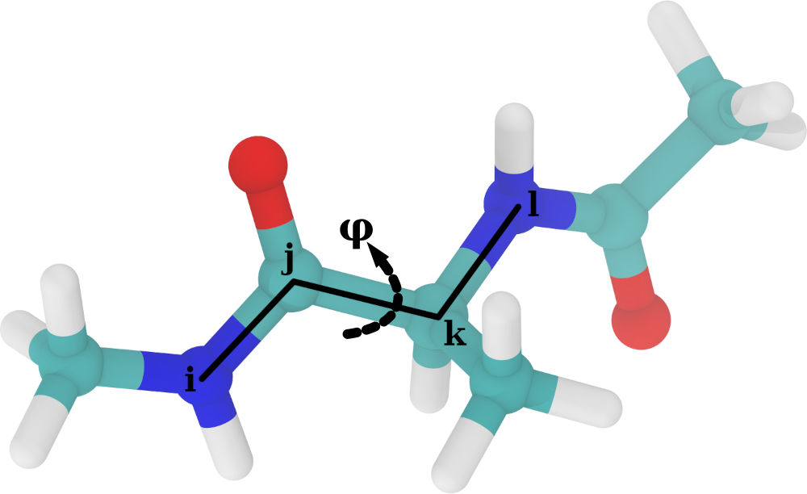
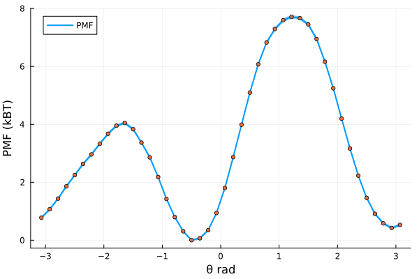
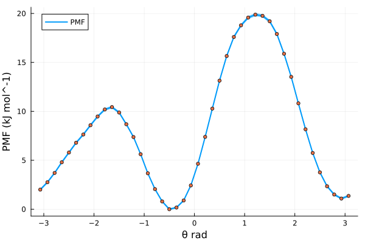
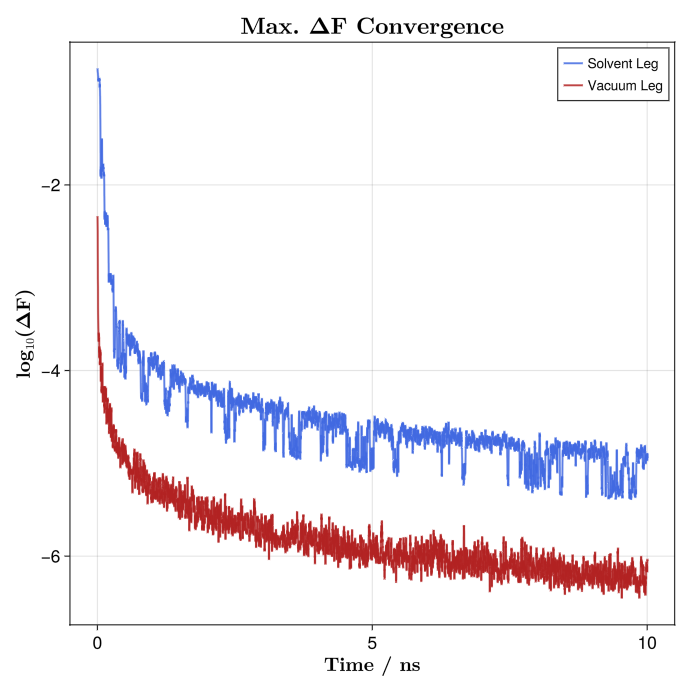
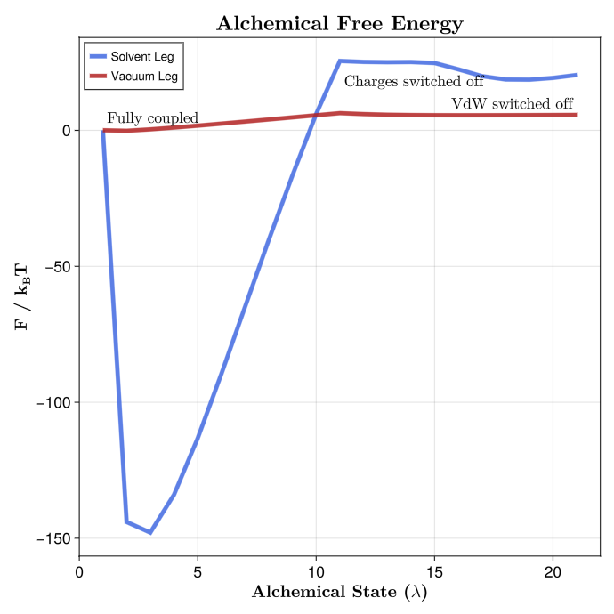

# Free energies with MBAR

## A brief introduction

One of the most relevant uses of molecular dynamics (MD) is the estimation of free energy (FE) changes along a given reaction coordinate. One may be interested in, for example, how favorable the binding of a ligand to a target protein is; or which conformer of a molecule is the most stable. These are the kind of questions that can be addressed with FE techniques.

Through the years, researchers have developed a collection of techniques to solve these problems. As early as 1954, Robert W Zwanzig introduced the [FE perturbation](https://doi.org/10.1063/1.1740409) method, leading to the Zwanzig equation:

```math
\Delta F_{A \rightarrow B} = F_B - F_A = k_B T \ln \left \langle \exp\left( - \frac{E_B - E_A}{k_B T} \right) \right \rangle _A
```

This states that, for a given system, the change of FE in going from state *A* to state *B* is equal to the FE difference between the two states and, more importantly, directly related to the total energy difference of states *A* and *B* through Botzmann statistics. In this equation, the angle brackets represent the expected value of the Boltzmann-weighted energy difference of the two states, but sampled only from conformations extracted from state *A*. This implies that, even when sampling only one state, we are able to infer information from the other, given that some niceness criteria is met, i.e. the energy difference between the two states is small enough. This reasoning about unsampled states by re-evaluating sampled states is known as reweighting.

A little over 20 years after Zwanzig introduced FE perturbation, Charles H Bennett expanded on this and developed the [Bennett Acceptance Ratio](https://doi.org/10.1016/0021-9991(76)90078-4) (BAR). Bennett built directly upon the statistical foundation of the Zwanzig equation, and recognized that both forward and reverse energy differences between two states contain complementary information; that is, while Zwanzig’s formulation reweights configurations from a single ensemble to estimate the free energy of another, BAR symmetrizes this process. It combines samples from both states and determines the free energy shift $\Delta F$ that makes each ensemble equally probable under some weighting derived from Boltzmann statistics. In this sense, BAR can be viewed as a generalization of Zwanzig’s exponential averaging, reducing to the Zwanzig equation when only one direction of sampling is available. However, it is because of this that BAR still suffers from the same issue as Zwanzig's reweighting method: the energy difference between states $A$ and $B$ must be small enough such that there is sufficient overlap between their configurational spaces, otherwise the necessary statistics for FE estimation will be very poor and intermediate steps between $A$ and $B$ are needed.

Thus, in 2008 Michael R Shirts and John D Chodera introduced the [Multistate Bennett Acceptance Ratio](https://doi.org/10.1063/1.2978177) (MBAR) method. MBAR expands on BAR by instead of just using two states *A* and *B*, considering a collection of *k* $\in$ *K* different thermodynamic states. The only thing that is expected from these states is that they must be sampled from equivalent thermodynamic ensembles, this is, all states should be NVT or NPT, etc.; but other than that, the specific Hamiltonian for each evaluated state can differ in an arbitrary manner. Then, a series of $n_k$ samples are drawn from each thermodynamic state, until a total of $N = \sum_{k}^{K} n_k$ samples are obtained. By evaluating each sample $n \in N$ with each Hamiltonian $\mathcal{H}_{k}; k \in K$, one obtains a matrix of reduced potentials $u_{nk} = \beta_{k} \left[ E_{k}(n)+p_{k}V(n) \right]$. MBAR then solves a set of self-consistent equations that yield the relative free energies $f_k$ of all states simultaneously, using every sample across all simulations to estimate each state’s free energy in a statistically optimal way. In this sense, MBAR generalizes BAR to an arbitrary number of thermodynamic states and provides the maximum-likelihood, minimum-variance estimator for free energies and ensemble averages, efficiently combining data from overlapping simulations into a unified framework. MBAR also allows the reweighting of any observable to a completely unsampled thermodynamic state. Because this themodynamic state is compared to a collection of sampled states, instead of just one, the conformational space between states is much more likely to overlap, therefore increasing the probability of the reweighting to be meaningful.

## How to run MBAR with Molly

### Defining the restraint interactions

In this example, we will use MBAR to calculate the Potential of Mean Force (PMF) along the central torsion of an alanine dipeptide molecule. In order to do that, we will have to run a series of independent biased simulations, where each will apply an umbrella potential to restrain the peptide torsion fixed around a given angle. We will first define the restraint interaction:



```julia
# restraints.jl file

using LinearAlgebra

struct DihedralRestraint{A, K}
    ϕ0::A # Radians, dimensionless number
    Δϕ::A # Radians, dimensionless number
    k::K  # Energy (e.g. kJ/mol)
end

# Store angles as plain Float64 radians, k should be energy
function DihedralRestraint(ϕ0::Unitful.AbstractQuantity, Δϕ::Unitful.AbstractQuantity, k)
    ϕ0r = ustrip(u"rad", ϕ0)
    Δϕr = ustrip(u"rad", Δϕ)
    return DihedralRestraint(ϕ0r, Δϕr, k)
end
```

Then, we have to define the potential energy and force functions that Molly will call when it encounters such an interaction. We will make use of the machinery present in Molly and define the restraint as a specific interaction, returning the force as a [`SpecificForce4Atoms`](@ref). The functional form used as the bias potential is a quadratic flat bottom angle restraint, using:

```math
\varphi^{\prime} = (\varphi - \varphi^0)\ \%\ 2\pi
```

```math
V\left( \varphi^{\prime} \right) = \begin{cases}
    \frac{1}{2} \cdot k \cdot \left( \varphi^{\prime} - \Delta\varphi \right)^2 & \mathrm{for} \ \lvert \varphi^{\prime} \rvert \ge \Delta\varphi \\
    0 & \mathrm{for} \ \lvert \varphi^{\prime} \rvert \lt \Delta\varphi
\end{cases}
```

Where $\varphi$ and $\varphi^0$ are the current and reference dihedral angles, respectively; $\Delta\varphi$ is the width of the flat bottom of the potential, and $k$ is the energy constant associated with the interaction. The analytic derivation of the force acting on each atom defining the dihedral, given the previous potential, is quite involved and beyond the scope of this tutorial. We do provide here, however, the Julia code used to define the potential energy and force:

```julia
# restraints.jl file

# Robust geometry with clamped inverses
function _dihedral_geom(ci, cj, ck, cl, boundary)
    b1 = vector(cj, ci, boundary)
    b2 = vector(cj, ck, boundary)
    b3 = vector(ck, cl, boundary)

    n1 = cross(b1, b2)
    n2 = cross(b2, b3)

    b2n  = norm(b2)
    n1n2 = dot(n1, n1)
    n2n2 = dot(n2, n2)

    # Angle via atan2
    y = b2n * dot(b1, n2)
    x = dot(n1, n2)
    ϕ = atan(y, x)

    return ϕ, b1, b2, b3, n1, n2, b2n, n1n2, n2n2, x, y
end

_wrap_pi(x::Real) = (x + π) % (2π) - π # Take into account periodicity
_rad(x::Real) = Float64(x)
_rad(x) = Float64(ustrip(u"rad", x))

function Molly.potential_energy(inter::DihedralRestraint{FT, K},
                                ci, cj, ck, cl, boundary, args...) where {FT, K}
    b1 = vector(cj, ci, boundary)
    b2 = vector(cj, ck, boundary)
    b3 = vector(ck, cl, boundary)
    n1 = cross(b1, b2)
    n2 = cross(b2, b3)

    b2n  = norm(b2)
    n1n2 = dot(n1, n1)
    n2n2 = dot(n2, n2)

    y = b2n * dot(b1, n2)
    x = dot(n1, n2)
    ϕ = atan(y, x)

    # Scale-aware tolerances
    Ls = max(ustrip(norm(b1) + norm(b2) + norm(b3)), 1.0) * oneunit(norm(b1))
    tol_b  = 1e-12 * Ls
    tol_xy = 1e-24 * (Ls^4)

    if !isfinite(ϕ) || b2n ≤ tol_b || abs(x) ≤ tol_xy || abs(y) ≤ tol_xy ||
                    sqrt(n1n2) ≤ tol_b^2 || sqrt(n2n2) ≤ tol_b^2
        return zero(inter.k)
    end

    ϕ0 = _rad(inter.ϕ0)
    Δ  = _rad(inter.Δϕ)
    d  = _wrap_pi(ϕ - ϕ0)
    ad = abs(d)

    if ad ≤ Δ
        return zero(inter.k)
    else
        diff = ad - Δ
        return FT(inter.k * (diff * diff) / 2)
    end
end

function Molly.force(inter::DihedralRestraint{FT, K},
                     ci, cj, ck, cl, boundary, args...) where {FT, K}
    b1 = vector(cj, ci, boundary)
    b2 = vector(cj, ck, boundary)
    b3 = vector(ck, cl, boundary)
    n1 = cross(b1, b2)
    n2 = cross(b2, b3)

    b2n  = norm(b2)
    n1n2 = dot(n1, n1)
    n2n2 = dot(n2, n2)

    y = b2n * dot(b1, n2)
    x = dot(n1, n2)
    ϕ = atan(y, x)

    # Zero force with correct units (energy/length)
    F0 = FT(zero(inter.k) / oneunit(norm(b1)))
    Fz = SVector(F0, F0, F0)

    # Tolerances
    Ls = max(ustrip(norm(b1) + norm(b2) + norm(b3)), 1.0) * oneunit(norm(b1))
    tol_b  = 1e-12 * Ls
    tol_xy = 1e-24 * (Ls^4)

    if !isfinite(ϕ) || b2n ≤ tol_b || abs(x) ≤ tol_xy || abs(y) ≤ tol_xy ||
                    sqrt(n1n2) ≤ tol_b^2 || sqrt(n2n2) ≤ tol_b^2
        return SpecificForce4Atoms(Fz, Fz, Fz, Fz)
    end

    ϕ0 = _rad(inter.ϕ0)
    Δ  = _rad(inter.Δϕ)
    d  = _wrap_pi(ϕ - ϕ0)
    ad = abs(d)
    if ad ≤ Δ
        return SpecificForce4Atoms(Fz, Fz, Fz, Fz)
    end

    # dU/dϕ as energy
    dU_dϕ = inter.k * (ad - Δ) * (d ≥ 0 ? 1.0 : -1.0)

    # Safe inverses
    εL4 = 1e-32 * (Ls^4)
    εL2 = 1e-32 * (Ls^2)
    inv_n1  = 1 / max(n1n2, εL4)
    inv_n2  = 1 / max(n2n2, εL4)
    b22     = dot(b2, b2)
    inv_b22 = 1 / max(b22,  εL2)

    # Gradients (all ~ 1/L)
    g1 = (b2n * inv_n1) * n1
    g4 = (b2n * inv_n2) * n2
    s1 = dot(b1, b2) * inv_b22
    s3 = dot(b3, b2) * inv_b22
    g2 = -g1 + s1*g1 - s3*g4
    g3 = -g4 + s3*g4 - s1*g1

    F1 = -(dU_dϕ) * g1
    F2 = -(dU_dϕ) * g2
    F3 = -(dU_dϕ) * g3
    F4 = -(dU_dϕ) * g4
    return SpecificForce4Atoms(FT.(F1), FT.(F2), FT.(F3), FT.(F4))
end
```

### Setting up simulations

With this in hand, we are ready to set up the individual biased simulations. We will explore a full torsion around the dihedral, i.e. spanning 360 degrees. We will do so in 60 independent biased simulations, so 360 degrees / 60 simulations = 6 degrees increments per simulation. The system is quite well-behaved, so we can get away with using Float32 precision on GPU. We will use a time step of 1 fs to integrate the equations of motion, and will run the simulations in the NPT ensemble at 310 K and 1 bar of pressure.

```julia
# pulling.jl

using Molly
using CUDA

include("restraints.jl")

FT     = Float32               # Float precision
AT     = CuArray               # Array type, run simulations on CUDA GPU
N_WIN  = 60                    # Number of umbrella windows to generate
dR     = FT(6)u"deg"           # Increment in CV (torsion angle) in each consecutive window
ΔR     = FT(3)u"deg"           # Width of flat bottom potential
K_bias = FT(250)u"kJ * mol^-1" # Energy constant for restraint potential
Δt     = FT(1)u"fs"            # Simulation timestep
T0     = FT(310)u"K"           # Simulation temperature
P0     = FT(1)u"bar"           # Simulation pessure
```

One must take into account that the simulations will start from an initial (ideally equilibrated) configuration, and therefore an arbitrarirly imposed restraint may be too far away from the equilibrium distribution of the CV to be biased, causing numerical issues. Thus, we will begin our setup by gently pulling the system along the CV in a series of short, sequential simulations. How short? The answer to that question depends on the system to be simulated; the pulling simulations should be long enough so that the system has time to move towards and stabilize around the imposed biased equilibrium, but also sufficiently short as to not waste time in this initial sequential part, as once each umbrella window is equilibrated it can run in parallel with the rest. For this simple study case, equilibrating each window for 0.5 ns is enough. We can define:

```julia
# pulling.jl

tu      = unit(Δt)                   # Time units used for timestep
max_t   = uconvert(u, FT(0.5)u"ns")  # Simulation time in appropriate time units
N_STEPS = Int(floor(max_t / Δt))     # Number of simulation steps
```

We can now load the initial configuration into a [`System`](@ref):

```julia
# pulling.jl

data_dir = joinpath(dirname(pathof(Molly)), "..", "data")
ff_dir = joinpath(data_dir, "force_fields")

ff = MolecularForceField(
    FT,
    joinpath.(ff_dir, ["ff99SBildn.xml", "tip3p_standard.xml"])...;
    units=true,
)

sys_0 = System(
    joinpath(data_dir, "..", "exercises", "dipeptide_equil.pdb"),
    ff;
    array_type=AT,
    nonbonded_method=:cutoff,
)

random_velocities!(sys_0, T0) # Initialize velocities from M-B distribution at target temperature
```

Now, before starting to produce the pulling simulations, we need to know what is the value of the CV (remember, the torsion angle) for an equilibrated system. We can make use of the functions defined in `restraints.jl`. Remember to take note of this value, it will be important later!

```julia
# pulling.jl

# Indices of the atoms defining the dihedral
i = 17
j = 15
k = 9
l = 7

coords_cpu = Molly.from_device(sys_0.coords)
eq_θ,      = _dihedral_geom(coords_cpu[i], coords_cpu[j], coords_cpu[k], coords_cpu[l], sys_0.boundary)
eq_θ       = _wrap_pi(eq_θ) # = -0.48948112328583804 rad
```

We are getting very close to running the pulling simulations. The only remaining things to define are the coupling algorithms to keep a constant temperature and pressure, which integrator to use, and also tell Molly every how many integration steps should we write the coordinates to a trajectory file:

```julia
# pulling.jl

τ_T        = FT(1)u"ps" # Thermostat coupling constant
# Apply thermostat every simulation step, required for Verlet-type integrators
thermostat = VelocityRescaleThermostat(T0, τ_T, n_steps = 1)

τ_P        = FT(1)u"ps" # Barostat coupling constant
# Apply barostat 10 times per τ_P, good balance of precision and computational overhead
frac       = uconvert(tu, 0.1 * τ_P)
n_P        = Int(floor(frac/Δt)) # The number of simulation steps
barostat   = CRescaleBarostat(P0, τ_P; n_steps = n_P)

# Create the integrator, remove COM motion every 100 steps
vverlet    = VelocityVerlet(Δt, (thermostat, barostat,), 100)

save_t     = uconvert(tu, FT(1)u"ps") # Save coordinates every picosecond
save_steps = Int(floor(save_t / Δt))  # The number of simulation steps
```

With all of this ready, we only need to sequentially run the pulling simulations. We use the coordinates and velocities at the end of simulation n to seed the beginning of simulation n + 1:

```julia
# pulling.jl

old_sys = deepcopy(sys_0) # Get a copy of the initial system
sils    = deepcopy(sys_0.specific_inter_lists) # Get the interactions lists of the unbiased system
for w in 1:N_WIN
    # Calculate where is the potential well located for a given window
    rest_θ = FT(eq_θ - (w-1) * uconvert(u"rad", dR))
    # Create the Dihedral restraint given our parameters
    dRest = DihedralRestraint(rest_θ*u"rad", uconvert(u"rad", ΔR) , K_bias)

    # Pack restraint into an independent interaction list
    rest_inter = InteractionList4Atoms(
        Molly.to_device([i], AT),
        Molly.to_device([j], AT),
        Molly.to_device([k], AT),
        Molly.to_device([l], AT),
        Molly.to_device([dRest], AT),
    )

    rest_inter = (sils..., rest_inter,) # Merge unbiased and biased into single tuple

    sys_w = System(
        deepcopy(old_sys); # Get the same layout as the unbiased system
        specific_inter_lists=rest_inter, # Overwrite interaction list with the one containing the bias
        loggers=(TrajectoryWriter(save_steps, "./pull_$(w).dcd"),),
    )

    simulate!(sys_w, vverlet, N_STEPS)

    # We also write the very last structure to a pdb file
    write_structure("./pull_$(w).pdb", sys_w)

    global old_sys = sys_w # Override old system with the newly simulated one
end
```

### Running umbrella simulations

Once we have run the pulling, we can write a small standalone script to produce the umbrella sampling simulations. These can be run in parallel as they are independent. The simulation setup must be exactly the same used to produce the pulling, except for the amount of time the simulations will be run for. In our case, each simulation was run for a total of 50 ns:

```julia
# individual_simulation.jl

using Molly
using CUDA

include("restraints.jl")

SIM_N = parse(Int, ARGS[1])      # Take the umbrella index as the first argument

FT     = Float32               # Float precision
AT     = CuArray               # Array type, run simulations on CUDA GPU
N_WIN  = 60                    # Number of umbrella windows to generate
dR     = FT(6)u"deg"           # Increment in CV (torsion angle) in each consecutive window
ΔR     = FT(3)u"deg"           # Width of flat bottom potential
K_bias = FT(250)u"kJ * mol^-1" # Energy constant for restraint potential
Δt     = FT(1)u"fs"            # Simulation timestep
T0     = FT(310)u"K"           # Simulation temperature
P0     = FT(1)u"bar"           # Simulation pessure

data_dir = joinpath(dirname(pathof(Molly)), "..", "data")
ff_dir = joinpath(data_dir, "force_fields")

ff = MolecularForceField(
    FT,
    joinpath.(ff_dir, ["ff99SBildn.xml", "tip3p_standard.xml"])...;
    units=true,
)

sys = System(
    "pull_$(SIM_N).pdb", # Now we load the final structure for a given pull simulation
    ff;
    array_type=AT,
    nonbonded_method=:cutoff,
)

random_velocities!(sys, T0)

# Indices of atoms defining the dihedral
i = 17
j = 15
k = 9
l = 7

eq_θ = FT(-0.48948112328583804) # We get this from the equilibrium structure

tu         = unit(Δt)                 # Time units used for timestep
max_t      = uconvert(u, FT(50)u"ns") # Simulation time in appropriate time units
N_STEPS    = Int(floor(max_t / Δt))   # Number of simulation steps

τ_T        = FT(1)u"ps"               # Thermostat coupling constant
thermostat = VelocityRescaleThermostat(T0, τ_T, n_steps=1) # Apply thermostat every simulation step

τ_P        = FT(1)u"ps"               # Barostat coupling constant
frac       = uconvert(tu, 0.1 * τ_P)  # Apply barostat 10 times per τ_P, good balance of precision and computational overhead
n_P        = Int(floor(frac/Δt))      # To number of simulation steps
barostat   = CRescaleBarostat(P0, τ_P; n_steps=n_P)

vverlet    = VelocityVerlet(Δt, (thermostat, barostat,), 100) # Create the integrator, remove COM motion every 100 steps

save_t     = uconvert(tu, FT(1)u"ps")  # Save coordinates every picosecond
save_steps = Int(floor(save_t / Δt))   # To number of simulation steps

rest_θ = FT(eq_θ - (SIM_N-1) * uconvert(u"rad", dR)) # The equilibrium value for the bias
dRest  = DihedralRestraint(rest_θ*u"rad", uconvert(u"rad", ΔR) , K_bias) # Create interaction

# Pack into interaction list
rest_inter = InteractionList4Atoms(
    Molly.to_device([i], AT),
    Molly.to_device([j], AT),
    Molly.to_device([k], AT),
    Molly.to_device([l], AT),
    Molly.to_device([dRest], AT),
)

sils       = deepcopy(sys.specific_inter_lists) # Unbiased
rest_inter = (sils..., rest_inter,)             # Merge biased and unbiased

sys = System(
    deepcopy(sys); # Everything from the unbiased system
    specific_inter_lists=rest_inter, # Overwrite specific interactions
    loggers=(trj=TrajectoryWriter(save_steps, "./umbrella_$(SIM_N).dcd"),),
)

simulate!(sys, vverlet, N_STEPS)
```

### Calculating free energies with MBAR

Once all of the individual umbrella simulations are finished, we are ready to run MBAR on the results and estimate the free energy along our reaction coordinate. Remember from the first section of this tutorial that the MBAR equations are solved by evaluating every generated conformation with every used Hamiltonian. It follows, then, that we will first have to set up an array of [`System`](@ref) structs that represent each Hamiltonian. Moreover, we will be reading data from trajectories, so those Systems will actually be wrapped inside [`EnsembleSystem`](@ref) structs, which allow IO operations from trajectory files into data structures usable by Molly.

We start by defining variables that will be shared by all thermodynamic states. Notice how many things are shared with the parameters used to produce the simulations!

```julia
# MBAR.jl

using Molly
using CUDA

include("restraints.jl")

AT = CuArray
FT = Float32

# Bias parameters
dR     = FT(6)u"deg"           # Increment of CV in each umbrella window
ΔR     = FT(3)u"deg"           # Width for flat bottom potential
K_bias = FT(250)u"kJ * mol^-1" # Force used in the restraint

temp = FT(310)u"K"
pres = FT(1)u"bar"

data_dir = joinpath(dirname(pathof(Molly)), "..", "data")
ff_dir = joinpath(data_dir, "force_fields")

trajs_dir = "./" # Or wherever you have saved the umbrella simulations

ff = MolecularForceField(
    FT,
    joinpath.(ff_dir, ["ff99SBildn.xml", "tip3p_standard.xml"])...;
    units=true,
)

sys_nobias = System(
    joinpath(data_dir, "..", "exercises", "dipeptide_equil.pdb"),
    ff;
    array_type=AT,
    nonbonded_method=:cutoff,
)

# Atom indices defining dihedral
i = 17
j = 15
k = 9
l = 7

eq_θ  = FT(-0.48948112328583804) # We get this from the equilibrium structure

N_TRJ       = 60 # The number of umbrella simulations produced
TRJ_SYSTEMS = Vector{EnsembleSystem}(undef, N_TRJ)

Threads.@threads for trj_n in 1:N_TRJ
    traj_path = joinpath(trajs_dir, "umbrella_$(trj_n).dcd")

    # Note that the restraint and specific interactions list must be created
    # in exactly the same way as for the umbrella simulations, we need exactly
    # the same Hamiltonian
    rest_θ = FT(eq_θ - (trj_n-1) * uconvert(u"rad", dR))
    dRest = DihedralRestraint(rest_θ*u"rad", uconvert(u"rad", ΔR) , K_bias)

    rest_inter = InteractionList4Atoms(
        Molly.to_device([i], AT),
        Molly.to_device([j], AT),
        Molly.to_device([k], AT),
        Molly.to_device([l], AT),
        Molly.to_device([dRest], AT),
    )

    sils = deepcopy(sys_nobias.specific_inter_lists)

    rest_sils = (sils..., rest_inter,)
    sys_rest = System(sys_nobias; specific_inter_lists=rest_sils)

    # Store in struct that allows reading trajectories
    sys_trj = EnsembleSystem(sys_rest, traj_path)

    TRJ_SYSTEMS[trj_n] = sys_trj
end
```

We now have a vector of structs that represent each system and its trajectory. The next step is to read the trajectories and sample the relevant magnitudes to solve MBAR and get our PMF. We will need the coordinates, the system boundaries (needed to calculate the volume for the $pV$ terms of the Hamiltonian, as we have run the simulations in the NPT ensemble) and, of course, the CV of interest. Note that MBAR assumes statistical independence of samples, so the selected conformations must be subsampled from decorrelated states. Molly does provide the functionality to estimate the statistical inefficiency of a given timeseries and subsequent subsampling.

```julia
# MBAR.jl

C  = Vector{<:Any}(undef, N_TRJ) # Vector to store coordinates
B  = Vector{<:Any}(undef, N_TRJ) # Vector to store boundaries
CV = Vector{<:Any}(undef, N_TRJ) # Vector to store the CV

# We discard the first 12500 frames (12.5 ns), assume system is still equilibrating there
FIRST_IDX = 12_500

Threads.@threads for nt in 1:N_TRJ
    trjsys = TRJ_SYSTEMS[nt]
    n_frames = Int(length(trjsys.trajectory))

    # Temp arrays to store potential energy, coordinates, boundaries and CV
    u, c, b, cv  = [], [], [], []

    # Iterate over trajectory frames
    for n in FIRST_IDX:n_frames
        current_sys = read_frame!(trjsys, n) # Read the current frame as a System
        pe = potential_energy(current_sys)
        coords = Molly.from_device(current_sys.coords)
        boundary = current_sys.boundary

        # Measure the CV at the current frame
        ϕ = _dihedral_geom(coords[i], coords[j], coords[k], coords[l], boundary)

        push!(u, pe)
        push!(c, coords)
        push!(b, boundary)
        push!(cv, ϕ*u"rad")
    end

    # Estimate the decorrelation time from the timeseries of the potential energy
    ineff = Molly.statistical_inefficiency(u; maxlag=n_frames-1)

    # Subsample arrays based on statistical inefficiency
    sub_coords = Molly.subsample(c,  ineff.stride; first=1)
    sub_bounds = Molly.subsample(b,  ineff.stride; first=1)
    sub_CV     = Molly.subsample(cv, ineff.stride; first=1)

    C[nt]  = sub_coords
    B[nt]  = sub_bounds
    CV[nt] = sub_CV
end
```

Next, we define a vector of thermodynamic states to represent each Hamiltonian used to produce the simulations, as well a single state that represents the system in the absence of bias potentials. We will use the [`ThermoState`](@ref) struct provided by Molly:

```julia
# MBAR.jl

# Assemble the thermodynamic systems for each umbrella window
energy_units = TRJ_SYSTEMS[1].system.energy_units
kBT          = uconvert(energy_units, Unitful.R * temp)
βi           = Float64(ustrip(1.0 / kBT))

states = ThermoState[ThermoState("win_$i", βi, pres, TRJ_SYSTEMS[i].system)
                     for i in eachindex(TRJ_SYSTEMS)]

target_state = ThermoState("target", βi, pres, sys_nobias)
```

We are finally in possession of everything needed to solve the MBAR equations and estimate the PMF along our CV! There are two paths we can take for this, the long path and the short path. For the sake of completeness, we describe the long path first. The first step for solving MBAR is assembling the reduced energy matrix. Molly provides a functionality just for that through the [`assemble_mbar_inputs`](@ref) method:

```julia
# MBAR.jl

mbar_gen = assemble_mbar_inputs(
    C, B, states; # Coordinates, boundaries and thermodynamic states
    target_state=target_state, # The target state, in our case the unbiased system
    energy_units=energy_units,
)

u        = mbar_gen.u        # Reduced energy matrix, K states by N sampled conformations
u_target = mbar_gen.u_target # The reduced energy of the N samples evaluated by the target state hamiltonian
N_counts = mbar_gen.N        # Number of sampled conformations
win_of   = mbar_gen.win_of   # Indexing helper that tells which k state was used to generate each n sample
shifts   = mbar_gen.shifts   # Numerical shifts, if used, for stability reasons when building the reduced energy matrix
```

This generates the necessary inputs to use the self-consistent iteration method to solve the MBAR equations. Of course, Molly provides the [`iterate_mbar`](@ref) method to do so:

```julia
# MBAR.jl

# Returns the relative free energy of each k state and log.(N_counts), needed for downstream computations
F_k, logN = iterate_mbar(u, win_of, N_counts)
```

With this, we can also produce a weight matrix and a vector of target weights, using the  [`mbar_weights`](@ref) method, that will let us reweight any arbitrary quantity from the sampled K thermodynamic states to any target state:

```julia
# MBAR.jl

# Returns the weights matrix and the target weights
W_s, w_target = mbar_weights(u, u_target, F_k, logN, N_counts; check=true, shifts=shifts)
```

And finally, we can estimate the PMF using the output of the previous step by calling the [`pmf_with_uncertainty`](@ref) method:

```julia
# MBAR.jl

pmf = pmf_with_uncertainty(u, u_target, F_k, N_counts, logN, CV; shifts=shifts, kBT=kBT)

centers   = pmf.centers        # The collective variable
PMF       = pmf.F              # PMF in kBT
PMF_enr   = pmf.F_energy       # PMF in energy units
sigma     = pmf.sigma_F        # Standard deviation in kBT
sigma_enr = pmf.sigma_F_energy # Standard deviation in energy units
```

But what about the short path? Well, we also provide an overload of the [`pmf_with_uncertainty`](@ref) method that allows to get the PMF in a single call by doing:

```julia
# MBAR.jl
pmf = pmf_with_uncertainty(
    C,            # Coordinates
    B,            # Boundaries
    states,       # Themodynamic states
    target_state, # Target state
    CV,           # Collective variable
)
```

Now one can put this into a graph, for example using a scatter for the free energy and making use of the calculated sigmas (see the previous code blocks) to shade the plot and give a feel for the uncertainties. The code is left as an exercise to the reader, but the results should look like something similar to this:




# Free energies with AWH

## An overview

One of the major challenges in MD is the timescale limitation when exploring complex free energy (FE) landscapes. While methods like MBAR excel at extracting free energies from a set of equilibrium simulations, obtaining that equilibrium sampling is often hindered by high free energy barriers. When a system gets trapped in a local minimum, standard MD, and even parallel equilibrium simulations, might fail to sample the transition regions adequately.

To overcome this, researchers turn their attention to adaptive biasing techniques. Rather than applying a static bias, adaptive methods build a bias potential on the fly to actively push the system out of local minima and drive the exploration of the collective variable (CV) space. Pioneering methods in this family include the Wang-Landau algorithm and Metadynamics. These approaches continuously add bias to previously visited states, effectively flattening the free energy landscape over time. However, a common drawback of these early adaptive methods is the need for heuristic parameters to decrease the bias update rate as the simulation progresses. If the bias update is shrunk too quickly, the system might not converge to the true free energy; if shrunk too slowly, the bias will continue to fluctuate, adding noise to the final FE estimate.

In 2012, Jack Lidmar [introduced](https://doi.org/10.1103/PhysRevE.85.056708) the Accelerated Weight Histogram (AWH) method to solve this convergence problem. AWH continuously adapts a bias function to steer the simulation toward a predefined target distribution, using a rigorous statistical mechanics foundation that guarantees asymptotic convergence.

### The Mathematics of AWH

AWH operates within the framework of an extended ensemble. Instead of simulating a system at a fixed thermodynamic state, an state parameter $\lambda$ is promoted to be a dynamic variable alongside the atomic coordinates $x$. In Molly, $\lambda$ typically represents an index mapping to a specific discrete state (such as a specific umbrella restraint, an alchemical Hamiltonian, a particular temperature...). The goal of the extended ensemble is to sample the joint probability distribution:

```math
P(x, \lambda) \propto \exp\left( - \beta_\lambda E_\lambda(x) + g(\lambda) \right)
```

Here, $\beta_{\lambda}​E_{\lambda}​(x)$ is the dimensionless potential energy of configuration $x$ evaluated at state $\lambda$, and $g(\lambda)$ is a (fictitious) bias function. We want the marginal distribution of the sampled states $P(\lambda)$ to match a specific, user-defined target distribution $\rho(\lambda)$ (which is often simply a flat, uniform distribution). To achieve this, the exact bias required is $g(\lambda) = F(\lambda) + \log \rho (\lambda)$, where $F(\lambda)$ is the true dimensionless free energy. Because $F(\lambda)$ is initially unknown, AWH substitutes it with an iteratively refined estimate, $f(\lambda)$:

```math
g(\lambda) = f(\lambda) + \ln \rho(\lambda)
```

In Molly's implementation, the dynamics of $x$ and $\lambda$ are decoupled using a Gibbs sampling approach. The simulation proceeds by integrating the equations of motion for the coordinates $x$ using the Hamiltonian of the currently active state $\lambda$. Periodically, the simulation pauses the integration of $x$ to sample a new $\lambda$ state.

To do this, AWH leverages the same reweighting principles found in MBAR. The current configuration $x$ is re-evaluated across all available Hamiltonians $\mathcal{H}_{k}$​ to compute the dimensionless potentials $\beta_{k}​E_{k}​(x)$. From these, a transition probability, or weight, is calculated for every state k:

```math
\omega_k(x) = \frac{\exp\left( f_k + \ln \rho_k - \beta_k E_k(x) \right)}{\sum_j \exp\left( f_j + \ln \rho_j - \beta_j E_j(x) \right)}
```

A new active state $\lambda$ is then drawn randomly according to these weights $\omega_{k}$​. This allows the system to make arbitrarily large jumps in $\lambda$-space as long as there is sufficient phase-space overlap.

### The Free Energy Update

As the simulation progresses, the calculated weights $\omega_{k}$​ are accumulated into a segment histogram $W_{k}$​. After a set number of steps, AWH updates its free energy estimate $f_{k}$​. The core principle of AWH is that the accumulated weights represent fluctuations on top of an ideal reference weight histogram containing an effective number of samples $N$. The update equation is:

```math
f_k \leftarrow f_k - \ln \left( \frac{N \rho_k + W_k}{N \rho_k + n \rho_k} \right)
```

where $n$ is the number of samples collected in the current update segment.

The magnitude of the free energy update is governed by $N$. AWH dictates a highly robust two-stage update scheme for $N$:

1. **Initial Stage**: $N$ is kept artificially small and constant. This causes the $\Delta f$ updates to remain large, rapidly filling in free energy basins and aggressively bootstrapping the system across high energy barriers. Once the system has sufficiently covered the $\lambda$ space, $N$ is scaled up exponentially.

2. **Linear Stage**: Once the initial exploration is complete, $N$ is allowed to grow linearly with the simulation time ($N \propto t$). Consequently, the magnitude of the free energy updates scales down exactly as $1/t$, which is the theoretically optimal statistical rate for convergence.

## How to run AWH with Molly

### Defining a 2D collective variable space

In this example, we will calculate the free energy landscape of an alanine dipeptide molecule, but this time we will explore a two-dimensional reaction coordinate: both the $\phi$ and $\psi$ central torsions. While running standard Umbrella Sampling and MBAR on a 2D grid is possible, the number of required independent simulations grows geometrically (e.g., a $15 \times 15$ grid requires 225 independent simulations!). Accelerated Weight Histogram (AWH) bypasses this issue. By treating the discrete bias grid as an extended ensemble parameter $\lambda$, AWH can dynamically explore the entire 2D space within a single, continuous molecular dynamics simulation.

We will begin by defining the basic simulation parameters. We want our 2D grid to span the entire periodic range from $-\pi$ to $\pi$ for both dihedral angles, using 15 bins per dimension.

```julia
# awh_2d.jl

using Molly
using LinearAlgebra
using Statistics
using Unitful
using CUDA
using GLMakie

# --- 1. Simulation Parameters ---

FT = Float32
AT = CuArray
T_sim = FT(310.0)u"K"
K_bias = FT(500.0)u"kJ * mol^-1" # Bias force constant
DT = FT(1.0)u"fs"

tu = unit(DT)
sim_t = uconvert(tu, FT(20)u"ns")
sim_steps = Int(floor(sim_t / DT))

# AWH Parameters (2D)
PMF_MIN = FT(-π)
PMF_MAX = FT(π)
N_BINS = 15 # 15x15 = 225 discrete λ states
GRID_WIDTH = FT((PMF_MAX - PMF_MIN) / N_BINS)

DELTA_R = FT(12.0)u"°" 
WIDTH_RAD = ustrip(u"rad", DELTA_R)

# Atom Indices for Alanine Dipeptide (ACE-ALA-NME)
phi_inds = [5, 7, 9, 15] 
psi_inds = [7, 9, 15, 17]
```

Next, we load the initial configuration and define our standard base [`System`](@ref) and integration algorithms, exactly as we would for a normal MD run.

```julia
# awh_2d.jl

data_dir = joinpath(dirname(pathof(Molly)), "..", "data")
ff_dir = joinpath(data_dir, "force_fields")
ff = MolecularForceField(FT, joinpath.(ff_dir, ["ff99SBildn.xml", "tip3p_standard.xml"])...; units=true)

# Load PDB
sys = System(
    joinpath(data_dir, "..", "exercises", "dipeptide_equil.pdb"),
    ff;
    array_type=AT,
    nonbonded_method=:cutoff,
)

# Initialize standard integrator
thermostat = VelocityRescaleThermostat(T_sim, FT(1)u"ps")
barostat   = CRescaleBarostat(FT(1)u"bar", FT(1)u"ps"; n_steps = 100)

simulator = VelocityVerlet(
    dt=DT,
    coupling=(thermostat, barostat),
    remove_CM_motion = 100
)
```

### Setting up the AWH thermodynamic states

AWH requires a collection of [`ThermoState`](@ref) objects, where each state represents a specific point $\lambda$ in our extended ensemble. In our case, each $\lambda$ is a unique combination of a $\phi$ and $\psi$ restraint target.

We will loop over our 15 × 15 grid. For each coordinate pair, we define the respective collective variables and biases. Notice a crucial optimization step here: instead of deep-copying the entire [`System`](@ref) 225 times (which would heavily bloat GPU memory with duplicate coordinate and atom arrays), we create shallow systems that share the heavy arrays but use unique `general_inters` lists containing the specific [`BiasPotential`](@ref) for that window.

```julia
# awh_2d.jl

thermo_states = ThermoState[]
grid_points = range(PMF_MIN, PMF_MAX, length=N_BINS)

println("Generating $(N_BINS*N_BINS) thermodynamic states...")

for phi_target in grid_points
    for psi_target in grid_points
        
        # --- Bias 1: Phi ---
        cv_phi = CalcTorsion(phi_inds, :pbc, true)
        bias_phi = PeriodicFlatBottomBias(K_bias, WIDTH_RAD, phi_target)
        bp_phi = BiasPotential(cv_phi, bias_phi)

        # --- Bias 2: Psi ---
        cv_psi = CalcTorsion(psi_inds, :pbc, true)
        bias_psi = PeriodicFlatBottomBias(K_bias, WIDTH_RAD, psi_target)
        bp_psi = BiasPotential(cv_psi, bias_psi)
        
        # --- Create System with Dual Bias ---
        # We share heavy arrays (atoms, coords) to save memory
        sys_window = System(
            atoms=sys.atoms,
            coords=sys.coords,
            boundary=sys.boundary,
            pairwise_inters=sys.pairwise_inters,
            specific_inter_lists=sys.specific_inter_lists,
            general_inters=(sys.general_inters..., bp_phi, bp_psi), # Inject the active biases
            neighbor_finder=sys.neighbor_finder
        )
        
        push!(thermo_states, ThermoState(sys_window, simulator))
    end
end
```

### Initializing and running the AWH simulation

With our discrete grid of states ready, we initialize the [`AWHState`](@ref) and the [`AWHSimulation`](@ref).

Because our $\lambda$ states represent harmonically biased umbrellas rather than true alchemical intermediates, the free energy $f(\lambda)$ evaluated directly by AWH will be convoluted by the umbrella potentials. To obtain the unbiased PMF $\Phi(\xi)$, Molly provides an on-the-fly PMF deconvolution scheme. By providing the `pmf_grid` argument to [`AWHSimulation`](@ref), Molly will continuously reweight the sampled coordinates to build a high-resolution, deconvoluted PMF during the simulation itself.

```julia
# awh_2d.jl

println("Initializing AWH State...")
awh_state = AWHState(thermo_states; n_bias=100)

println("Setting up Simulation...")

# Note the tuple structure for 2D pmf_grid: ((min_x, min_y), (max_x, max_y), (bins_x, bins_y))
awh_sim = AWHSimulation(
    awh_state;
    num_md_steps = 10,
    update_freq  = 1,
    well_tempered_factor = FT(500.0),
    pmf_grid = ((PMF_MIN, PMF_MIN), (PMF_MAX, PMF_MAX), (60, 60)) # Deconvolve onto a 60x60 high-res grid
)

println("Starting Simulation...")
simulate!(awh_sim, sim_steps)
println("Simulation Complete.")
```

### Extracting and plotting the PMF

Once the simulation completes, our deconvoluted PMF is safely stored inside `awh_sim.pmf_calc`. We can extract it by calculating the negative logarithm of the reweighted histogram ratio. We will write a small helper function to safely handle unvisited bins, shifting the global minimum of the free energy surface to zero.

```julia
# awh_2d.jl

function get_pmf(pmf_struct)
    num = pmf_struct.numerator_hist
    den = pmf_struct.denominator_hist
    
    # Avoid log(0) for unsampled regions
    valid = (num .> 0) .& (den .> 0)
    
    # Create PMF array (implicitly 2D based on input)
    pmf = fill(FT(Inf), size(num))
    pmf[valid] .= -log.(num[valid] ./ den[valid])
    
    # Shift global minimum to 0
    min_val = minimum(pmf[valid])
    pmf[valid] .-= min_val
    return pmf
end

final_pmf = get_pmf(awh_sim.pmf_calc)

# Prepare grid axes in degrees for plotting
phi_vals = rad2deg.(range(PMF_MIN, PMF_MAX, length=60))
psi_vals = rad2deg.(range(PMF_MIN, PMF_MAX, length=60))

# Plot the 2D surface using GLMakie
fig = Figure(resolution = (800, 600))
ax = Axis(fig[1, 1], 
    title = "Alanine Dipeptide 2D PMF (AWH)",
    xlabel = "Phi (degrees)",
    ylabel = "Psi (degrees)"
)

hm = heatmap!(ax, phi_vals, psi_vals, final_pmf, colormap=:viridis, colorrange=(0, 25))
Colorbar(fig[1, 2], hm, label="Free Energy (kBT)")

save("ala_dipeptide_2d_pmf.png", fig)
```

This will output a robust 2D free energy map of the alanine dipeptide Ramachandran plot. All achieved without the need for manual sequential equilibration, thanks to the continuous adaptive biasing of AWH!

## Calculating Alchemical Free Energies with AWH

### The alchemical transformation and the two-leg cycle

In an alchemical free energy calculation, the collective variable is an alchemical parameter $\lambda$ that interpolates the Hamiltonian between two thermodynamic end states. Using AWH eliminates the need to manually optimize a dense ladder of intermediate $\lambda$ states, as the algorithm dynamically enforces a uniform target distribution, dedicating more sampling time to high-gradient regions. 

For a rigorous standard state solvation calculation, a two-leg thermodynamic cycle must be used to account for intramolecular self-interactions and conformational entropy changes that occur upon removing the solvent:
1.  **Solvent Leg (Annihilation):** Both solute-solvent and solute-solute non-bonded interactions are turned off.
2.  **Vacuum Leg (Annihilation):** The isolated solute is simulated, and its intramolecular non-bonded interactions are turned off.

Subtracting the vacuum annihilation work from the solvent annihilation work perfectly isolates the free energy of solvation.

To prevent numerical instability when atoms overlap at low $\lambda$ values, the schedule decouples electrostatic interactions linearly first, followed by van der Waals interactions using a soft-core potential. The timestep is set to **1 fs** to maintain stable numerical integration against the steep potential gradients present in highly decoupled states.

```julia
# alchemical_awh.jl

using Molly
using CUDA
using Unitful
using GLMakie
using StatsBase

# --- Simulation Constants ---
FT = Float32
AT = CuArray
Δt = FT(1)u"fs"
T0 = FT(310)u"K"
P0 = FT(1)u"bar"

# Define Lambda Schedule: (Charge Scaling, VdW Scaling)
lambda_schedule = [
    (1.0, 1.0), (0.9, 1.0), (0.8, 1.0), (0.7, 1.0), (0.6, 1.0), 
    (0.5, 1.0), (0.4, 1.0), (0.3, 1.0), (0.2, 1.0), (0.1, 1.0),
    (0.0, 1.0),
    (0.0, 0.9), (0.0, 0.8), (0.0, 0.7), (0.0, 0.6), 
    (0.0, 0.5), (0.0, 0.4), (0.0, 0.3), (0.0, 0.2), 
    (0.0, 0.1), (0.0, 0.0)
]

# --- Force Field Setup ---
data_dir = joinpath(dirname(pathof(Molly)), "..", "data")
ff_dir   = joinpath(data_dir, "force_fields")
ff = MolecularForceField(FT, joinpath.(ff_dir, ["tip3p_standard.xml", "gaff.xml", "ethanol.xml"])...; units=true)
```

### Annihilation mixing rules

To properly annihilate the solute, custom λ-mixing rules are required. By using a nested minimum function and clamping the highest value, both solute-solvent and solute-solute interactions are appropriately scaled down to zero. Note that using a Lorentz mixing rule in this case is not correct, since for a completely turned off solute $\lambda_{solute} = 0$ and a completely turned on solvend $\lambda_{solvent} = 1$ the overall lambda would yield $\lambda = (0 + 1)/2 = 0.5$. A geometric mixig such as $\sqrt{\lambda \cdot \lambda}$ could be used instead, but that would lead to a non-linear scaling along the alchemical coordinate and would potentially degrade the convergence if the algorithm.

```julia
# alchemical_awh.jl

function annihilation_λ_vdw_mixing(a, b)
    return min(typeof(a.λ_vdw)(0.99999), min(a.λ_vdw, b.λ_vdw))
end

function annihilation_λ_coul_mixing(a, b)
    return min(typeof(a.λ_coul)(0.99999), min(a.λ_coul, b.λ_coul))
end
```

### Setting up the alchemical thermodynamic states

The `setup_alchemical_awh` function constructs the [`AWHState`](@ref) grid. The function handles ensemble selection via the `is_vacuum` flag: an NPT ensemble ([`VelocityRescaleThermostat`](@ref) and [`CRescaleBarostat`](@ref)) is applied for the solvent leg, whereas an NVT ensemble (thermostat only) is applied for the vacuum leg to prevent the unconstrained simulation box from catastrophically collapsing.

Soft-core potentials ([`CoulombSoftCoreBeutler`](@ref) and [`LennardJonesSoftCoreBeutler`](@ref)) replace the standard non-bonded interactions.

```julia
# alchemical_awh.jl

function setup_alchemical_awh(pdb_file, solute_indices; is_vacuum=false)
    sys_base = System(pdb_file, ff; array_type=AT, nonbonded_method=:none)

    thermostat = VelocityRescaleThermostat(T0, FT(0.1)u"ps")
    
    if is_vacuum
        integrator = VelocityVerlet(Δt, (thermostat,), 100)
    else
        barostat = CRescaleBarostat(P0, FT(1)u"ps"; n_steps=250)
        integrator = VelocityVerlet(Δt, (thermostat, barostat), 100)
    end

    minim = SteepestDescentMinimizer(step_size=FT(0.01)u"nm", max_steps=1000)
    simulate!(sys_base, minim)

    p_inters = sys_base.pairwise_inters
    idx_lj   = findfirst(x -> x isa LennardJones, p_inters)
    idx_coul = findfirst(x -> x isa Coulomb, p_inters)
    
    lj_0 = p_inters[idx_lj]
    cl_0 = p_inters[idx_coul]

    atoms_cpu = Molly.from_device(sys_base.atoms)
    thermo_states = ThermoState[]

    for (λ_coul, λ_lj) in lambda_schedule
        lj_sc = LennardJonesSoftCoreBeutler(
            cutoff = lj_0.cutoff,
            λ_mixing = annihilation_λ_vdw_mixing,
            α = FT(0.85),
            use_neighbors = lj_0.use_neighbors
        )

        coul_sc = CoulombSoftCoreBeutler(
            cutoff = cl_0.cutoff,
            λ_mixing = annihilation_λ_coul_mixing,
            α = FT(0.1), 
            coulomb_const = cl_0.coulomb_const,
            use_neighbors = cl_0.use_neighbors
        )

        acopy = Atom[]
        for a in atoms_cpu
            if a.index ∈ solute_indices
                push!(acopy, Atom(a.index, a.atom_type, a.mass, a.charge, a.σ, a.ϵ, FT(λ_coul), FT(λ_lj)))
            else
                push!(acopy, Atom(a.index, a.atom_type, a.mass, a.charge, a.σ, a.ϵ, a.λ_coul, a.λ_vdw))
            end
        end

        sys_w = System(
            deepcopy(sys_base);
            atoms = Molly.to_device([acopy...], AT),
            pairwise_inters = (coul_sc, lj_sc)
        )

        push!(thermo_states, ThermoState(sys_w, deepcopy(integrator)))
    end

    awh_state = AWHState(thermo_states; reuse_neighbors=true)
    awh_sim   = AWHSimulation(awh_state; num_md_steps = 5, log_freq=100, well_tempered_factor=Inf)
    
    return awh_sim, sys_base
end
```

### Execution and Standard State Corrections

The calculation integrates both the solvated and vacuum legs. Since $\lambda$ is tracked dynamically by AWH as a discrete index, the output vector $f(\lambda)$ yields the alchemical free energy profile directly, requiring no PMF deconvolution.

An analytical standard state volume correction, $k_{B}​T \ln(V_{gas}​/V_{std}​)$, shifts the initial and final states from the finite simulation volume to their macroscopic standard definitions (an ideal gas at 1 bar to a 1 Molar solution).

```julia
# alchemical_awh.jl

md_time  = FT(10)u"ns"
md_steps = Int(floor(uconvert(unit(Δt), md_time) / Δt))
solute_idx = 1:9

# 1. Solvated Leg
println("Running Solvated AWH Leg...")
awh_solv, sys_solv = setup_alchemical_awh("ethanol_solv.pdb", solute_idx; is_vacuum=false)
simulate!(awh_solv, md_steps)
dF_solv = awh_solv.state.f[end] - awh_solv.state.f[1]

# 2. Vacuum Leg
println("Running Vacuum AWH Leg...")
awh_vac, sys_vac = setup_alchemical_awh("ethanol.pdb", solute_idx; is_vacuum=true)
simulate!(awh_vac, md_steps)
dF_vac = awh_vac.state.f[end] - awh_vac.state.f[1]

# --- Thermodynamic Cycle ---
V_gas = ustrip(u"nm^3", Unitful.k * T0 / P0)
V_std = ustrip(u"nm^3", 1.0u"L" / (1.0u"mol" * Unitful.Na))
dG_std_corr = log(V_gas / V_std)

dG_solv = dF_vac - dF_solv + dG_std_corr
beta = awh_solv.state.λ_β[1]

println("=========================================")
println("Annihilation in solvent (kJ mol^-1):   ", dF_solv / beta)
println("Annihilation in vacuum (kJ mol^-1):    ", dF_vac / beta)
println("Standard State Correction (kJ mol^-1): ", dG_std_corr / beta)
println("Solvation Free Energy (kJ mol^-1):     ", dG_solv / beta)
println("=========================================")
```

```
=========================================
Annihilation in solvent (kJ mol^-1):   52.39459
Annihilation in vacuum (kJ mol^-1):    14.510403
Standard State Correction (kJ mol^-1): 8.375271054356045
Solvation Free Energy (kJ mol^-1):     -29.508914674463064
=========================================
```

### Analyzing Convergence and Free Energy Profiles

The `max_delta_f_history` array records the maximum bias update applied over time. Plotted logarithmically, this variable confirms convergence once it transitions into a linear $1/t$ decay regime.

```julia
# alchemical_awh.jl

function smooth_array(arr; smooth_n = 4)
    N = length(arr)
    return [mean(arr[max(i - smooth_n, 1):min(i + smooth_n, N)]) for i in eachindex(arr)]
end

steps_solv = length(awh_solv.state.stats.max_delta_f_history)
time_solv  = [ustrip(md_time) * n/steps_solv for n in 1:steps_solv]
steps_vac = length(awh_vac.state.stats.max_delta_f_history)
time_vac  = [ustrip(md_time) * n/steps_vac for n in 1:steps_vac]

fig_conv = Figure(size = (720, 720))
ax_conv = Axis(fig_conv[1,1], title = L"\textbf{Max. ΔF Convergence}", xlabel = L"\textbf{Time / ns}", ylabel = L"\textbf{log}$_{10}$\textbf{(ΔF)}")

lines!(ax_conv, time_solv, log10.(smooth_array(awh_solv.state.stats.max_delta_f_history)), color = :royalblue, label = "Solvent Leg")
lines!(ax_conv, time_vac, log10.(smooth_array(awh_vac.state.stats.max_delta_f_history)), color = :firebrick, label = "Vacuum Leg")

axislegend(ax_conv, position = :rt)
save("awh_alchemical_convergence.png", fig_conv)
```



The resulting alchemical free energy profiles can be extracted and plotted directly from the converged `f` vectors.

```julia
# alchemical_awh.jl

λ_indices = collect(eachindex(awh_solv.state.λ_β))

fig_fe = Figure(size = (720, 720))
ax_fe = Axis(fig_fe[1,1], title = L"\textbf{Alchemical Free Energy}", xlabel = L"\textbf{Alchemical State (\lambda)}", ylabel = L"\textbf{F / k_{B}T}")

lines!(ax_fe, λ_indices, awh_solv.state.f, color = :royalblue, linewidth = 5.0, label = "Solvent Leg")
lines!(ax_fe, λ_indices, awh_vac.state.f, color = :firebrick, linewidth = 5.0, label = "Vacuum Leg")

text!(ax_fe, 1.0, awh_solv.state.f[1], text = L"\text{Fully coupled}", align = (:left, :bottom), offset = (5, 5), fontsize = 18)
text!(ax_fe, 11.0, awh_solv.state.f[11], text = L"\text{Charges switched off}", align = (:left, :top), offset = (5, -15), fontsize = 18)
text!(ax_fe, 21.0, awh_solv.state.f[21], text = L"\text{VdW switched off}", align = (:right, :top), offset = (-5, -25), fontsize = 18)

axislegend(ax_fe, position = :lt)
save("awh_alchemical_profile.png", fig_fe)
```

