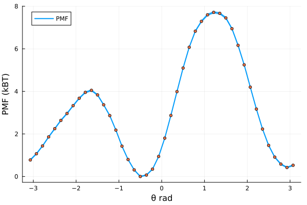
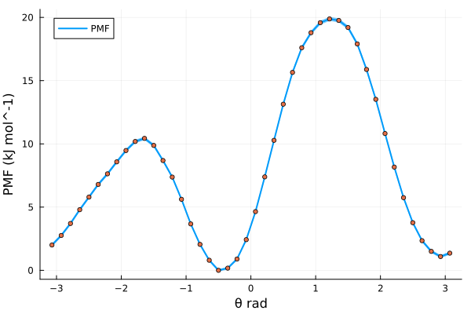

# Free energies with MBAR

## A brief introduction

One of the most relevant uses of Molcular Dynamics (MD) is the estimation of Free Energy (FE) changes along a given reaction coordinate. One may be interested on, for example, how favorable is the binding of a ligand to a target protein; or which conformer of a molecule is the most stable one. These are the kind of questions that can be addressed with FE techniques.

Through the years, researchers have developed a collection of techniques to solve these problems. As early as in 1954, Robert W. Zwanzig introduced the [FE perturbation](https://doi.org/10.1063/1.1740409) method, leading to the Zwanzig equation:

```math
\Delta F_{A \rightarrow B} = F_B - F_A = k_B T \ln \left \langle \exp\left( - \frac{E_B - E_A}{k_B T} \right) \right \rangle _A
```

which states that, for a given system, the change of FE by going from state *A* to state *B* is equal to the FE difference between the two states and, more importantly, directly related to the total energy difference of states *A* and *B*, through Botzmann statistics. In this equation, the angle brackets represent the expected value of the Boltzmann-weighted energy difference of the two states, but sampled **only** from conformations extracted from state *A*. This implies that, even when sampling only one state, we are able to infer information from the other, given that some niceness criteria is met, *i.e.* the energy difference between the two states is small enough. This reasoning about unsampled states by re-evaluating sampled states is known as **reweighting**.

A little over 20 years after Zwanzig introduced FE perturbation, Charles H. Bennet expanded on this and developed the [Bennet Acceptance Ratio](https://doi.org/10.1016/0021-9991(76)90078-4) (BAR). Bennett built directly upon the statistical foundation of the Zwanzig equation, and recognized that both forward and reverse energy differences between two states contain complementary information; that is, while Zwanzig’s formulation reweights configurations from a single ensemble to estimate the free energy of another, BAR symmetrizes this process. It combines samples from both states and determines the free energy shift $\Delta F$ that makes each ensemble equally probable under some weighting derived from Boltzmann statistics. In this sense, BAR can be viewed as a generalization of Zwanzig’s exponential averaging, reducing to the Zwanzig equation when only one direction of sampling is available. However, it is because of this that BAR still suffers from the same issue as Zwanzig's reweihghting method: the energy difference between states $A$ and $B$ must be small enough such that there is sufficient overlap between their configurational spaces, otherwise the necessary statistics for FE estimation will be very poor, and intermediate steps between $A$ and $B$ are needed.

Thus, in 2008 Michael R. Shirts and John D. Chodera introduced the [Multistate Bennet Acceptance Ratio](https://doi.org/10.1063/1.2978177) (MBAR) method. MBAR expands on BAR by instead of just using two states *A* and *B*, considering a collection of *k* $\in$ *K* different thermodynamic states. The only thing that is expected from these states is that they must be sampled from equivalent thermodynamic ensembles, this is, all states should be *NVT* or *NPT*, *etc.*; but other than that, the specific Hamiltonian for each evaluated state can differ in an arbitrary manner. Then, a series of $n_k$ samples are drawn from each thermodynamic state, until a total of $N = \sum_{k}^{K} n_k$ samples are obtained. By evaluating each sample $n \in N$ with each Hamiltonian $\mathcal{H}_{k}; k \in K$, one obtains a matrix of reduced potentials $u_{nk} = \beta_{k} \left[ E_{k}(n)+p_{k}V(n) \right]$. MBAR then solves a set of self-consistent equations that yield the relative free energies $f_k$ of all states simultaneously, using every sample across all simulations to estimate each state’s free energy in a statistically optimal way. In this sense, MBAR generalizes BAR to an arbitrary number of thermodynamic states and provides the maximum-likelihood, minimum-variance estimator for free energies and ensemble averages, efficiently combining data from overlapping simulations into a unified framework. MBAR also allows to reweight any observable to a completely unsampled thermodynamic state. Because this themodynamic state is compared to a collection of sampled states, instead of just one, the conformational space between states is much more likely to overlap, therefore increasing the probability of the reweighting to be meaningful.

## How to run MBAR with Molly

### Defining the restraint interactions

In this example, we will use MBAR to calculate the Potential of Mean Force (PMF) along the central torsion of an Alanine Dipeptide. In order to do that, we will have to run a series of independent biased simulations, in which each one of those will apply an umbrella potential to restrain the peptide torsion fixed around a given angle. We will first define the restraint interaction:


```julia
# restraints.jl file

using LinearAlgebra

struct DihedralRestraint{A, K}
    ϕ0::A      # radians, dimensionless number
    Δϕ::A      # radians, dimensionless number
    k::K       # energy (e.g. kJ/mol)
end

# store angles as plain Float64 radians; enforce k as energy
@inline function DihedralRestraint(ϕ0::Unitful.AbstractQuantity, Δϕ::Unitful.AbstractQuantity, k)
    ϕ0r = ustrip(u"rad", uconvert(u"rad", ϕ0))
    Δϕr = ustrip(u"rad", uconvert(u"rad", Δϕ))
    return DihedralRestraint(ϕ0r, Δϕr, k)  # k should be energy
end
```

Then, we have to define the potential energy and force functions that Molly will call when it encounters such interaction. We will make use of the machinery present in Molly and define the restraint as a Specific Interaction, returning the force as a [`SpecificForce4Atoms`](@ref). The functional form used as the bias potential is a quadratic flat bottom angle restraint, using:

```math
\varphi^{\prime} = (\varphi - \varphi^0)\ \%\ 2\pi 
```

```math
V\left( \varphi^{\prime} \right) = \begin{cases}
    \frac{1}{2} \cdot k \cdot \left( \varphi^{\prime} - \Delta\varphi \right)^2 & \mathrm{for} \ \lvert \varphi^{\prime} \rvert \ge \Delta\varphi \\
    0 & \mathrm{for} \ \lvert \varphi^{\prime} \rvert \lt \Delta\varphi
\end{cases}
```

Where $\varphi$ and $\varphi^0$ are the current and reference dihedral angles, respectively; $\Delta\varphi$ is the width of the flat bottom of the potential, and $k$ is the energy constant associated with the interaction. The analytic derivation of the force acting in each atom defining the dihedral, given the previous potential, is quite involved and beyond the scope of this tutorial. We do provide here, however, the Julia code used to define the potential energy and force:

```julia
# restraints.jl file

# Robust geometry with clamped inverses
@inline function _dihedral_geom(ci, cj, ck, cl, boundary)
    b1 = vector(cj, ci, boundary)
    b2 = vector(cj, ck, boundary)
    b3 = vector(ck, cl, boundary)

    n1 = cross(b1, b2)
    n2 = cross(b2, b3)

    b2n  = norm(b2)
    n1n2 = dot(n1, n1)
    n2n2 = dot(n2, n2)

    # angle via atan2
    y = b2n * dot(b1, n2)
    x = dot(n1, n2)
    ϕ = atan(y, x)

    return ϕ, b1, b2, b3, n1, n2, b2n, n1n2, n2n2, x, y
end

@inline _wrap_pi(x::Real) = (x + π) % (2π) - π # Take into account periodicity
@inline _rad(x::Real) = Float64(x)
@inline _rad(x) = Float64(ustrip(u"rad", x))

@inline function Molly.potential_energy(inter::DihedralRestraint{FT, K},
                                        ci, cj, ck, cl, boundary, args...) where {FT, K}
    # geometry
    b1 = vector(cj, ci, boundary)
    b2 = vector(cj, ck, boundary)
    b3 = vector(ck, cl, boundary)
    n1 = cross(b1, b2)
    n2 = cross(b2, b3)

    b2n  = norm(b2)
    n1n2 = dot(n1, n1)
    n2n2 = dot(n2, n2)

    y = b2n * dot(b1, n2)
    x = dot(n1, n2)
    ϕ = atan(y, x)

    # scale-aware tolerances
    Ls = max(ustrip(norm(b1) + norm(b2) + norm(b3)), 1.0) * oneunit(norm(b1))
    tol_b  = 1e-12 * Ls
    tol_xy = 1e-24 * (Ls^4)

    if !isfinite(ϕ) ||
       b2n ≤ tol_b ||
       abs(x) ≤ tol_xy || abs(y) ≤ tol_xy ||
       sqrt(n1n2) ≤ tol_b^2 || sqrt(n2n2) ≤ tol_b^2
        return zero(inter.k)
    end

    ϕ0 = _rad(inter.ϕ0)
    Δ  = _rad(inter.Δϕ)
    d  = _wrap_pi(ϕ - ϕ0)
    ad = abs(d)

    if ad ≤ Δ
        return zero(inter.k)
    else
        diff = ad - Δ
        return FT(0.5 * inter.k * (diff * diff))
    end
end

@inline function Molly.force(inter::DihedralRestraint{FT, K},
                             ci, cj, ck, cl, boundary, args...) where {FT, K}
    # geometry
    b1 = vector(cj, ci, boundary)
    b2 = vector(cj, ck, boundary)
    b3 = vector(ck, cl, boundary)
    n1 = cross(b1, b2)
    n2 = cross(b2, b3)

    b2n  = norm(b2)
    n1n2 = dot(n1, n1)
    n2n2 = dot(n2, n2)

    y = b2n * dot(b1, n2)
    x = dot(n1, n2)
    ϕ = atan(y, x)

    # zero force with correct units (energy/length)
    F0 = FT(zero(inter.k) / oneunit(norm(b1)))
    Fz = SVector(F0, F0, F0)

    # tolerances
    Ls = max(ustrip(norm(b1) + norm(b2) + norm(b3)), 1.0) * oneunit(norm(b1))
    tol_b  = 1e-12 * Ls
    tol_xy = 1e-24 * (Ls^4)

    if !isfinite(ϕ) ||
       b2n ≤ tol_b ||
       abs(x) ≤ tol_xy || abs(y) ≤ tol_xy ||
       sqrt(n1n2) ≤ tol_b^2 || sqrt(n2n2) ≤ tol_b^2
        return SpecificForce4Atoms(Fz, Fz, Fz, Fz)
    end

    ϕ0 = _rad(inter.ϕ0)
    Δ  = _rad(inter.Δϕ)
    d  = _wrap_pi(ϕ - ϕ0)
    ad = abs(d)
    if ad ≤ Δ
        return SpecificForce4Atoms(Fz, Fz, Fz, Fz)
    end

    # dU/dϕ as ENERGY
    dU_dϕ = inter.k * (ad - Δ) * (d ≥ 0 ? 1.0 : -1.0)

    # safe inverses
    εL4 = 1e-32 * (Ls^4)
    εL2 = 1e-32 * (Ls^2)
    inv_n1  = 1 / max(n1n2, εL4)
    inv_n2  = 1 / max(n2n2, εL4)
    b22     = dot(b2, b2)
    inv_b22 = 1 / max(b22,  εL2)

    # gradients (all ~ 1/L)
    g1 = (b2n * inv_n1) * n1
    g4 = (b2n * inv_n2) * n2
    s1 = dot(b1, b2) * inv_b22
    s3 = dot(b3, b2) * inv_b22
    g2 = -g1 + s1*g1 - s3*g4
    g3 = -g4 + s3*g4 - s1*g1

    F1 = -(dU_dϕ) * g1
    F2 = -(dU_dϕ) * g2
    F3 = -(dU_dϕ) * g3
    F4 = -(dU_dϕ) * g4
    return SpecificForce4Atoms(FT.(F1), FT.(F2), FT.(F3), FT.(F4))
end
```

### Setting up simulations

With this in hand, we are ready to set up the individual biased simulations. We will explore a full torsion around the dihedral, this is, spanning 360 degrees. We will do so in 60 independent biased simulations, so 360 degrees / 60 simulations = 6 degrees increments per simulation. The system is quite well behaved, so we can get away with using Float32 precision on GPU. We will use a timestep of 1 fs to integrate the equations of motion, and will run the simulations in the NPT ensemble at 310 K and 1 bar of pressure.

```julia
# pulling.jl

using Molly
using CUDA

include("restraints.jl")

FT      = Float32                # Float precision
AT      = CuArray                # Array type, run simulations on CUDA GPU
N_WIN   = 60                     # Number of umbrella windows to generate
dR      = FT(6)u"deg"            # Increment in CV (torsion angle) in each consecutive window
ΔR      = FT(3)u"deg"            # Width of flat bottom potential
K_bias  = FT(250)u"kJ * mol^-1"  # Energy constant for restraint potential
Δt      = FT(1)u"fs"             # Simulation timestep
T0      = FT(310)u"K"            # Simulation temperature
P0      = FT(1)u"bar"            # Simulation pessure
```

One must take into account that the simulations will start from an initial (ideally equilibrated) configuration, and therefore an arbitrarirly imposed restraint may be too far away from the equilibrium distribution of the CV to be biased, causing numerical issues. Thus, we will begin our setup by gently pulling the system along the CV in a series of short, sequential simulations. How short? The answer to that question depends on the system to be simulated; the pulling simulations should be long enough so that the system has time to move towards and stabilize around the imposed biased equilibrium, but also sufficiently short as to not waste time in this initial sequential part, as once each umbrella window is equilibrated it can run in parallel with the rest. For this simple study case, equilibrating each window for 0.5 ns is enough. We can define:

```julia
# pulling.jl

tu      = unit(Δt)                   # Time units used for timestep
max_t   = uconvert(u, FT(0.5)u"ns")  # Simulation time in appropriate time units
N_STEPS = Int(floor(max_t / Δt))     # Number of simulation steps
```

We can now load the initial configuration into a [`System`](@ref):

```julia
# pulling.jl

data_dir = joinpath(dirname(pathof(Molly)), "..", "data")
ff_dir   = joinpath(data_dir, "force_fields")

ff = MolecularForceField(
    FT,
    joinpath.(ff_dir, ["ff99SBildn.xml", "tip3p_standard.xml", "his.xml"])...;
    units=true,
)

sys_0 = System(
    joinpath(data_dir, "dipeptide_equil.pdb"),
    ff;
    array_type          = AT,
    rename_terminal_res = false,
    nonbonded_method    = "cutoff",
)

random_velocities!(sys_0, T0) # Initialize velocities from M-B distribution at target temperature
```

Now, before starting to produce the pulling simulations, we need to know what is the value of the CV (remember, the torsion angle) for an equilibrated system. We can make use of the functions defined in `restraints.jl`. **Remember to take note of this value, it will be important later!**

```julia
# pulling.jl

# Indices of the atoms defining the dihedral
i = 17 
j = 15
k = 9
l = 7

coords_cpu = Molly.from_device(sys_0.coords)
eq_θ,      = _dihedral_geom(coords_cpu[i], coords_cpu[j], coords_cpu[k], coords_cpu[l], sys_0.boundary)
eq_θ       = _wrap_pi(eq_θ) # = -0.48948112328583804 rad
```

We are getting very close to running the pulling simulations. The only remaining things to define are the coupling algorithms to keep a constant temperature and pressure, which integrator to use, and also tell Molly every how many integration steps should we write the coordinates to a trajectory file:

```julia
# pulling.jl

τ_T        = FT(1)u"ps"                                       # Thermostat coupling constant
thermostat = VelocityRescaleThermostat(T0, τ_T, n_steps = 1)  # Apply thermostat every simulation step, required for Verlet-type integrators

τ_P        = FT(1)u"ps"               # Barostat coupling constant
frac       = uconvert(tu, 0.1 * τ_P)  # Apply barostat 10 times per τ_P, good balance of precision and computational overhead
n_P        = Int(floor(frac/Δt))      # To number of simulation steps
barostat   = CRescaleBarostat(P0, τ_P; n_steps = n_P)

vverlet    = VelocityVerlet(Δt, (thermostat, barostat,), 100) # Create the integrator, remove COM motion every 100 steps

save_t     = uconvert(tu, FT(1)u"ps")  # Save coordinates every picosecond
save_steps = Int(floor(save_t / Δt))   # To number of simulation steps
```

With all of this ready, we only need to sequentially run the pulling simulations. We use the coordinates and velocities at the end of simulation n to seed the beginning of simulation n + 1:

```julia
# pulling.jl

old_sys = deepcopy(sys_0) # Get a copy of the initial system
sils    = deepcopy(sys_0.specific_inter_lists) # Get the interactions lists of the unbiased system
for w in 1:N_WIN

    rest_θ = FT(eq_θ - (w-1) * uconvert(u"rad", dR)) # Calculate where is the potential well located for a given window
    dRest = DihedralRestraint(rest_θ*u"rad", uconvert(u"rad", ΔR) , K_bias) # Create the Dihedral restraint given our parameters
    
    rest_inter = InteractionList4Atoms(Molly.to_device([i], AT),
                                       Molly.to_device([j], AT),
                                       Molly.to_device([k], AT),
                                       Molly.to_device([l], AT),
                                       Molly.to_device([dRest], AT)) # Pack restraint into an independent interaction list

    rest_inter = (sils..., rest_inter,) # Merge unbiased and biased into single tuple

    sys_w = System(deepcopy(old_sys); # Get the same layout as the unbiased system 
                   specific_inter_lists = rest_inter, # Overwrite interaction list with the one containing the bias
                   loggers = (TrajectoryWriter(save_steps, "./pull_$(w).dcd"; correction = :pbc),)) # Log trajectory

    simulate!(sys_w, vverlet, N_STEPS)

    write_structure("./pull_$(w).pdb", sys_w) # We also write the very last structure to a pdb file

    global old_sys = sys_w # Override old system with the newly simulated one
    
end
```

### Running umbrella simulations

Once we have run the pulling, we can write a small standalone script to produce the umbrella sampling simulations. These can be run in parallel as they are not interdependent. The simulation setup must be exactly the same used to produce the pulling, except for the amount of time the simulations will be run for. In our case, each simulation was run for a total of 50 ns:

```julia
# individual_simulation.jl

using Molly
using CUDA

include("restraints.jl")

SIM_N = parse(Int, ARGS[1])      # Take the umbrella index as the first argument

FT      = Float32                # Float precision
AT      = CuArray                # Array type, run simulations on CUDA GPU
N_WIN   = 60                     # Number of umbrella windows to generate
dR      = FT(6)u"deg"            # Increment in CV (torsion angle) in each consecutive window
ΔR      = FT(3)u"deg"            # Width of flat bottom potential
K_bias  = FT(250)u"kJ * mol^-1"  # Energy constant for restraint potential
Δt      = FT(1)u"fs"             # Simulation timestep
T0      = FT(310)u"K"            # Simulation temperature
P0      = FT(1)u"bar"            # Simulation pessure

data_dir = joinpath(dirname(pathof(Molly)), "..", "data")
ff_dir = joinpath(data_dir, "force_fields")

ff = MolecularForceField(
    FT,
    joinpath.(ff_dir, ["ff99SBildn.xml", "tip3p_standard.xml", "his.xml"])...;
    units=true,
)

sys = System(
    joinpath("./", "./pull_$(SIM_N).pdb"), # Now we load the final structure for a given pull simulation
    ff;
    array_type          = AT,
    rename_terminal_res = false,
    nonbonded_method    = "cutoff",
)

random_velocities!(sys, T0)

# Indices of atoms defining the dihedral
i = 17
j = 15
k = 9
l = 7

eq_θ = FT(-0.48948112328583804) # We get this from the equilibrium structure

tu         = unit(Δt)                   # Time units used for timestep
max_t      = uconvert(u, FT(50)u"ns")  # Simulation time in appropriate time units
N_STEPS    = Int(floor(max_t / Δt))     # Number of simulation steps

τ_T        = FT(1)u"ps"                                       # Thermostat coupling constant
thermostat = VelocityRescaleThermostat(T0, τ_T, n_steps = 1)  # Apply thermostat every simulation step

τ_P        = FT(1)u"ps"               # Barostat coupling constant
frac       = uconvert(tu, 0.1 * τ_P)  # Apply barostat 10 times per τ_P, good balance of precision and computational overhead
n_P        = Int(floor(frac/Δt))      # To number of simulation steps
barostat   = CRescaleBarostat(P0, τ_P; n_steps = n_P)

vverlet    = VelocityVerlet(Δt, (thermostat, barostat,), 100) # Create the integrator, remove COM motion every 100 steps

save_t     = uconvert(tu, FT(1)u"ps")  # Save coordinates every picosecond
save_steps = Int(floor(save_t / Δt))   # To number of simulation steps

rest_θ = FT(eq_θ - (SIM_N-1) * uconvert(u"rad", dR)) # The equilibrium value for the bias
dRest  = DihedralRestraint(rest_θ*u"rad", uconvert(u"rad", ΔR) , K_bias) # Create interaction

rest_inter = InteractionList4Atoms(Molly.to_device([i], AT),
                                   Molly.to_device([j], AT),
                                   Molly.to_device([k], AT),
                                   Molly.to_device([l], AT),
                                   Molly.to_device([dRest], AT)) # Pack into interaction list 

sils       = deepcopy(sys.specific_inter_lists) # Unbiased
rest_inter = (sils..., rest_inter,)             # Merge biased and unbiased

sys = System(deepcopy(sys); # Everything from the unbiased system
             specific_inter_lists = rest_inter, # Overwrite specific interactions
             loggers = (trj = TrajectoryWriter(save_steps, 
                                               "./umbrella_$(SIM_N).dcd"; 
                                               correction = :pbc), ))
                    
simulate!(sys, vverlet, N_STEPS)
```

### Calculating free energies with MBAR

Once all of the individual umbrella simulations are finished, we are ready to run MBAR on the results and estimate the free energy along our reaction coordinate. Remember from the first section of this tutorial, the MBAR equations are solved by evaluating every generated conformation with every used Hamiltonian. It follows, then, that we will have first to set up an array of [`System`](@ref) structs that represent each Hamiltonian. Moreover, we will be reading data from trajectories, so those Systems will actually be wrapped inside [`TrajSystem`](@ref) structs, which allow IO operations from trajectory files into data structures usable by Molly.

We start by defining variables that will be shared by all thermodynamic states. Notice how many things are shared with the parameters used to produce the simulations!

```julia
# MBAR.jl

using Molly
using CUDA

include("restraints.jl")

AT = CuArray
FT = Float32

# Bias parameters
dR      = FT(6)u"deg"           # Increment of CV in each umbrella window
ΔR      = FT(3)u"deg"           # Width for flat bottom potential
K_bias  = FT(250)u"kJ * mol^-1" # Force used in the restraint

# Overall Thermo parameters
temp = FT(310)u"K"
pres = FT(1)u"bar"

data_dir = joinpath(dirname(pathof(Molly)), "..", "data")
ff_dir = joinpath(data_dir, "force_fields")

trajs_dir = "./" # Or wherever you have saved the umbrella simulations

ff = MolecularForceField(
    FT,
    joinpath.(ff_dir, ["ff99SBildn.xml", "tip3p_standard.xml", "his.xml"])...;
    units=true,
)

sys_nobias = System(
    joinpath(data_dir, "./dipeptide_equil.pdb"),
    ff;
    array_type          = AT,
    rename_terminal_res = false,
    nonbonded_method    = "cutoff",
)

# Atom indices defining dihedral
i = 17
j = 15
k = 9
l = 7

eq_θ  = FT(-0.48948112328583804) # We get this from the equilibrium structure

N_TRJ       = 60 # The number of umbrella simulations produced
TRJ_SYSTEMS = Vector{TrajSystem}(undef, N_TRJ)

Threads.@threads for trj_n in 1:N_TRJ

    traj_path = joinpath(trajs_dir, "umbrella_$(trj_n).dcd")

    # Note that the restraint and specific interactions list must be created
    # in exactly the same way as for the umbrella simulations! We need exactly
    # the same Hamiltonian!
    rest_θ = FT(eq_θ - (trj_n-1) * uconvert(u"rad", dR))
    dRest = DihedralRestraint(rest_θ*u"rad", uconvert(u"rad", ΔR) , K_bias)
    
    rest_inter = InteractionList4Atoms(Molly.to_device([i], AT),
                                       Molly.to_device([j], AT),
                                       Molly.to_device([k], AT),
                                       Molly.to_device([l], AT),
                                       Molly.to_device([dRest], AT))

    sils = deepcopy(sys_nobias.specific_inter_lists)

    rest_sils = (sils...,rest_inter,)

    sys_rest = System(sys_nobias;
                      specific_inter_lists = rest_sils)
        
    sys_trj = TrajSystem(deepcopy(sys_rest), traj_path) # Store in struct that allows reading trajectories

    TRJ_SYSTEMS[trj_n] = sys_trj
end
```

We now have a vector of structs that represent each system and its trajectory. The next step is to read the trajectories and sample the relevant magnitudes to solve MBAR and get our PMF. We will need the coordinates, the system boundaries (needed to calculate the volume for the $pV$ terms of the Hamiltonian, as we have run the simulations in the NPT ensemble) and, of course, the CV of interest. Note that MBAR assumes statistical independence of samples, so the selected conformations must be subsampled from decorrelated states. Molly does provide the functionality to estimate the statistical inefficiency of a given timeseries and subsequent subsampling.

```julia
# MBAR.jl

C  = Vector{<:Any}(undef, N_TRJ) # Vector to store coordinates
B  = Vector{<:Any}(undef, N_TRJ) # Vector to store boundaries
CV = Vector{<:Any}(undef, N_TRJ) # Vector to store the CV

FIRST_IDX = 12_500 # We discard the first 12500 frames (12.5 ns), assume system is still equilibrating there

Threads.@threads for nt in 1:N_TRJ

    trjsys = TRJ_SYSTEMS[nt]

    n_frames = Int(length(trjsys.trajectory))

    # Temp arrays to store potential energy, coordinates, boundaries and CV
    u  = []
    c  = []
    b  = []
    cv = []

    # Iterate over trajectory frames
    for n in FIRST_IDX:n_frames

        current_sys = read_frame!(trjsys, n) # Read the current frame and store into molly System

        pe = potential_energy(current_sys) 

        coords = Molly.from_device(current_sys.coords)

        boundary = current_sys.boundary

        # Measure the CV at the current frame
        ϕ,       = _dihedral_geom(coords[i], coords[j], coords[k], coords[l], boundary)

        push!(u, pe)
        push!(c, coords)
        push!(b, boundary)
        push!(cv, ϕ*u"rad")

    end

    # Estimate the decorrelation time from the timeseries of the potential energy
    g, stride, N_total, N_eff, L = Molly.statistical_inefficiency(u; maxlag=n_frames-1)

    # Subsample arrays based on statistical inefficiency
    sub_coords   = Molly.subsample(c, stride;  first = 1)
    sub_bounds   = Molly.subsample(b, stride;  first = 1)
    sub_CV       = Molly.subsample(cv, stride; first = 1)

    C[nt]  = sub_coords
    B[nt]  = sub_bounds
    CV[nt] = sub_CV

end
```

Next, we define a vector of thermodynamic states to represent each Hamiltonian used to produce the simulations, as well a single state that represents the system in the absence of bias potentials. We will use the [`ThermoState`](@ref) struct provided by Molly:

```julia
# MBAR.jl

# Assemble the Thermodynamic systems for each umbrella window
energy_units = TRJ_SYSTEMS[1].system.energy_units
kBT          = uconvert(energy_units, Unitful.R * temp)
βi           = Float64(ustrip(1.0 / kBT))

states = ThermoState[
    let
        ThermoState("win_$i", βi, pres, TRJ_SYSTEMS[i].system)   # NPT here; otherwise pres = nothing
    end for i in eachindex(TRJ_SYSTEMS)
]

target_state = ThermoState("target", βi, pres, sys_nobias)
```

We are finally in possesion of everything needed to solve the MBAR equations and estimate the PMF along our CV! There are two paths we can take for this, the long path and the short path. For the sake of completeness, we describe first the long path. The first step for solving MBAR is assembling the reduced energy matrix. Molly provides a functionality just for that through the [`assemble_mbar_inputs`](@ref) method:

```julia
# MBAR.jl

mbar_gen = assemble_mbar_inputs(C, B, states; # Coordinates, boundaries and thermodynamic states
                                target_state = target_state, # The target state, in our case the unbiased system
                                energy_units = energy_units)

u        = mbar_gen.u         # Reduced energy matrix, K states by N sampled conformations
u_target = mbar_gen.u_target  # The reduced energy of the N samples evaluated by the target state hamiltonian
N_counts = mbar_gen.N         # Number of sampled conformations
win_of   = mbar_gen.win_of    # Indexing helper that tells which k state was used to generate each n sample
shifts   = mbar_gen.shifts    # Numerical shifts, if used, for stability reasons when building the reduced energy matrix
```

This generates the necessary inputs to use the self-consistent iteration method to solve the MBAR equations. Of course, Molly provides the [`iterate_mbar`](@ref) method to do so:

```julia
# MBAR.jl
F_k, logN = iterate_mbar(u, win_of, N_counts) # Returns the relative free energy of each k state and log.(N_counts), needed for downstream computations
```

With this, we can also produce a weight matrix and a vector of target weights, using the  [`mbar_weights`](@ref) method, that will let us reweight any arbitrary quantity from the sampled K thermodynamic states to any target state:

```julia
# MBAR.jl
W_s, w_target = mbar_weights(u, u_target, F_k, logN, N_counts; check = true, shifts = shifts) # Returns the weights matrix and the target weights
```

And finally, we can estimate the PMF using the output of the previous step by calling the [`pmf_with_uncertainty`](@ref) method:

```julia
# MBAR.jl

pmf = pmf_with_uncertainty(u, u_target, F_k, N_counts, logN, CV; shifts = shifts, kBT = kBT)

centers   = pmf.centers         # The collective variable 
PMF       = pmf.F               # PMF in kBT
PMF_enr   = pmf.F_energy        # PMF in energy units
sigma     = pmf.sigma_F         # Standard deviation in kBT
sigma_enr = pmf.sigma_F_energy  # Standard deviation in energy units
```

But what about the short path? Well, we also provide an overload of the [`pmf_with_uncertainty`](@ref) method that allows to get the PMF in a single call by doing:

```julia
# MBAR.jl
pmf = pmf_with_uncertainty(C,            # Coordinates
                           B,            # Boundaries
                           states,       # Themodynamic states 
                           target_state, # Target state
                           CV)           # Collective Variable
```

Now one can plot this into a graph. The code for that is left as an exercise to the reader, but the results should look like something similar to this!


